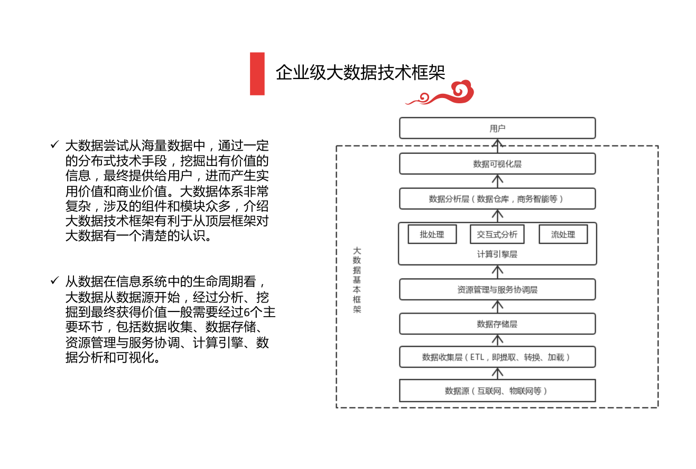
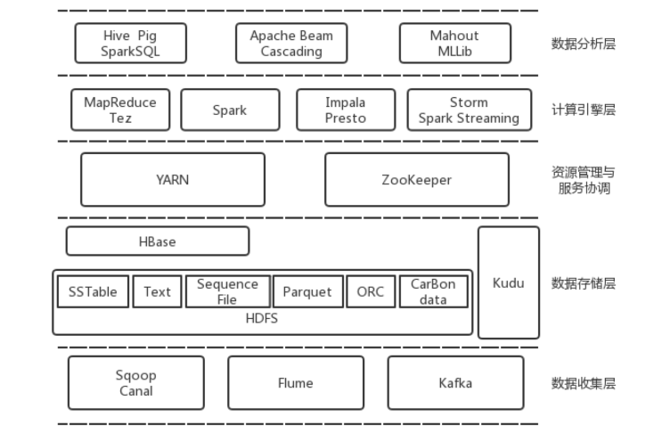
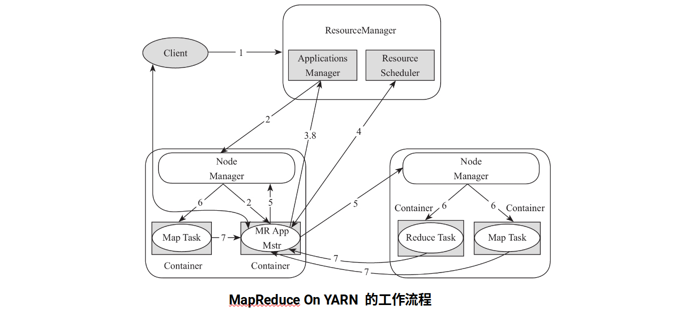
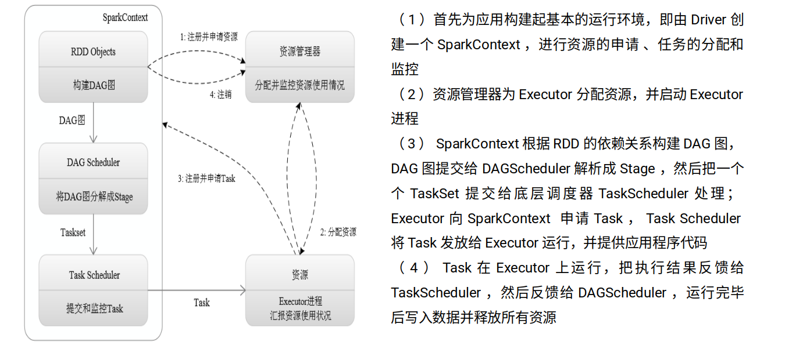
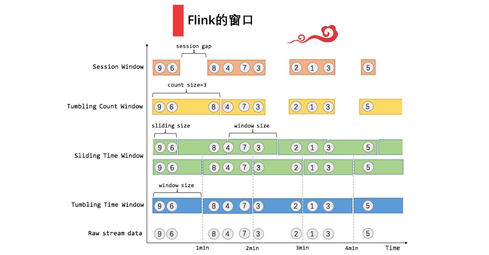

<!--toc:start-->
- [大数据概述](#大数据概述)
  - [框架](#框架)
  - [技术栈](#技术栈)
- [大数据收集](#大数据收集)
  - [结构化数据收集](#结构化数据收集)
  - [非结构化](#非结构化)
  - [分布式消息队列](#分布式消息队列)
- [大数据存储](#大数据存储)
  - [序列化](#序列化)
  - [文件存储格式](#文件存储格式)
  - [文件存储系统](#文件存储系统)
    - [HDFS](#hdfs)
    - [NoSQL](#nosql)
    - [重点了解 HBase](#重点了解-hbase)
- [分布式协调与资源管理](#分布式协调与资源管理)
  - [分布式协调：ZooKeeper](#分布式协调zookeeper)
  - [资源管理：YARN](#资源管理yarn)
  - [资源管理系统架构演化](#资源管理系统架构演化)
- [计算引擎](#计算引擎)
  - [MapReduce](#mapreduce)
  - [DAG 计算引擎 Spark](#dag-计算引擎-spark)
- [流式计算引擎](#流式计算引擎)
  - [Storm](#storm)
  - [Spark Streaming](#spark-streaming)
  - [Flink](#flink)
- [图计算引擎 Pregel](#图计算引擎-pregel)
<!--toc:end-->

---

## 大数据概述
几个思维方式转变
- 全样而非抽样：大数据时代可以分析更多数据，甚至可以处理和某个现象相关的全部数据，而不再依赖于随机采样。
- 效率而非精确：大数据时代，数据量极大，乐于接收数据的纷繁复杂，而不再追求精确性。
- 相关而非因果：由前两个转变促成，大数据告诉我们“是什么”而不是“为什么”，从因果关系向相关关系转变。

特征（4V）：量大，多样化，快速化，价值密度低

大数据产生
1. 运营式系统阶段
2. 用户原创内容阶段
3. 感知式系统阶段

大数据 vs 大规模数据 vs 海量数据

科学研究四范式
1. 经验主义阶段（实验）
2. 理论阶段
3. 计算阶段
4. **数据探索阶段**

计算模式
1. 流：时间要求最高 1s 之内
2. 查询分析：时间要求第二，秒级别
3. 批处理：时间要求第三，10s 以上，吞吐量要求高，响应要求不高
4. 图：将数据表征成图的方式

### 框架

我们关注的，自下而上：
1. 数据收集层
2. 存储
3. 资源管理与服务协调（上层高效地利用物理资源）
4. 计算引擎

但在要说明框架时，要完整列出 6 层，并简要列出每层功能。

### 技术栈

- 数据收集层
	- 结构化：sqoop canal
	- 非结构化：flume
	- 消息队列：kafka
- 存储
	- 行式存储：文本
	- 列式存储
	- 分布式文件系统：HDFS
	- 分布式数据库
		- HBase 列簇式的分布式数据库，并不是纯列式
		- Kudu 是纯列式
- 资源管理与服务协调
	- yarn
	- zoo keeper
- 计算引擎
	- 批处理：MapReduce
	- DAG（也是批处理）：Spark
	- 流式数据处理：Spark straming & Storm
	- 图计算：Pregel

## 大数据收集
### 结构化数据收集
- Sqoop：解决关系型数据库与 Hadoop 之间的数据传输问题
- Canal：CDC 数据增量收集，增量日志解析

### 非结构化
- Flume：流式日志收集，完全分布式，生命式动态配置拓扑，事物支持（保证数据在传输过程中不丢）
    - **多路合并**：把消息来源汇总到一起
    - **多路复用**：一条路在时间上复用

### 分布式消息队列
- Kafka
    - 设计动机（解决了什么问题）
        - 生产者和消费者之间耦合度高，数据处理不够灵活
        - 生产者和消费者之间速度不对等，带来数据丢失或阻塞
        - 大量并发的网络连接对后端消费者不友好
    - 基本架构：push-pull 生产者主动推到 broker，消费者主动从 broker 拉取
        - producer
        - consumer
        - broker 把生产者和消费者解耦
        - zookeeper 分布式服务协调，broker 和 consumer 直接依赖于 zookeeper
            - broker 将自己的位置、健康状态、维护的 topic 等信息写入
            zookeeper，以便于其他的 consumer 发现并获取这些数据，
            以及相关的容错机制。
            - consumer group 通过 zookeeper  保证内部各个 consumer 负载均衡，
            consumer 会将最近所获取的消息的 offset 写入 zookeeper，
            便于端点续传。
    - 关键技术
        - 可控的可靠性级别
        - 持久化机制
        - 数据多副本（强一致性）
        - zero-copy，数据从磁盘到网卡 buffer 转移的过程中不拷贝到用户态，
        快一些。
- ELK stack
    - Logstash：收集日志数据，解析和转换数据格式等
    - ElasticSearch：接收 Logstash 转换后的数据并存储，建立搜索索引
    - Kibana：使用 Elastic Search DB 可视化和共享
- 爬虫策略
    - 反向链接数策略
        - 反向连接数是指一个网页被其他网页链接指向的数量，
        代表一个网页的内容受到他人推荐的程度。
    - 部分 page rank
        - 借鉴 page rank 策略的思想：对于已经下载的网页，连同待抓取
        URL 队列中的 URL，形成网页集合，计算每个页面的 page rank 值，完成后，
        将待抓取 URL 队列中的 URL 按照 page rank 值的大小排列，
        按照这个顺序抓取页面。
        - 如果每次只抓取一个页面，则要重新计算 page rank 值，
        一种折中的方案是每次抓取 k 个页面，重新计算 page rank。
    - OPIC online page importance calculation
        - 也是对页面进行重要性评分，给每个页面一定量的初始 cash，
        当下载了某个页面后，将其 cash 分摊给所有从该页面分析出的链接。
        对于待抓取 URL 队列中的所有页面，按照 cash 数量进行排列。
    - 大站优先
        - 对于待下载页面较多的网站，优先下载。

## 大数据存储
###  序列化
- Thrift
- ProtoBuf
- Avro

### 文件存储格式
- 行式存储与列式存储的区别
    - Sequence File 行式存储，简单的 KV 二进制行式存储格式，物理存储上是分块的。
- 列式存储格式?
    - ORC (Optimized Row Clumnar)
    专为 Hadoop 设计的自描述的列式存储格式
    - parquet 更好地适配查询引擎、计算框架和序列化框架，分为三部分
        1. 存储格式
        2. 对象模型转换器
        3. 对象模型
    - carbon data

### 文件存储系统
- 两个概念：是什么，各自的优势是什么？
    - 横向扩展：利用现有的存储系统，通过不断增加存储容量来满足增长需求
    - 纵向扩展：通过扩大节点数量来 scale
    - 对比（目前大数据领域通常采用横向扩展方案）：
        - 纵向扩展存在价格昂贵、省级困难以及存在物理瓶颈的问题
        - 横向扩展存在因故障丢失数据、存储开销更大、一次写入多次读取等问题
- 文件级别的分布式系统与块级别的分布式系统
    - 文件粒度的不足
        1. 难以负载均衡：文件大小不统一
        2. 难以并行处理：多个任务读取同一个文件时会被阻塞

#### HDFS
HDFS 架构
- 块级别的分布式文件系统
- 客户端 client 数据分块在 client 进行
- 主节点 NameNode，管理元信息和 DataNode
- 从节点 DataNode
- zoo keeper

HDFS 容错性设计
- NameNode 故障，使用 SecondaryNameNode
- DataNode 故障，不同 DataNode 之间有冗余，
心跳机制使得 NameNode 能及时发现故障
- 数据块损坏，通过校验码探测损坏，通过 NameNode 向其他 DataNode
获取正确的数据进行恢复。

#### NoSQL
三大基石
- CAP 理论
    - Consistency
    一致性，分布式环境中多个节点的数据是一致的
    - Availability
    可用性，在确定的时间内有返回结果，不管是成功还是失败都有响应
    - Partition Tolerance
    分区容错性，当网络中部分断开时，分离的系统也能够正常运行
- BASE：牺牲高一致性，换可用性或可靠性
    - Basically Avaliable
    - Soft state
    - Eventual consistency
    最终一致性是弱一致性的一种特例，允许
    后续访问操作可能暂时读不到更新后的数据，但在一段时间后一定能读到。
    最终一致性公式（W：更新数据时需要保证写完成的节点数, 
    R：读取数据时需要读取的节点数, N：copy 数）
        - 强一致性：W + R > N，写的节点和读的节点重叠，则是强一致性。
        - 弱一致性：W + R <= N。

数据库类型
- key value
    - redis 数据类型简单、需要的读取速度快
    - memcached
- key column
    - HBase
    - Cassandra
- key document
    - 核心思想：数据用文档（JSON）表示
    - mongo DB
- 图模型
    - neo4j

#### 重点了解 HBase

**HBase 逻辑数据模型**

每行数据有一个 row key，以及若干 column family 构成，
每个 column family 可包含无限个 column（通过 column qualifier 标识）。
通过 `(rowkey, column family, column qualifier)` 可以为一确定一个 cell，
cell 内部保存了多个版本的数值，通过写入时的 timestamp 作为版本号，最新的
排在最前面。

HBase 的逻辑数据模型也可以看作一个 key value 模型，如下。

```json
{
  "RowKey": {
    "ColumnFamily1": {
      "ColumnA": {
        "timestamp1": "val"
      }
    },
    "ColumnFamily2": {
      "ColumnA": {
        "timestamp1": "val_v2",
        "timestamp2": "val_v1"
      }
    }
  }
}
```

**HBase 物理数据模型**

|key|ColumnFamily|ColumnQualifier|timestamp|value|
|-|-|-|-|-|
|xicheng|data|city|111|a_v2|
|xicheng|data|city|110|a_v1|
|haidian|data|city|100|b|

- 对不同版本的 cell value，会重复保存 rowkey, column family 和 column qualifier。
- 同一表中的数据按照 rowkey 升序排列
- 同一行中的不同列按照 column qualifier 升序排列
- 同一 cell 中的数值按照版本号（时间戳）降序排列

> 注意：HBase 并不是列式存储引擎，而是列簇式存储引擎（同一列簇中的数据会
单独存储），但列簇内部数据是行式存储的。Kudu 是列式存储的分布式数据库。

**HBase 架构**

由 HMaster 和 RegionServer 组成 master-slave 架构，
但是 master 与 slave 通过 zookeeper 解耦，master 无状态。
- HMaster：可以有多个，主 HMaster 由 zookeeper 动态选举产生，有以下职责
    1. 协调 RegionServer，分配 region，均衡各个 RegionServer 的负载，
    发现坏掉的 RegionServer 后及时处理。
    2. 元信息管理：为用户提供 table 的增删改查操作。
- RegionServer：负责单个 Region 的存储和管理
- ZooKeeper：职责如下
    1. 保证任何时候，只有一个 HMaster
    2. 存储所有 Region 的寻址入口
    3. 实时监控 RegionServer 的上线下线信息，及时同志 HMaster
    4. 存储 HBase 的 schema 和 table 元数据
- Client：提供 HBase 访问接口，与 RegionServer 交互读写数据，并维护
cache，加快对 HBase 的访问速度。

**HBase 内部原理**

- Region 定位：给定一个 rowkey 或 rowkey 区间，获取这个 rowkey 所在的
RegionServer 地址，步骤如下：
    1. Client 向 ZooKeeper 查找 hbase:meta 系统表所在的 RegionServer，
    hbase:meta 表维护了每个用户表中 rowkey 区间与 region 存放位置的映射关系。
    2. Client 向 hbase:meta 表所在的 RegionServer 查找 rowkey 所在的 RegionServer。
    3. Client 向 rowkey 所在的 RegionServer 交互，执行该 rowkey 相关操作。
- RegionServer 内部实现
    1. BlockCache：读缓存
    2. MemStore：写缓存
    3. HFile：保存 HBase 中的实际数据，存在 HDFS 中
    4. **WAL\***：Write Ahead Log，保存在 HDFS 上的日志，用来保存（恢复）因
    RegionServer 故障而还未持久化到 HDFS 中的数据
- RegionServer 数据读写流程
    - 写流程
        1. RegionServer 收到写请求后，将写入的数据以追加的方式写到
        HDFS 上的 WAL 中
        2. RegionServer 将数据写入内存数据结构 MemStore 中，然后通知客户端
        写入成功
        3. MemStore 所占内存达到一定阈值后，将数据顺序刷新到 HDFS 中，
        保存为 HFile
    - 读流程
        1. 查询读缓存 BlockCache，如果未命中才进行后续操作
        2. 查询写缓存 MemStore，如果未命中才进行后续操作
        3. 读取 HDFS 中的 HFile

## 分布式协调与资源管理
> 解决的问题：leader 选举，负载均衡

### 分布式协调：ZooKeeper
功能
- 配置管理，集中管理配置文件，自动更新
- 名字服务，对应用、服务的统一命名和索引查询
- 集群管理，监控集群运行状态
- 分布式锁服务，保证数据一致性（节点间状态同步）

特性
- 顺序一致性：客户端发送的更新请求将按照发送的顺序进行执行
- 原子性：更新操作只有成功或失败两个状态
- 单一系统视图：客户端链接到任意的服务器都看到相同的数据视图
- 可靠性
- 及时性

架构
- 服务由奇数个 ZooKeeper 实例构成，一个为 leader 其他为 follower，
它们同时维护了层级目录结构的一个副本，通过 ZAB (ZooKeeper Atomic Brodcast)
协议维持副本间的一致性。
- 为了扩展，引入第三个角色 observer，不参与投票过程，其他行为与 follower 类似

考察问题
- 为什么 zoo keeper 服务通常由奇数个实例构成？ZAB 协议的一个约定是
数据写入到多数个节点才算写入成功，因此偶数个实例会存在没有多数的情况
（2N + 1 个节点和 2N + 2 个节点的容错能力相同）。
- 负载均衡是对谁的负载均衡？
（Kafka 的负载均衡是对 leader partition 的负载均衡）

### 资源管理：YARN
> 将一个分布式集群的所有计算资源抽象成一个“大型计算机”，
自动在之上部署各种类型的服务，并协调好各个节点的负载和资源利用率。

- 解决问题：MapReduce V1 将资源管理与任务调度放在一起（JobTracker），
会导致其负载过大，成为整个系统的性能瓶颈。
- 角色（这里 ResourceManager 和 NodeManager 是 YARN 中两个层级的节点角色，
其各自又划分为几个子模块）
    - ResourceManager 上层（管理层）
        - Scheduler：一个纯调度器，不从事任何与具体应用程序相关的工作
        - Applications Manager ASM：应用管理器，负责在
            应用程序提交后与调度器协商资源以启动 ApplicationMaster，
            检测其运行状态并在失败时重启它等。YARN 中 ASM 有主备实现的高可用。
    - 工作层
        - ApplicationMaster：每个提交的应用程序均有一个独立的 AM，其功能包括
            1. 与 ResourceManager 协商以获取资源（用 Container 表示）
            2. 将得到的资源进一步分配给内部的任务
            3. 与 NodeManager 通信以启动/停止任务
            4. 监控任务的运行状态，并在任务运行失败时重新申请资源以重启任务
        - NodeManager：每个节点上的资源管理器
            1. 定时向 ResourceManager 汇报本节点的资源使用情况和各个 Container
            的运行状态
            2. 接收并处理来自 ApplicationMaster 的任务，启动、停止等各种请求
    - Client

Container 是 YARN 中的基本资源分配单位，是对应用程序运行环境的抽象，
并为其提供资源隔离环境。YARN 中每个任务均会对应一个 Container，且该任务
只能使用该 Container 中的资源。
- DefaultContainerExecutor：直接以进程方式启动
- LinuxContainerExecutor：使用 Cgroups 启动
- DockerContainerExecutor：运行 Docker Container

- **工作流程（8 步）\***
  
    1. 提交应用程序，Client 向 ResourceManager 提交应用程序，包含程序本身
    以及元数据
    2. ResourceManager 为该程序分配第一个 Container，这个 Container 中运行
    这个应用程序的ApplicationMaster
    3. ApplicationMaster 启动后，向 ResourceManager 注册，这样用户可以通过
    ResourceManager 查看应用程序的运行状态
    4. 资源获取：ApplicationMaster 采用轮询的方式通过 RPC 向 ResourceManager
    申请和领取资源
    5. 申请到资源后，ApplicationMaster 与对应的 NodeManager 通信，请求其启动
    任务的 Container
    6. NodeManager 为任务设置好运行环境 Container，并运行 Container
    7. Container 监控：ApplicationMaster 通过两种方式监控每个任务的运行状态
        1. ResourceManager 有向 ApplicationMaster 发送周期性的心跳信息
        2. Container 中的任务可以通过 RPC 向 ApplicationMaster 汇报
    8. 注销 ApplicationMaster：程序完成后，ApplicationMaster 向 ResourceManager
    注销，并推出执行

### 资源管理系统架构演化
1. 中央式调度 Hadoop Job tracker：资源的调度和应用程序的管理功能
全部放到一个进程中完成
    - 集群规模受限
    - 新的调度策略难以融入
2. 双层 Mesos 和 YARN：各个框架调度器（如 YARN 中的 ApplicationMaster）
并不知道整个集群资源的使用情况，只被动的接收资源
3. 共享状态 Omega：共享数据实际上就是整个集群的实时资源使用信息，
各个应用程序调度器自我管理和控制

## 计算引擎

### MapReduce
编程模型/运行时环境
- 编程组件
    - InputFormat：描述输入数据的格式，两个功能
        1. 数据切分
        2. 为 Mapper 提供输入数据
    - Mapper：封装处理逻辑，输入一个 kv pair，输出一个 kv pair
    - Combiner (optional)：为了提高性能加入，Mapper 后面的 local Reducer
    - Partitioner：对 Mapper 产生的中间结果进行分片，将同一组的数据交给同一个
    Reducer，直接影响 Reduce 阶段的负载均衡
    - Reducer：对 Mapper 产生的结果进行规约操作
    - OutputFormat：描述输出数据的格式

    其中 Mapper 和 Reducer 跟应用程序逻辑相关，必须由用户编写。
- 计算流程
    - 不同 map 任务和不同的 reduce 任务之间不会通信，且可并行
    - 用户不能显式地从一台机器向另一台机器发送消息
- 关键技术
    - 数据本地性：MRAppMaster 会尽量将 Map Task 调度到它所处理的数据所在的节点
    - 推测执行：同一个作业的多个任务之间运行速度可能不一致，可以通过一定的法则
    推测出“拖后腿”的任务，为这个任务启动一个备份任务，两个任务同时运行，选用
    最先成功运行的任务的计算结果作为最终结果。 

### DAG 计算引擎 Spark
- 解决的问题（也是 MapReduce 的局限性）
    - MapReduce 在很多场景下的速度非常慢
    - 仅支持 map 和 reduce 操作，过于底层，想要实现复杂逻辑开发工作量大
    - 处理效率低，因为 mapper 端和 reduce 端都需要排序
    - 不适合迭代和交互式运算，MapReduce 追求的是高吞吐量
    （每次读写都要序列化到磁盘），而延迟较高
- RDD（lazy execution）
    - transformtion：只记录转换
    - action：真正进行操作
- Spark 是通用 DAG 计算引擎，比 MR 这种两阶段计算引擎更灵活
- 运行流程 
- 作业生命周期
    - 生成逻辑计划
    - 生成物理计划
    - 调度并执行任务
- 运行模式
    - local 线程
    - standalone 独立组成分布式网络
    - Spark on YARN
    - Spark on Mesos
- 生态系统
    - Spark Streaming
    - Spark SQL
    - MLLib
    - Graph X

## 流式计算引擎
流式数据线
- 数据采集
- 数据缓冲
- 实时分析
- 结果存储

流式计算引擎组织特点
- 基于行 Storm
- 基于微批处理 Spark Streaming

### Storm
延迟低、吞吐量低
- 可靠性机制：为每个消息保存大概 20 字节的数据

### Spark Streaming
延迟高、吞吐量高

### Flink
> 一个针对流数据和批数据的分布式计算引擎
- Flink 的窗口
    - 翻滚窗口：不重叠
    - 滑动窗口：重叠
    - flink 中的 5 种窗口 
        - raw stream data
        - tumbling time window
        - sliding time window
        - tumbling count window
        - session window

## 图计算引擎 Pregel
> 一种基于 BSP 模型实现的并行图处理系统
pregel 计算实例
- 按超步分层（每一层是相同拓扑的几个节点组成的计算图）
- 每层计算完成后将结果向下一层传输
- 如果状态和上一次没有改变，则进入非活跃状态（不再向外发送）
