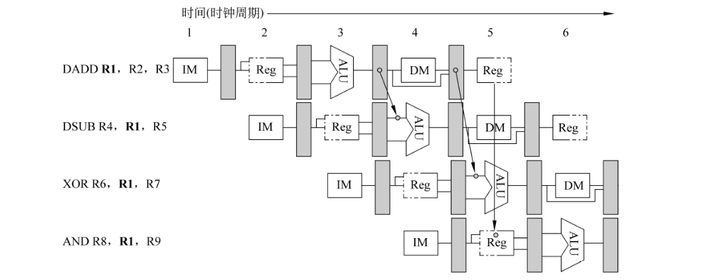
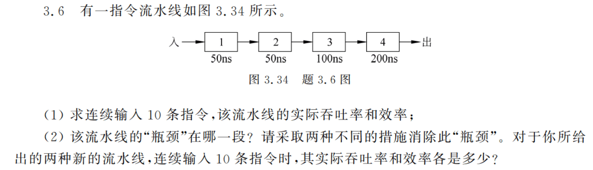
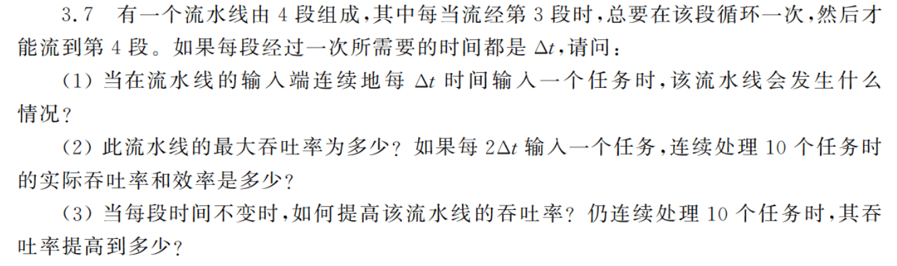
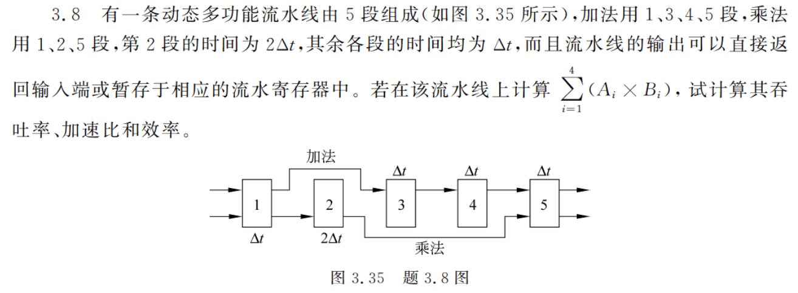
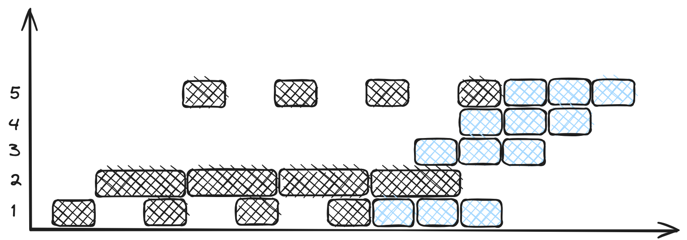
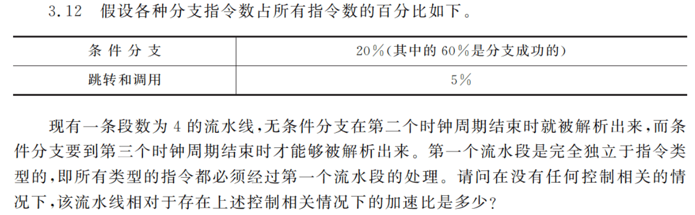

<!--toc:start-->
- [分类](#分类)
- [性能指标](#性能指标)
  - [吞吐率](#吞吐率)
    - [优化性能](#优化性能)
  - [加速比](#加速比)
  - [效率](#效率)
- [相关与冲突](#相关与冲突)
  - [举例：MIPS 5 段流水线](#举例mips-5-段流水线)
  - [相关](#相关)
  - [流水线冲突](#流水线冲突)
- [题目](#题目)
  - [3.6](#36)
  - [3.7](#37)
  - [3.8](#38)
  - [3.12](#312)
<!--toc:end-->

## 分类

1. 部件级、处理机级、系统级
2. 单功能与多功能
3. 静态与动态
4. 线性与非线性
5. 顺序与乱序

## 性能指标

### 吞吐率

- $TP$: 吞吐率，单位时间内流水线所完成的任务数量或输出结果数量
- $\Delta t_n$: 第 $n$ 段所需时间

各段时间不等的流水线的**实际**吞吐率为

$$
TP = \frac{n}{\sum_{i=1}^k \Delta t_i + (n-1)max(\Delta t_1, \Delta t_2, ..., \Delta t_k)}
$$

**最大**吞吐率为

$$
TP_{max} = \frac{1}{max(\Delta t_1, \Delta t_2, ..., \Delta t_k)}
$$

#### 优化性能

消除瓶颈段
1. 细分瓶颈段，使瓶颈段不再是最慢的一段
2. 重复设置瓶颈段

### 加速比

- $T_s$: 顺序执行所用的时间
- $T_k$: 按流水线方式处理所用的时间
- $k$: 流水线段数
- $n$: 流水线指令数

理论加速比
$$
S = \frac{T_s}{T_k}
$$

实际加速比：若各段时间相同，一条 $k$ 段流水线完成 $n$ 个连续任务
$$
S = \frac{nk}{k+n-1}
$$
这种情况下，最大加速比为
$$
S_{max} = \lim_{n\rightarrow \infty}\frac{nk}{k+n-1} = k
$$

流水线各段时间不等时，实际加速比为
$$
S = TP \times \sum_{i=1}^k \Delta t_i
$$

### 效率

> 流水线的效率指流水线设备的利用率，实际上就是时空图中阴影面积比总面积。

$$
E = \frac{n \times \sum \limits_{i=1}^n t_i}{k\times T_k}
$$

## 相关与冲突

### 举例：MIPS 5 段流水线
1. 取指 IF
2. 指令译码 / 读寄存器 ID
3. 执行 / 有效地址计算 EX
4. 存储器访问 / 分支完成 MEM
5. 写回 WB

<table class="MIPS-table">
    <tr>
        <td></td> 
        <td>ALU</td> 
        <td>Load/Store</td> 
        <td>Branch</td> 
    </tr>
    <tr>
        <td>IF</td> 
        <td colspan="3">取指</td>    
    </tr>
    <tr>
        <td>ID</td> 
        <td colspan="3">译码、读寄存器堆</td>    
    </tr>
    <tr>
        <td>EX</td> 
        <td>执行</td> 
        <td>计算访存有效地址</td> 
        <td>计算目标地址设置条件码</td> 
    </tr>
    <tr>
        <td>MEM</td> 
        <td></td> 
        <td>访问存储器</td> 
        <td>若条件成立 转移目标地址送 PC</td> 
    </tr>
    <tr>
        <td>WB</td> 
        <td>计算结果写回寄存器堆</td> 
        <td>Load 数据写回寄存器堆</td> 
        <td></td> 
    </tr>
</table>

### 相关

两条指令之间存在某种依赖关系，在流水线中不能重叠或只能部分重叠。
1. 数据相关：后面的指令依赖前面的指令产生的结果，且这种关系可传递。
2. 名相关：“名” 指存储器或存储单元名称，名相关是两条指令使用相同的名，
但并没有数据流动。
    1. 反相关：两条指令所读的名相同
    2. 输出相关：两条指令所写的名相同
3. 控制相关：分支内的指令与条件判读指令之间的相关。

### 流水线冲突

由于相关存在，流水线中的下一条指令需要延迟执行。
1. 结构冲突：硬件满足不了指令重叠执行。
2. 数据冲突：需要用到前面指令的结果。
    1. 写后读：j 用到 i 的计算结果，且在 i 将结果写入寄存器之前
    就去读该寄存器，得到旧的值。
    2. 写后写：指令 j 和指令 i 的结果寄存器相同，且 j 在 i 写入之前
    就先对寄存器进行写入，导致写入顺序错误。
    3. 读后写：j 的目的寄存器和 i 的操作数寄存器相同，且 j 在 i
    读取之前就写入了，导致数据错误。

    > **定向（旁路）技术**
    >
    > 在发生写后读相关的情况下，在计算结果尚未出来之前，后面等待结果的
    指令不一定马上就要用该结果。

    如果能将计算结果从其产生的地方（ALU 出口）直接送到其他指令
    需要它的地方（ALU 的入口），就可以避免停顿。

    

    并不是所有数据冲突都能够通过定向技术解决，有时必须停顿。
    此外，可以通过在编译阶段进行**指令调度**的方式减少数据冲突。

3. 控制冲突：遇到分支指令或其他改变 PC 的指令。分支成功：PC 值改变
为分支转移的目标地址。流水线中，由分支指令引起的延迟称为分支延迟。
为减少分支延迟，可以
    1. 在流水线中尽早判断（或预测）分支
    2. 尽早计算分支目标地址

## 题目

### 3.6

1. 实际吞吐率：
    $$
    \frac{10}{(50 + 50 + 100 + 200) + 9 \times 200} = \frac{10}{2200}
    $$
    效率：
    $$
    \frac{10 \times (50 + 50 + 100 + 200)}{4 \times [(50 + 50 + 100 + 200) + 9 \times 200]} = \frac{5}{11}
    $$
2. 瓶颈在用时 100ns 和 200ns 的段，可重复设置瓶颈段或将其拆分来消除瓶颈。
    1. 采用拆分瓶颈段的方式，将第三段拆分为 50 * 2，第四段拆分为 50 * 4。
    此时实际吞吐率 $T_p = \frac{10}{50\times 8 + 9 \times 50}$，效率
    $E = \frac{10 \times 50 \times 8}{8 \times [(50 \times 8) + 9 \times 50]}$。
    2. 采用重复设置瓶颈段的方式，此时总用时 $T_k$ 需要画时空图得到。

### 3.7

1. 会发生阻塞
2. 最大吞吐率为 $\frac{1}{2\Delta t}$，处理 10 个任务时的实际吞吐率是
$\frac{10}{5\Delta t + 9 \times 2\Delta t}$，效率是
$\frac{10 \times 5\Delta t}{4 \times [5\Delta t + 9 \times 2\Delta t]}$
3. 设置两个第 3 段，改进后，$T_k = 14\Delta t$，吞吐率变为 $\frac{10}{14\Delta t}$，
效率变为 $\frac{10 \times 5\Delta t}{5 \times 14\Delta t}$

### 3.8

计算任务需要 4 次乘法，3 次加法，且加法操作需要至少两个乘法结果才能进行。
画时空图发现，先进行全部乘法操作，再进行加法操作所得到的就是最优结果。

吞吐率为 7 / 13，加速比为 $\frac{4 \times 4 + 4 \times 3}{13}$，效率由阴影面积比总面积得到。

### 3.12

1. 排空流水线策略，条件分支多 2 个时钟周期，其他多 1 个时钟周期，CPI = 1 + 20% \* 2 + 5% = 1.45
2. 预测分支成功策略，预测成功多 1 个时钟周期，预测失败多 2 个时钟周期，
CPI = 1 + 20% \* (60% + 40% \* 2) + 5% = 1.33 
3. 预测分支失败策略，预测成功无额外时钟周期，预测失败多 2 个时钟周期，
CPI = 1 + 20% \* (60% \* 2 + 40% \* 0) + 5% = 1.29
