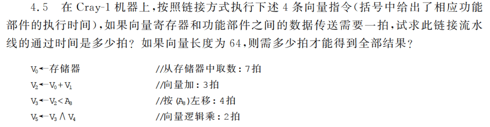
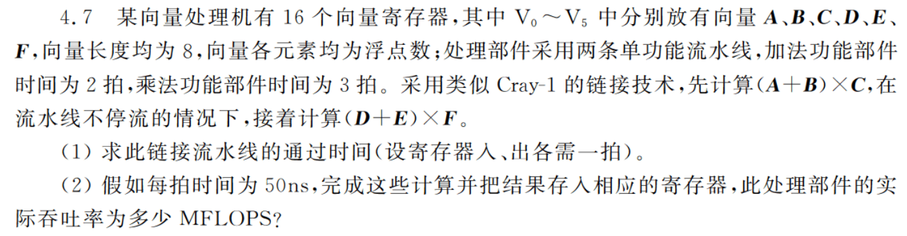
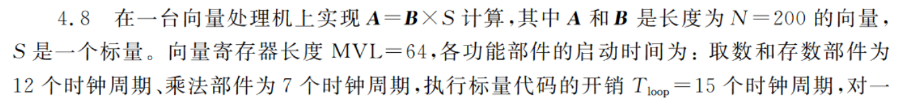
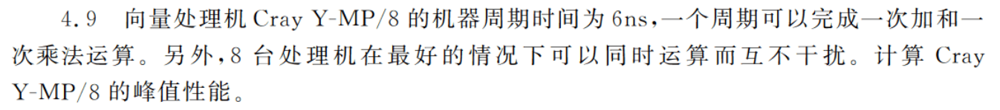
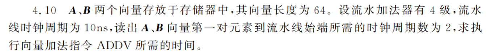

<!--toc:start-->
- [向量的处理方式](#向量的处理方式)
  - [例子](#例子)
- [向量处理机的结构](#向量处理机的结构)
  - [存储器-存储器结构](#存储器-存储器结构)
  - [寄存器-寄存器结构](#寄存器-寄存器结构)
- [提高向量处理机性能](#提高向量处理机性能)
  - [多个功能部件](#多个功能部件)
  - [链接技术\*](#链接技术)
    - [两条指令占用流水线和寄存器的 4 种情况](#两条指令占用流水线和寄存器的-4-种情况)
  - [循环开采技术](#循环开采技术)
  - [多处理机系统](#多处理机系统)
- [性能评价](#性能评价)
  - [向量指令的处理时间](#向量指令的处理时间)
    - [一组向量指令执行的总时间](#一组向量指令执行的总时间)
    - [分段开采时一组向量指令执行的总时间](#分段开采时一组向量指令执行的总时间)
  - [最大性能 $R_{\infty}$](#最大性能-rinfty)
  - [半性能向量长度 $n_{\frac{1}{2}}$](#半性能向量长度-nfrac12)
  - [向量长度临界值 $n_v$](#向量长度临界值-nv)
- [习题](#习题)
  - [4.5](#45)
  - [4.7](#47)
  - [4.8](#48)
  - [4.9](#49)
  - [4.10](#410)
<!--toc:end-->

## 向量的处理方式

向量由一组有序、具有相同类型和位数的元素组成，特别适合进行流水处理。

- 横向：将向量按位循环计算，每次循环发生一次数据相关，只适合一般的处理机器，不适合并行处理。
- 纵向：将整个向量按相同的运算处理后再进行别的运算，相关只发生在响亮之间，适合并行处理。
- 纵横：结合上面两者，把向量分成若干组，组内纵向处理，依次处理各组。

### 例子

要计算 $D = A \times (B - C)$
- 横向的计算方式是先算 $a_1 \times (b_1 - c_1) \rightarrow d_1$，再计算
$a_2 \times (b_2 - c_2) \rightarrow d_2$ ...
- 纵向的方式是先计算 $b_1 - c_1 \rightarrow q_1$ ... $b_n - c_n \rightarrow q_n$，
再计算 $a_1 \times q_1 \rightarrow d_1$ ... $a_n \times q_n \rightarrow d_n$，
表示成向量指令，就是
$$
B \rightarrow C \rightarrow Q \\
A \times Q \rightarrow D
$$
- 纵横（分组）方式就是将 N 个向量按 n 为一组分组，组内横向计算，组间纵向计算。

数据相关次数
- 横向每次循环一次数据相关
- 纵向每完成一步向量指令计算一次数据相关

功能切换次数
- 横向每次对一个位置的元素进行全部计算，每次需要切换功能。
- 纵向在有 n 步的时候一共只需要切换 n-1 次功能。

## 向量处理机的结构

### 存储器-存储器结构

**适用于纵向处理方式**，流水运算部件的输入输出与存储器相连（可能经过缓冲）。
每拍从存储器读取两个数据，并写回一个结果，对存储器的带宽以及数据通信带宽要求高。

### 寄存器-寄存器结构

**适用于分组处理方式**，向量被分为 n 个数据一组，以组为单位进行数据的存取和运算，设置可快速访问的向量寄存器。
这种方式对向量长度没有限制，但组的大小是固定的。

## 提高向量处理机性能

### 多个功能部件

显然

### 链接技术\*

**要求**
1. 相关性（先写后读）
2. 同周期
3. 同时
4. 长度相等

#### 两条指令占用流水线和寄存器的 4 种情况

1. 指令不相关
2. 功能部件冲突
3. 源寄存器冲突
3. 结果寄存器冲突

链接技术指具有先写后读相关的两条指令，在不出现功能部件冲突的情况下，
可以直接链接两个功能部件，而不需要等待一组向量全部写入寄存器。

### 循环开采技术

将长向量分成长度固定的断，循环分段处理。

### 多处理机系统

显然

## 性能评价

### 向量指令的处理时间

一条向量长度为 n 的向量指令执行所需时间

$$
T_{vp} = (T_{start} + n) T_c
$$

- $T_c$: 时钟周期时间
- $T_{start}$: 启动准备时间

#### 一组向量指令执行的总时间

$$
T_{all} = \sum \limits_{i=1}^m T_{vp}^{(i)}
$$

#### 分段开采时一组向量指令执行的总时间

$$
T_{all} = \lceil \frac{n}{MVL} \rceil \times (T_{start} + T_{loop}) + mn
$$

- $MVL$: 向量寄存器长度
- $n$: 要计算长向量长度
- $T_{loop}$: 分段开采所引入的额外时钟周期数量
- $m$: 共有 m 个编队

### 最大性能 $R_{\infty}$

向量长度为 $\infty$ 时的性能

$$
R_{\infty} = \lim \limits_{n\rightarrow\infty} \frac{指令序列中浮点运算次数 \times 时钟频率}{指令序列完成所需时钟周期数}
$$

### 半性能向量长度 $n_{\frac{1}{2}}$

性能为峰值性能一半时所需的向量长度。

### 向量长度临界值 $n_v$

向量流水方式处理的速度优于标量串行方式处理速度的最小向量长度。
计算方式是将 $n_v$ 作为未知数，代入标量方式处理速度与向量方式处理速度相等的方程求解。

## 习题

### 4.5

$$
\begin{aligned}
C_{pass} &= 7 + 1 + 1 + 3 + 1 + 1 + 4 + 1 + 1 + 2 + 1 = 23 \\
C_{result} = C_{pass} + 64 - 1 = 86
\end{aligned}
$$

### 4.7

$$
C_{pass} = 1 + 2 + 1 + 1 + 3 + 1 = 9
$$

$$
\begin{aligned}
T_{all} &= (C_{pass} + (8-1) + 8) \times 50 = 1200ns \\
TP &= \frac{(4 \times 8)}{T_{all}} \approx 26.67 \; MFLOPS
\end{aligned}
$$

### 4.8

执行一次运算：$12 + 12 + 7 + 15$

$$
n = \lceil \frac{200}{64} \rceil = 4
$$

$$
\begin{aligned}
T_{all} &= n\sum (T_s + T_{loop}) + mT_g \times N \\
&= 4 \times (12 + 12 + 7 + 15) + 3 \times 1 \times 200 = 784
\end{aligned}
$$

### 4.9

$$
R_{\infty} = \frac{2 \times 8}{6 \times 10^{-9} \times 10^6}
= 2666.67 \; MFLOPS
$$

### 4.10

$$
T_{ADDV} = (2 + 4 + 64 - 1) \times 10 = 690 \; ns
$$
