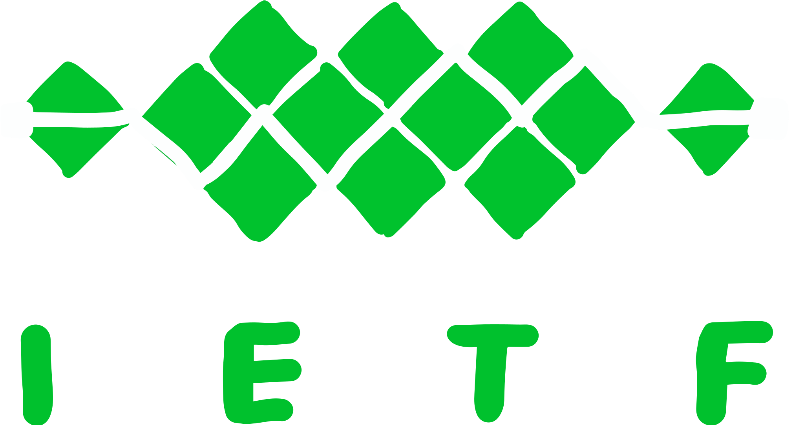

> 本文翻译自 [Replacing HLS/DASH](https://quic.video/blog/replacing-hls-dash/)  
> This is a Chinese translation of [Replacing HLS/DASH](https://quic.video/blog/replacing-hls-dash/)

<!--toc:start-->
- [太长不看](#太长不看)
- [写在前面](#写在前面)
- [为什么选择 HLS/DASH？](#为什么选择-hlsdash)
- [好的方面](#好的方面)
- [不好的方面](#不好的方面)
  - [延迟](#延迟)
  - [客户端](#客户端)
  - [所有权](#所有权)
- [下一步是什么？](#下一步是什么)
  - [TCP](#tcp)
  - [HTTP](#http)
  - [HTTP/3](#http3)
- [Media over QUIC](#media-over-quic)
  - [理由 0：QUIC](#理由-0quic)
  - [理由 1：中继层](#理由-1中继层)
  - [理由 2：媒体层](#理由-2媒体层)
  - [理由 3：IETF](#理由-3ietf)
- [还缺什么？](#还缺什么)
<!--toc:end-->

## 太长不看

如果你使用 HLS/DASH 的主要要求是：
- **成本**：你需要等待 CDN 的技术迭代
- **延迟**：你应该考虑 MoQ
- **附加功能**：新的技术需要一段时间的发展以实现所有附加功能
- **vod**：HLS/DASH 工作得很好，为什么要替换他们？

## 写在前面

首先感谢在 [Hacker News 上的积极反馈](https://news.ycombinator.com/item?id=38069974)，本文继续讲述基于
WebTransport 的 MoQ。

在过去的9年里，我一直致力于 HLS 和 Twitch 的扩展 LHLS 的各个方面。
我们遇到了一个延迟的障碍，我的任务是找到一个替代方案，最初是 WebRTC，但最终转向了基于
QUIC 的媒体传输（MoQ）。

## 为什么选择 HLS/DASH？

答案很简单：这是[苹果的要求](https://developer.apple.com/library/archive/documentation/NetworkingInternet/Conceptual/StreamingMediaGuide/UsingHTTPLiveStreaming/UsingHTTPLiveStreaming.html)

> 如果你的应用程序通过蜂窝网络传输视频，并且视频的持续时间超过 10
分钟，或者在 5 分钟内的数据超过 5 MB，则你必须使用 HTTP Live Streaming。

这是个令人失望的答案，但 Twitch 从
[RTMP](https://en.wikipedia.org/wiki/Real-Time_Messaging_Protocol)
迁移到 [HLS](https://en.wikipedia.org/wiki/HTTP_Live_Streaming)，以免被从
App Store 下架。下一句话暗示了原因：

> 如果你的应用程序在蜂窝网络上使用 HTTP Live Streaming，则必须提供至少一个 64 Kbps 或更低带宽的流。

这是在 2009 年，iPhone 3GS 发布时，AT&T 的网络
[难以满足需求](https://www.wired.com/2010/07/ff-att-fail/) 的情况下。HLS 的关键特性是
[ABR](https://en.wikipedia.org/wiki/Adaptive_bitrate_streaming)
：生成相同内容在不同比特率下编码的多个副本。这允许由 Apple 控制的 HLS
播放器减少比特率，而不是使一个可怜的蜂窝网络承担超出其能力的任务。

[DASH](https://en.wikipedia.org/wiki/Dynamic_Adaptive_Streaming_over_HTTP)
是在之后出现的，试图标准化 HLS，但去除了由 Apple 控制的部分。DASH 中肯定有一些很酷的功能，但
[核心概念](https://www.cloudflare.com/learning/video/what-is-mpeg-dash/)是相同的，
它们现在甚至共享相同的 [media container](https://www.wowza.com/blog/what-is-cmaf)。
所以两者并称 HLS/DASH。

但我接下来在这篇文章中会更关注 HLS，因为这是我更熟悉的。

## 好的方面

虽然我们被迫在技术上切换协议，但 HLS 实际上有一些令人惊叹的好处。最大的好处是它使用 HTTP。

HLS/DASH 通过将媒体分割成“片段”来工作，每个片段包含几秒钟的媒体内容。播放器将通过 HTTP
请求单独请求每个片段，并无缝地拼接它们在一起。新的片段不断生成，并通过“播放列表”向播放器发送。


> DALL·E 生成的图片

由于 HLS 使用 HTTP，像 Twitch 这样的服务可以利用现有的互联网基础设施。有大量经过优化的
CDN、服务器和客户端，它们都使用 HTTP 进行通信，可以用于传输媒体。
你需要做一些额外的工作，将实时视频转换为 HTTP 负载，但这是值得的。

关键是利用规模效益，使大规模分发实时媒体变得廉价。制作单个 IP
数据包可能是以最小延迟的方式发送实时媒体的*正确*方法（即 WebRTC），但这不是性价比最高的方式。

## 不好的方面

夸完了，开始骂。

### 延迟

我们有点伤心地告别了 Flash（喘气）。Twitch 的延迟从 RTMP 的大约3秒增加到了使用 HLS 后的15秒。

延迟的来源有很多，从片段的持续时间到播放列表更新的频率不等。多年来，我们慢慢地在优化，最终将
HLS 的延迟降低到理论上的 RTMP 水平。如果您对细节感兴趣，我记录了
[我们的历程](https://quic.video/blog/distribution-at-twitch/)。

但一个重要的延迟来源依旧存在：TCP

我在[上一篇博客](/blog/webrtc/moq_replacing_webrtc)中详细介绍了，问题是头部阻塞。一旦将帧传入
TCP socket，它将被可靠地按顺序传递。
然而，当网络拥塞时，编码的媒体比特率将超过网络传输速率，队列将增长。
帧将需要越来越长的时间才能到达播放器，直到缓冲区耗尽，观众就会看到他们痛恨的旋转动画。


HLS/DASH 播放器可以检测到排队并通过 ABR 切换到较低的比特率。
然而，它只能在不频繁的（例如每2秒）片段边界进行此操作，并且无法取消已经在传输链路中的任何帧。
因此，如果你正在观看 1080p 视频，而网络出现问题，那么在切换到合理的 360p 之前，
仍然需要硬着头皮下载几秒钟的 1080p 视频。

### 客户端

HLS 使用“智能”的客户端和“愚蠢”的服务器。
客户端决定何时、为何、以何种方式下载每个媒体播放列表、片段和帧。
与此同时，服务器只是坐在那里并为 HTTP 请求提供服务。

问题实际上取决于你的角度。如果你控制：

- 仅客户端：生活是美好的！
- 客户端和服务器：生活是美好的！你甚至可以扩展协议！
- 仅服务器：那就相当痛苦。

对于像 Twitch 这样的服务，解决方案似乎很简单：构建自己的客户端和服务器！
我们也做到了，包括专门为 HLS 设计的裸金属实时 CDN。

但是，直到[最近](https://bitmovin.com/managed-media-source)，
我们一直被迫在 iOS 上使用 Apple 的 HLS 播放器以支持 AirPlay 或 Safari。
当然，电视、游戏机、投射设备和其他设备也有自己的 HLS 播放器。而且，如果你将裸金属实时 CDN
[作为云服务提供](https://aws.amazon.com/ivs/)，你无法强迫客户使用你的专有播放器。

所以，你陷入了一个由愚蠢的服务器和一堆愚蠢的客户端组成的死局。
这些愚蠢的客户端根据不完美的信息做出愚蠢的决定，并且与服务器没有任何合作。

### 所有权

与 DASH 相比，我喜欢 HLS 的简单性。与由委员会设计的 XML 怪物相比，有一种令人满意的感觉，
即你可以实际阅读的基于文本的播放列表。

```
#EXTM3U
#EXT-X-TARGETDURATION:10
#EXT-X-VERSION:3
#EXTINF:9.009,
http://media.example.com/first.ts
#EXTINF:9.009,
http://media.example.com/second.ts
#EXTINF:3.003,
http://media.example.com/third.ts
#EXT-X-ENDLIST
```

> [简洁美丽](https://datatracker.ietf.org/doc/html/draft-pantos-hls-rfc8216bis/#section-9.1).

但不幸的是，Apple 控制着 HLS。

Apple 和行业其他部分之间的立场不一致。我甚至不确定 Apple 如何使用 HLS，或者为什么他们会关心延迟，
或者为什么他们坚持成为直播流协议的唯一仲裁者。[Pantos](https://www.crunchbase.com/person/roger-pantos)
做了一份伟大而令我感激不尽的工作，但这一切感觉像是一个僵局。

例如，LL-HLS 最初要求使用
[HTTP/2 服务器推送](https://www.theoplayer.com/blog/impact-of-apple-ll-hls-update-2020)，
而且几乎整个行业都花了很多时间来说服 Apple 这是个坏主意。
好处是我们得到了一个[邮件列表](https://lists.apple.com/mailman/listinfo/hls-announce)，
所以他们可以首先向开发人员宣布变更... 但是不要指望能够很快提出变更。

DASH 也是一个麻烦，因为它受到 [MPEG](https://en.wikipedia.org/wiki/Moving_Picture_Experts_Group)
的控制。规范被[付费墙](https://www.iso.org/standard/79106.html)隔开，
或者需要[专利许可](https://www.streamingmedia.com/Articles/ReadArticle.aspx?ArticleID=133508)。
我甚至不确定我解析 DASH 播放列表是否会[被起诉](https://www.mpegla.com/wp-content/uploads/DASHWeb.pdf)。


> [图片来源](https://itsalwayssunny.fandom.com/wiki/The_Nightman_Cometh)

## 下一步是什么？

给了你一块空白的画布和一支画笔，让你画出最绿的草地，你会怎么做？


> [图片来源](https://www.freeimageslive.co.uk/free_stock_image/green-field-painting-jpg)

### TCP

在[上一篇博客文章](/blog/webrtc/moq_replacing_webrtc)发布后，有几个人私信我声称他们可以使用
TCP 进行实时级别的低延迟。我相信在这篇文章发布后，还会有更多的人这样做，所以我在此单开一章来澄清混淆。

是的，您可以在理想条件下使用 TCP（或 WebSockets）进行实时低延迟传输。

然而，在弱网环境中，它将无法很好地工作。拥塞和缓冲区膨胀绝对会破坏您的协议在弱网的表现。在
Twitch 工作的大部分时间都是在优化最差的那 10%：巴西、印度或澳大利亚等地的糟糕的蜂窝网络。

但是，如果您要重新发明 RTMP，有一些[减少排队的方法](https://www.youtube.com/watch?v=cpYhm74zp0U)，
但它们非常有限。在浏览器环境中，当限制为 HTTP 或 WebSockets 时，情况尤其如此。

查看我关于替换 RTMP 的下一篇博客文章。

### HTTP

到目前为止尚未提到的是 [LL-HLS](https://www.theoplayer.com/blog/low-latency-hls-lhls)
和 [LL-DASH](https://www.wowza.com/blog/what-is-low-latency-dash)。
这两个协议旨在通过将媒体片段分成较小的块来降低 HLS/DASH 的延迟。

块可能更小，但它们仍然按顺序通过 TCP 依次传输。延迟底线更低，
但延迟上限仍然与原来一样高，并且在拥塞期间仍然会进行缓冲。


我们也接近了使用 HTTP 传输能够实现的极限。

- LL-HLS 具有可配置的延迟，但代价是临界路径上指数数量的顺序请求。例如，每秒 20 个
HTTP 请求每个轨道仍然只能为您提供 +100ms 的延迟，这甚至对于实时延迟也不可行。
- LL-DASH 可以配置为将附加延迟降至 +0ms，通过分块传输逐帧传输。但它会完全破坏客户端端的
ABR 算法。Twitch
[举办了一个挑战](https://blog.twitch.tv/en/2020/01/15/twitch-invites-you-to-take-on-our-acm-mmsys-2020-grand-challenge/)
来改进这一点，但我相信除非有服务器反馈，否则这是不可能的。

[HESP](https://www.theoplayer.com/solutions/hesp-high-efficiency-streaming)
也特别受到赞赏，因为它很酷。它通过取消拥塞期间的 HTTP 请求并进行视频编码来工作，这是相当
~hacky~ 聪明的，但遭受了类似的命运。

我们在基于 TCP 的 HTTP 上达到了极限。

### HTTP/3

如果您是一个敏锐的 HTTP 爱好者，您可能已经注意到我以上说到的是“基于 TCP 的 HTTP”。但是 HTTP/3 使用
QUIC 而不是 TCP。问题解决了，我们可以用 QUIC 替换在所有 TCP 被使用的地方！

嗯，并不完全是这样。用另一个复杂的主题作为比喻：
- TCP 连接是单核 CPU。
- QUIC 连接是多核 CPU。

如果您将单线程程序运行在多核机器上，它将一样慢，甚至可能更慢。这就是每个片段请求都是顺序进行的
HLS/DASH 的情况。HTTP/3 不是银弹，在与 HLS/DASH 一起使用时只有微不足道的好处。

> 使用 QUIC 的关键是拥抱并发。

这意味着利用多个独立流，它们共享一个连接。您可以优先考虑一个流，以便在拥塞期间获得更多的带宽，就像在
Linux 上 CPU 饥饿时可以使用 `nice` 来优先考虑一个进程。如果一个流花费的时间太长，你可以取消它，就像你可以
`kill` 一个进程一样。

对于流媒体，您希望优先传输新的信息而不是旧的，以跳过旧内容。您还希望优先考虑音频而不是视频，
这样你可以听到某人说话而不一定看到他们的嘴巴动。如果你只能及时传输一半媒体流，确保它是最重要的一半。

值得赞扬的是，LL-HLS 正在探索使用 HTTP/3 进行 优先处理。（但是！）它还没有走得太远并且
HTTP 语义阻碍了它，但这绝对是正确的方向。我确信，某人会在某个时候制定一个
[只兼容 HTTP/3 的媒体协议](https://mailarchive.ietf.org/arch/msg/moq/S3eOPU5XnvQ4kn1zJyDThG5U4sA/)。

但是当然，我会有对下面这个东西的倾向...（因为是我做的）

## Media over QUIC

MoQ 通过直接使用 WebTransport/QUIC 来避免 TCP 和 HTTP。但是这不就享受不到规模效益了吗？

实际上，Media over QUIC 和某个标准化的还没有出现的协议有以下重要的区别：

### 理由 0：QUIC

QUIC 是互联网的未来，TCP 是历史遗留产物。


> 你会在未来多次看到这个 logo 的

我知道，这是个大胆的预言。但是我确实找不出未来你在 TCP 与 QUIC 之间选择前者的理由。
诚然，现在有些企业的防火墙会阻止 UDP 包（也意味着阻止了 QUIC），协议栈的硬件加速也有待提升，
但一旦这些障碍被扫除（在不远的未来），你便真的没有什么理由非要选择 TCP 了。

这个过程会花费几年，但是每个库，服务器，负载均衡，网卡都会为传输 QUIC 优化。Media over QUIC
将尽可能多的计算侧载到这一层（传输层和数据链路层）中，这意味着我们会从其中的一切优化中收益，
例如 [multi-path](https://datatracker.ietf.org/doc/draft-ietf-quic-multipath/)，
[FEC](https://datatracker.ietf.org/doc/draft-michel-quic-fec/)，
[拥塞控制](https://datatracker.ietf.org/doc/rfc9330/)，等等。
谢谢，我不想要我的媒体层中包含网络协议栈（说的就是你，WebRTC）。

HTTP/3 是 QUIC 上一层薄薄的包装，而 MoQ 也同样是 QUIC 之上的一层轻量的封装，
有效地只提供了视频传输相关的语义。我们可以获得 QUIC 带来的好处，同时不用背着一整套 HTTP 的包袱，
最重要的是由于 WebTransport 的存在，我们同样能取得很好的 web 支持。

不用担心过多传输层的东西，我们可以关注更重要的事：流媒体。

### 理由 1：中继层

为了避免犯下 [WebRTC 的错误](/blog/webrtc/moq_replacing_webrtc)，我们需要把应用与传输解耦。
如果一个中继（比如 CDN）需要知道任何跟编码相关的信息，我们就没有达成这一目的。

所以思路是将 Media over QUIC 分层。

[MoqTransport](https://datatracker.ietf.org/doc/draft-ietf-moq-transport/) 是最基础的一层，
采用典型的订阅/发布式的协议，只不过通过 QUIC 来进行。应用将数据划分成 "objects"，通过一个头标注，
头中包含简单的信息来告诉中继该如何交付这些负载。这些信息是通用的子段，如优先级、可靠性、分组、生命长度等等。

MoqTransport 设计成可以用于任何应用场景，例如
- 实时聊天
- 端到端加密
- 游戏状态
- 实时播放列表
- 甚至是时钟同步

这对 CDN 供应商来说是很有利的，因为他们现在可以搭建适用于任何应用场景的 MoqTransport 中继服务，
而不像之前那样搭建特殊的 WebRTC CDN 来服务特定应用。Akamai，Google 和 Cloudflare 正在参与这个标准化的过程，
因此 CDN 的支持是有保障的。

### 理由 2：媒体层

MoQ 之上至少需要一个媒体层，现阶段我们只是专注在传输上所以目前还没有官方的实现。

然而，我的提案是 [Wrap](https://datatracker.ietf.org/doc/draft-law-moq-warpstreamingformat/)，其使用 CMAF
以在对 HLS/DASH 的向后兼容的同时兼具低延迟的特性。我认为这是一个十分关键的部分，因为任何迁移都需要逐步进行，
特别是客户端的升级只能等待一个又一个的用户安装更新。相同的媒体片段可以以混合的发送给使用不同传输框架的客户端。

[这个网站](https://quic.video/watch) 就使用了 Wrap！点击链接尝试，或观看我的[演讲](https://www.youtube.com/watch?v=PncdrMPVaNc)

将来一定会出现其他的封装与整合，MoQ 不是与 CMAF 绑定的。重要的是，只有编码器和解码器需要了解媒体层的信息，
网络传输中间其他的部分不需要。还有很多很酷的想法被提出，比如一个[实时播放列表格式](https://datatracker.ietf.org/doc/draft-wilaw-moq-catalogformat/)
和一个[低开销的容器](https://datatracker.ietf.org/doc/draft-mzanaty-moq-loc/)。

### 理由 3：IETF

Media over QUIC 是一个 [IETF 工作组](https://datatracker.ietf.org/wg/moq/about/)。



如果你对 IETF 不了解，你只需要知道这是制定了像 HTTP, DNS, TLS, QUIC 甚至是 WebRTC 这些协议的标准的组织。
但我认为[这部分](https://www.ietf.org/about/introduction/)是最重要的：

> "There is no membership in the IETF. Anyone can participate by signing up to a working group mailing list
(more on that below), or registering for an IETF meeting. All IETF participants are considered volunteers
and expected to participate as individuals, including those paid to participate."

这不是一个由某个公司所有的协议，这也不是由某个律师所有的协议。

[加入邮件列表](https://www.ietf.org/mailman/listinfo/moq)

## 还缺什么？

希望我成功为你种草了 MoQ。那为什么你不能从今天开始就用它替换 HLS/DASH？
1. **它还没有完成**：IETF 有很多特质，但快速不是其中之一。
2. **成本**：QUIC 是一个新的协议，还没有得到像 TCP 那样充分的优化。不过显然 Google 在努力优化，也将[优化得很好](
https://conferences.sigcomm.org/sigcomm/2020/files/slides/epiq/0%20QUIC%20and%20HTTP_3%20CPU%20Performance.pdf)。
3. **支持**：你最喜爱的语言、库、CDN、云、浏览器或许还没有提供 HTTP/3 的支持，更不要提对 WebTransport 和 QUIC 的支持了。
4. **功能**：总还是需要有人重新在 MoQ 上实现 HLS/DASH 中已有的那些烦人的功能，如 DRM 和服务端广告...
5. **VoD**：MoQ 目前只支持直播。HLS/DASH 在 VoD 场景下工作得很好，为什么要替换它们？

我们最终会达成目标的。

如果你想自己实验，欢迎使用我们的 [Rust](https://github.com/kixelated/moq-rs) 与
[Typescript](https://github.com/kixelated/moq-js) 实现。加入 [Discord](https://discord.gg/FCYF3p99mr) 与我们讨论！

原文作者：[@kixelated](https://github.com/kixelated)。
