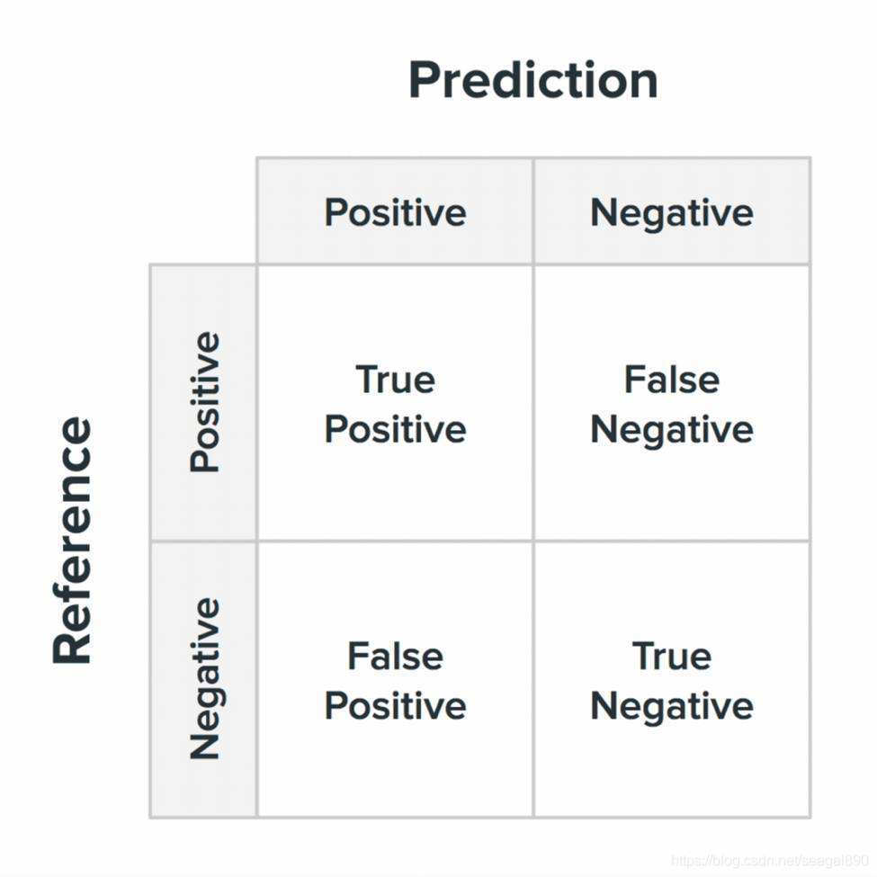

> 本文是作者就读于北京邮电大学数据科学与大数据专业复习考试期间整理，内容不全，只记下了关键的八股和公式。

## 一、概论

数据分类

- 依据结构
- 依据形式

DIKW

- data 数据
- information 信息
- knowledge 知识
- wisdom 智慧

5V

- volume 大量
- velocity 高速
- value 价值
- veracity 真实
- variety 多样

数据科学的理论体系

- 计算机科学
- 数学和统计学
- 实质性专业理论知识
- 沟通交流能力

数据科学家所具备的技能

- 通用技能  
  数据分析、数学、统计学、人工智能、机器学习、深度学习、自然语言处理、工程管理、软件工程、计算机科学、沟通能力等
- 技术技能  
  Python，R，SQL，Hadoop，Spark，Java，SAS，C++，TensorFlow等语言、库或是工具

## 二、数学基础

线性代数

- 哈达马积（对应位置元素相乘）
- 克罗内克积（左侧矩阵每个元素与右侧整个矩阵分别相乘）

概率论

- 条件概率公式
  $P(B|A)=\frac{P(AB)}{P(A)}$
- 全概率公式
  $P(A) = \sum_{i=1}^nP(B_i)P(A|B_i)$
- 贝叶斯公式
  $P(A|B) = \frac{P(B|A)P(A)}{P(B)}$

图论

- 连接矩阵
- 关联矩阵  
  对节点和边都编号，竖着的一列是节点，水平一行是边
- 拉普拉斯矩阵  
  度数矩阵-邻接矩阵  
  ☝ 这里度数矩阵是主对角线上是每个节点的度数，其他元素为0

## 三、Python 初步

特性

- 解释型语言
- 交互式语言
- 面向对象的语言

库

- Numpy
- Pandas
- Scipy
- Matplotlib

data types

- numbers
- string
- dictionary
- list
- tupule

## 四、数据预处理

分箱 binning

$3\sigma$ 原则

### 数据规约

- 维归约 Dimensionality reduction
  - PCA 主成分分析
- 数量归约 Quantity specification
  - 参数化数据规约
    - 回归模型
    - 对数线性模型
  - 非参数化数据规约
    - 直方图
    - 聚类
    - 抽样
    - 数据立方体聚集
  - 数据压缩 Data compression

### 数据变换

#### 规范化

**min-max normalization** 最小-最大规范化

对于一项数据x，属性最大值为max，最小值为min，变换到区间[a, b]：

$$
x^{'} = \frac{x - min}{max-min}\cdot(b - a)
$$

**z-score normalization**

z 分数规范化

$$
a^{'}=\frac{x - \bar{x}}{\sigma}
$$

**normalization by decimal scaling**

小数标定规范化

$$
x^{'} = \frac{x}{10^i},\;\;i\;取使\;max(|x^{'}|)<1\;的最大值
$$

#### 离散化

- 非监督离散化
  - 等宽算法
  - 等频算法
  - K-means聚类算法
- 监督离散化
  - ChiMerge算法
  - 基于熵的离散化方法

## 五、分析方法

### 分类模型

#### 决策树

构造分为三部分

1. 特征选择
2. 决策树的生成
   1. 特征 A 的信息增益 $gain(A) = entropy(D) - entropy(D|A)$
3. 决策树的剪枝

#### KNN

#### 朴素贝叶斯

当数据非常大，特征很多且具有一致的先验概率（各个类别的发生概率）时，该方法非常有效。
贝叶斯公式：

$$
P(B|A) = \frac{P(A|B)P(B)}{P(A)}
$$

在分类算法中：

$$
P(类别|特征) = \frac{P(特征|类别)P(类别)}{P(特征)}
$$

其中等式右边的量均可通过训练集计算得到

#### 支持向量机 SVM

### 模型性能评估

模型评估方法：留出法、交叉验证法和自助法

**混淆矩阵**

准确率 Accuracy: $\frac{TP+TN}{TP+FN+FP+TN}$

精确率 Precision: $\frac{TP}{TP+FP}$

召回率 Recall: $\frac{TP}{TP+FN}$

F1 Score: $\frac{2\cdot Percision \cdot Recall}{Percision + Recall}$

## 七、数据科学的重要研究领域

文本分析包含哪些任务：分词，切词，分类，聚类，信息抽取

### 网络结构分析

#### 节点中心性

> 下列 n 为节点总数，$d_p(a,b)$ 为节点 a 到 b 的最短路径

1. 度中心性

   $$
   C_D=\frac{degree(v)}{n-1}
   $$

2. 紧密中心性
   $V\backslash v$ 就是集合 V 中去掉元素 v 的子集

   $$
   C_C = \frac{\sum_{t\in V\backslash v}d_p(v,t)}{n-1}
   $$

3. 中介中心性

   $$
   C_B=\frac{\sum_{j\neq k\neq v \in V}|d_p^v(j,k)|}{d_p(j,k)}
   $$

4. $$
   全局聚集系数=\frac{|闭三元组|}{|闭三元组|+|开三元组|}
   $$

5. 局部聚集系数

   $$
   C(v_i) = \frac{2\cdot e_{jk}}{D(v_i)(D(v_i)-1)}
   $$

   其中 $e_{jk}$ 是 $v_i$ 的邻接节点相互连接的边数，$D(v_i)$ 是节点 $v_i$ 的邻接点个数

6. 网络密度
   $$
   d(g) = \frac{2M}{N(N-1)}
   $$
   其中 M 为边数，N 为节点数。

## 八、大数据处理技术

### 云计算

三类云计算服务及其特点

- IAAS 基础设施即服务
- PAAS 平台即服务
- SAAS 软件即服务

四类部署方式

- 公有云
- 社区云
- 私有云
- 混合云

Hadoop 生态系统重要组成部件

- HDFS 文件系统
- MapReduce 计算模型
- YARN 资源管理器
- Hive 数据仓库工具
- Mahout 机器学习库

Spark 及其生态

- 弹性分布数据集(Resilient Distributed Dataset，RDD)是 Spark 软件系统的核心概念，它是一个容错的、不可更新的(Immutable)分布式数据集，支持并行处理。
