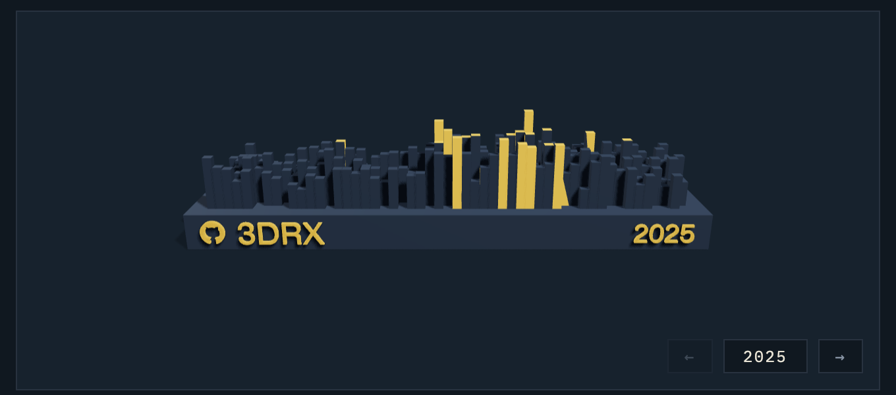
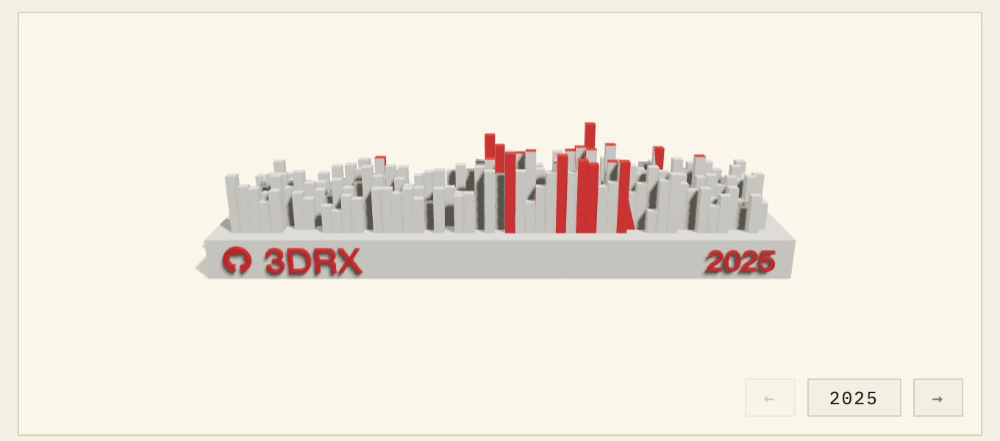

My About page used to show a single GitHub Skyline model from 2023 — a glTF I
had downloaded from [skyline.github.com](https://skyline.github.com) back then.
Three years later it was both out of date and rendered with a truly cursed
lighting setup (a directional light at intensity 5 plus a point light at 8000 —
everything blown out white). So I rebuilt the whole thing: fresh models for
2023–2025, a carousel to flip between years, proper studio lighting, and a
two-tone color scheme where the embossed text and my 20 busiest days glow in
the site's accent color. This post is about how it works.



## Getting the models: gh-skyline

The original skyline.github.com site is more or less abandoned, but GitHub
released an official CLI extension that does the same thing locally:
[github/gh-skyline](https://github.com/github/gh-skyline). Generating a model
is one command:

```bash
gh extension install github/gh-skyline
gh skyline -y 2025 -o 3DRX-2025.stl
```

The output is a binary STL — ~480k triangles, **24MB per year**. Way too heavy
to ship to a browser.

## Problem 1: 24MB is not a web asset

STL stores every triangle as 3 independent vertices ("triangle soup") — no
index buffer, so shared corners are duplicated. My converter
([scripts/stl2glb.mjs](https://github.com/3DRX/3DRX-blog/blob/9ffe525df61a1e7094fac9224d85d6e87af89f9f/scripts/stl2glb.mjs))
welds identical vertices (keyed by their raw float32
bit patterns) into an indexed `BufferGeometry`, which alone collapses 483k
triangles into ~221k unique vertices, and exports GLB via three.js
`GLTFExporter`. Then [`gltfpack`](https://meshoptimizer.org/gltf/) applies
quantization + meshopt compression:

```
STL 24MB  ->  indexed GLB ~13MB  ->  gltfpack -cc  ~1.8MB
```

One gotcha: `GLTFExporter` runs in Node fine, except it wants a `FileReader`
for the binary packing step — a 15-line shim over `Blob.arrayBuffer()` fixes
that.

On the frontend, `GLTFLoader` + three's `MeshoptDecoder` handles the
compressed files transparently.

## Problem 2: coloring only the text and the busiest days

I wanted the model to be mostly a subtle relief in the page's background
color, with the GitHub logo, username, year, and the tallest pillars picked
out in the accent color. But `gh-skyline` hands you **one merged mesh** — no
materials, no metadata, nothing to select by.

So the converter classifies triangles geometrically. After poking at the
model's bounding box and area histograms, the layout turns out to be:

- base plate: a slab spanning `z ∈ [-10, 0]`
- text: embossed on the front face (`y = 0`), protruding 1mm outward
- pillars: boxes rising from `z = 0`

Which gives simple rules:

1. **Text**: centroid beyond the front plane (`y < -ε`) and inside the base
   slab (`z < ε`). The surprise here: **~400k of the 480k triangles are text**.
   The GitHub logo and glyphs are tessellated absurdly finely compared to the
   boxes.
2. **Pillars**: upward-facing triangles above the base top (`n.z > 0.9`,
   `z > ε`) clustered by centroid distance — each pillar's two top triangles
   land in one cluster — then side faces join the nearest cluster. The 20
   tallest clusters are the "top 20 days".
3. Everything else is the base.

The two groups are exported as two meshes. But how does the frontend know
which is which after compression? Mesh names might not survive `gltfpack`, so
I tag them with a **sentinel material color**: the accent mesh gets pure red
(`0xff0000`), the base gets white. Material colors do survive compression, so
at load time it's just:

```ts
gltfScene.traverse((o) => {
  if (o.isMesh) {
    const isAccent =
      o.material.color.r > 0.9 &&
      o.material.color.g < 0.1 &&
      o.material.color.b < 0.1;
    o.material = isAccent ? accentMaterial : baseMaterial;
  }
});
```

## Problem 3: making it look good (and theme-aware)

The site's light and dark themes use different accent colors (vermillion 朱砂
on rice paper, imperial gold 雌黄 on indigo 黛蓝), and the model should
follow. Instead of hardcoding hex values in the scene, the materials read the
actual CSS custom properties, and re-read them on every theme toggle:

```ts
const cssVar = (name: string) =>
  getComputedStyle(document.documentElement).getPropertyValue(name).trim();

baseMaterial.color.set(cssVar("--model-base"));   // relief, close to the card bg
accentMaterial.color.set(cssVar("--accent"));     // vermillion / gold
accentMaterial.emissive.set(cssVar("--accent"));  // slight glow at night
```

Lighting is a studio rig instead of the old blowout special: a shadow-casting
key light (2048px PCF soft shadows, so pillars cast onto each other and the
base plate), a hemisphere fill, a rim light for edge separation, ACES filmic
tone mapping, and an invisible `ShadowMaterial` plane under the model so it
sits on a soft contact shadow instead of floating.



## The carousel

Three years of models live in one scene, all preloaded. The controls are a
bounded strip — it opens on the latest year and doesn't wrap around; the
arrow that would run off the end simply disables. Switching years plays a
slide transition driven from the render loop (ease-in-out cubic, ~550ms),
with the buttons locked while a transition is in flight. The controls float
in the bottom-right corner of the canvas card so they don't take up layout
space.

One small UX decision: the model does **not** auto-rotate. It rests with the
`@3DRX` + year face toward the camera, with only a subtle mouse parallax on
top — perpetual spinning is fun for exactly one second, then it's just the
back of some buildings.

## Making it repeatable

All of this is packed into one command so future-me can add 2026 without
re-deriving any of it:

```bash
npm run skyline -- 2026
```

That runs `gh skyline` → STL→GLB split → `gltfpack` → drops the file in
`public/`, and inserts the year into the `YEARS` list in the component
(sorted, deduplicated). The full write-up lives in
[`docs/skyline.md`](https://github.com/3DRX/3DRX-blog/blob/main/docs/skyline.md)
of the repo.
