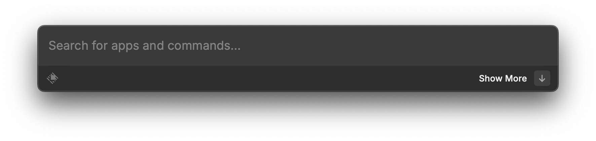
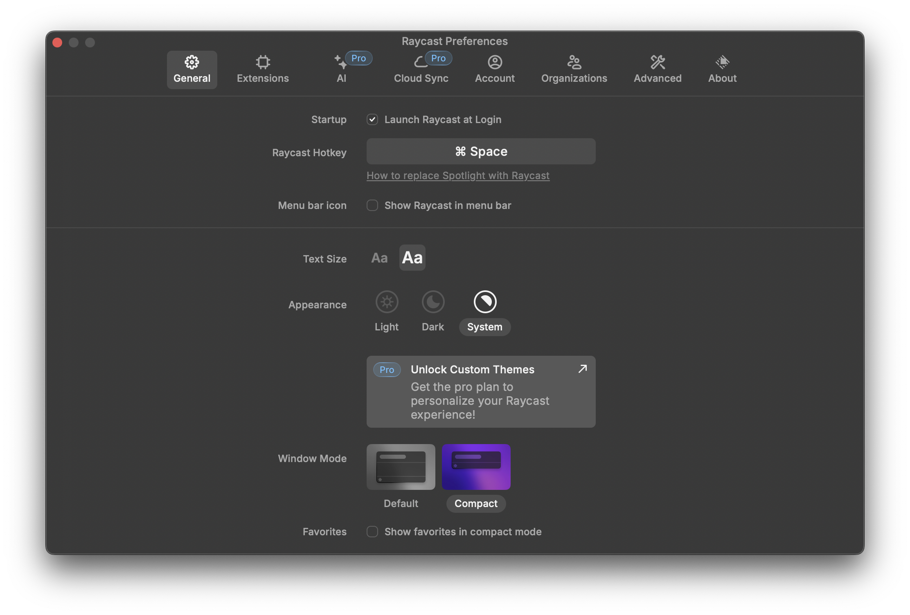

[Raycast](https://www.raycast.com/) is a launcher similar to [Alfred](https://www.alfredapp.com/),
which both functions as a spotlight alternative,
but Raycast is built with web technology and supports 3rd party plugins.
I have been using Alfred since I begin to use macOS, and I'm used to doing simple calculation, launch
apps and entering google search prompt using a small window that pops up by `cmd + space`.
This is a good experience and I like the concept that it can replace a lot of operations on mouse to
several keystrokes, which is almost always faster and smoother.

Due to my laziness, I've heard about Raycast quite some times ago, but I haven't dived deep into it.
But now, I replaced Alfred with Raycast, and I'm glad I did. There are 3 main reasons:
1. Much better UI style, and I don't think I need to explain this anymore.
2. Supports 3rd party plugins, and I might make one myself to suit my workflow.
There are [well documented API](https://github.com/raycast/extensions) to create extensions.
I first saw [Ant Fu](https://antfu.me/) did a stream which he created a Raycast plugin live,
and I thought it's pretty cool.
3. Good enough free tier. In Alfred, simple things such as executing commands are in the paid tier,
which is reasonable since it's a great productivity tool, but imo Raycast did a better tier division
by putting advanced features such as AI into the paid tier, and basic features are all free.

## My Configurations

I disabled many built-in extensions, and this is what I left with:
- Applications
- Calculator
- Quicklinks
- Raycast Preferences
- Script Commands
- System -> Eject All Disks

And since I'm going for a minimalistic desktop experience,
I also unchecked "Show Raycast in menu bar", and select Compact window mode.

I also discovered that I can set individual hot key for each searchable items
(command, applications, etc ...), which is surprisingly useful. Now I can finally have a consistent
experience (between Gnome I use on my Debian 12 machine and my Mac)
with the same global hotkeys of opening terminal and browser.

## My Thoughts

Raycast is great, but I think features such as AI, Cloud Sync and Organizations are weird.
Maybe this is because I didn't realize how useful they can be, but I don't think these
features are worth the extra weight and bloat. After all, why would anyone want their
fuzzy finding quick launcher to be synced with cloud and other people and packed with LLM chat?
