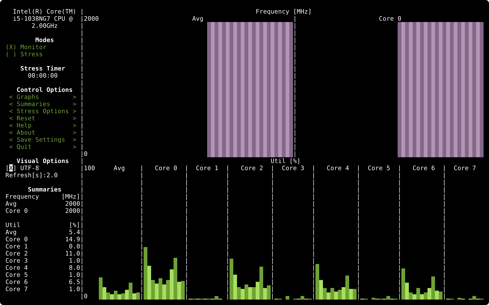

> The Stress Terminal UI: s-tui https://github.com/amanusk/s-tui

## Feature

- Monitoring your CPU temperature/utilization/frequency/power
- Shows performance dips caused by thermal throttling
- Requires no X-server
- Built-in options for stressing the CPU (stress/stress-ng/FIRESTARTER)

## Installation

Basic monitoring feature: `pip3 install s-tui` or `pip install s-tui` or `sudo apt install s-tui`

For stress feature: `sudo apt install stress`

## Configuration

Config file is located at `~/.config/s-tui/s-tui.conf`
