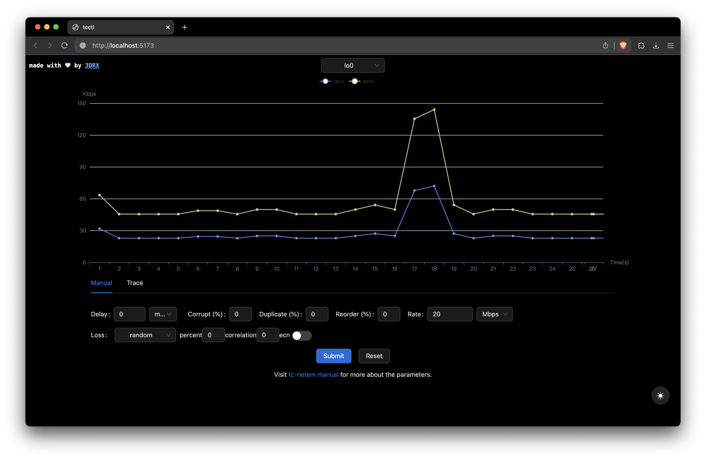

> https://github.com/3DRX/tcctl

<!--toc:start-->

- [Install & Run](#install-run)
- [Usage](#usage)
  - [Manual Mode](#manual-mode)
  - [Trace File Mode](#trace-file-mode)
  <!--toc:end-->

## Install & Run

> The following operations should be taken as root user.

1. Download release .zip on OpenWrt and decompress it to /root/tcctl
    - [tcctl-0.2.0-arm64.zip](https://github.com/3DRX/tcctl/releases/download/0.2.0/tcctl-0.2.0-arm64.zip)
    - [tcctl-0.2.0-x86_64.zip](https://github.com/3DRX/tcctl/releases/download/0.2.0/tcctl-0.2.0-x86_64.zip)
2. Install [tc](https://man7.org/linux/man-pages/man8/tc.8.html), for example, on OpenWrt using opkg:
```
opkg update && opkg install tc-full
```
3. Reboot
4. `cd /root/tcctl && chmod +x ./install.sh && ./install.sh`
5. Done! Go to `http://<host_name>:8080`

## Usage

1. Starts automatically in background when system boots.
2. Monitor network traffic by interface.
3. Apply limitations on **delay**, **corrupt**, **duplicate**, **reorder**, **packet loss**,
and **data rate** via [netem](/blog/gadgets/tc_openwrt).
4. Upload [trace file](#trace-file) and apply limitations according to the trace.
5. Switching between manual mode and trace file mode will reset all shaping rules.
6. It is recommended to connect to tcctl from a port that's not been controlled by itself.

### Manual Mode

Set network shaping parameters by **integer**.
Click "Submit" to apply the values, if submit multiple times,
subsequent submissions will override previous ones.
Click "Reset" button to clear all shaping rules to network interface.

### Trace File Mode

Set delay(ms/s), loss(%), rate(Mbps/Kbps) by **floating point precision**.
Select a NIC before upload trace file, click "Start" button to start playback the network trace.

For example

```
10 1 20
10 1 20
10 1 20
10 1 20
```

describes a trace that have 10 ms delay, 1% packet loss, and 20 Mbps data rate for 4 seconds (each line represents 1 second).
There shouldn't be blank line in trace file.
