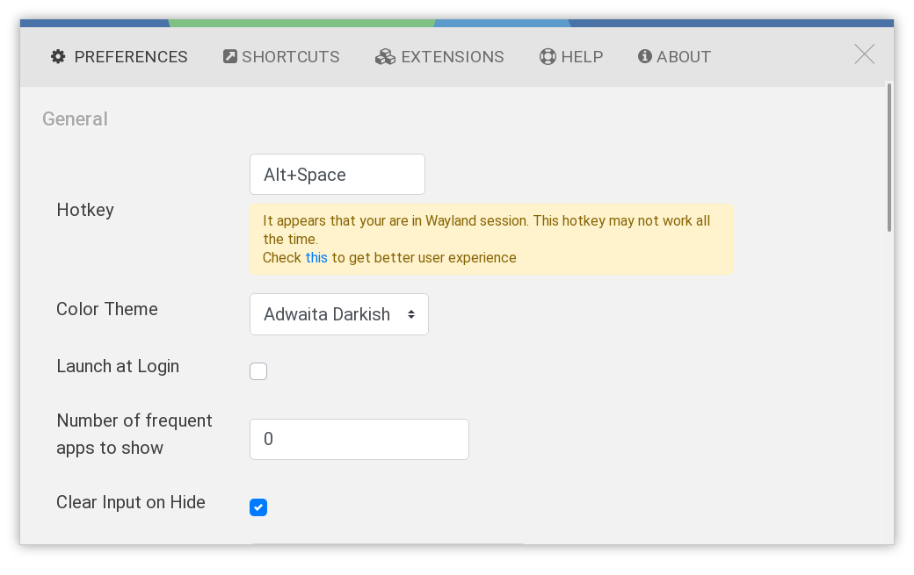

The last piece of my duel os setup (for now) is complete with ulauncher.

I heard this from DHH's tweet and give it a try, and it works.
All I do is to set up the shortcut and use the adwaita darkish
theme.

https://github.com/Ulauncher/Ulauncher

Looking into the project, it's a python application using
Gtk, and the ui is developed in vue, rendered using webview.
