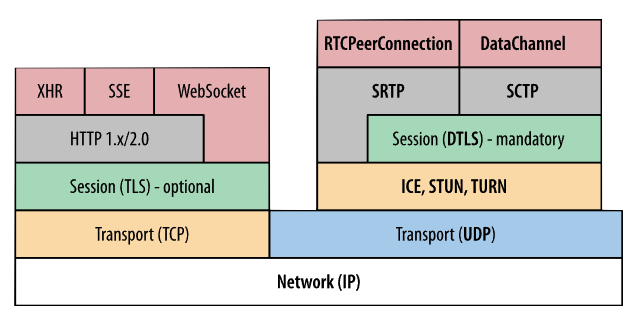

> 本文翻译自 [Replacing WebRTC](https://quic.video/blog/replacing-webrtc/)  
> This is a Chinese translation of [Replacing WebRTC](https://quic.video/blog/replacing-webrtc/)

<!--toc:start-->
- [太长不看](#太长不看)
- [免责声明](#免责声明)
- [为什么选择 WebRTC？](#为什么选择-webrtc)
- [为什么不使用 WebRTC？](#为什么不使用-webrtc)
  - [媒体](#媒体)
  - [数据](#数据)
  - [P2P](#p2p)
  - [SFU](#sfu)
- [替换 WebRTC](#替换-webrtc)
  - [WebCodecs](#webcodecs)
  - [WebTransport](#webtransport)
- [应该如何实现](#应该如何实现)
  - [由队列组成的互联网](#由队列组成的互联网)
  - [检测排队](#检测排队)
  - [降低码率](#降低码率)
- [替换 WebRTC](#替换-webrtc)
- [道阻且长](#道阻且长)
<!--toc:end-->

## 太长不看

如果你在以下场景使用 WebRTC：
- **实时音视频**：MoQ 需要一些时间才能达到可替换 WebRTC 的程度，我们正在努力。
- **数据通路**：WebTransport 很棒，已经能很好的工作。
- **P2P**：在可预见的未来 WebTransport 不会取代 WebRTC。

## 免责声明

我花了近两年时间在 Twitch 上构建/优化了部分 WebRTC 栈，使用了 [pion](https://github.com/pion/webrtc)。
我们的场景相当特殊，最终我们放弃了，但你的情况可能有所不同。

## 为什么选择 WebRTC？

谷歌在 2011 年发布了 WebRTC，以解决一个非常特定的问题：

> 我们如何构建 Google Meet？

那时，网络是一个完全不同的地方。Flash 是进行实时媒体的唯一方式，而且一团糟。HTML5 视频主要用于预录内容。
直到 2015 年，我才编写了一个[用于 Twitch 的 HTML5 播放器](
https://www.reddit.com/r/Twitch/comments/3hqfkw/the_csgo_client_embeds_the_twitch_html5_player/)，
使用了 [MSE](https://developer.mozilla.org/en-US/docs/Web/API/Media_Source_Extensions_API)，
即使在良好的情况下，仍然存在 5 秒以上的延迟。

通过互联网**实时**传输视频是很困难的。

你需要视频编码与网络之间的紧密耦合，以避免任何形式的拥塞，这会增加延迟。
这就强迫我们在 TCP 和 UDP 之间选择后者。
完成了基本的数据传输后，你还需要一个能够处理丢包而不会因丢包导致撕裂或失真的音视频编解码器。

> 因丢包而导致的画面撕裂

谷歌（正确地）确定，通过新的 web 标准逐步解决这些问题是不可能的。
取而代之的方法是创建 [libwebrtc](https://webrtc.googlesource.com/src/)，
这是默认的 WebRTC 实现，随所有浏览器一起发布。
它可以做任何事情，从组网到音视频编解码到数据传输，而且做得相当出色。
这实际上是一项相当了不起的软件工程成就，
特别是谷歌设法说服了苹果与 Mozilla 将完整的媒体/网络栈嵌入到他们的浏览器中。

我最喜欢 WebRTC 的部分是它成功利用了现有的标准。
WebRTC 实际上不是一个协议，而是一系列协议：
[ICE](https://datatracker.ietf.org/doc/html/rfc8445)，
[STUN](https://datatracker.ietf.org/doc/html/rfc5389)，
[TURN](https://datatracker.ietf.org/doc/html/rfc5766)，
[DTLS](https://datatracker.ietf.org/doc/html/rfc6347)，
[RTP/RTCP](https://datatracker.ietf.org/doc/html/rfc3550)，
[SRTP](https://datatracker.ietf.org/doc/html/rfc3711)，
[SCTP](https://datatracker.ietf.org/doc/html/rfc4960)，
[SDP](https://datatracker.ietf.org/doc/html/rfc4566)，
[mDNS](https://datatracker.ietf.org/doc/html/rfc6762)
等。
在这些之上加上一个 [JavaScript API](https://www.w3.org/TR/webrtc/)，你就得到了 WebRTC。

> [图片来源](https://hpbn.co/webrtc/)，这是相当多的协议堆叠在一起。

## 为什么不使用 WebRTC？

如果 WebRTC 完美无缺，我就不会写这篇博客了。核心问题是 WebRTC 不是一个协议，它是一个单体。

WebRTC 做了很多事情，让我们一步步来分解它：

- **媒体**：完整的捕获/编码/网络传输/渲染流水线。
- **数据**：可靠/不可靠链路。
- **P2P**：点对点连接能力。
- **SFU**：一个选择性转发媒体的中继。

### 媒体

WebRTC 媒体栈的设计用途是视频通话，在这个场景下，它做得很好。但当你试图将它用于其他用途时，问题就开始了。

我在 Twitch 的最后一个项目是通过用 WebRTC 替换 HLS 以进行传输来减少延迟。
起初，这似乎是一个不需要思考的选择，但很快就出现了[糟糕的状况](https://quic.video/blog/distribution-at-twitch/)。
最大的问题是用户体验非常糟糕。
Twitch 不需要像 Google Meet 那样具有激进的延迟，但是 WebRTC 是硬编码来妥协于质量的。

总的来说，在 WebRTC 之外定制 WebRTC 是相当困难的。它是一个黑盒，你启动它，如果它起作用则以。
如果它不起作用，那么你就必须痛苦地 fork libwebrtc，或者只是希望谷歌为你修复它。

WebRTC 作为一套协议有一些调整余地，我确实享受了摆弄 [pion](https://github.com/pion/webrtc) 的时光。
但你最终还是受限于浏览器的实现，除非你不需要 web 支持，则你就不需要 WebRTC。

### 数据

WebRTC 还有一个数据通路 API，这是非常有用的，因为[直到最近](TODO)，
它一直是从浏览器发送/接收“不可靠”消息的唯一方法。
事实上，许多公司使用 WebRTC 数据通路来绕开 WebRTC 的媒体堆栈 (例如 Zoom)。

我也走过这条路，尝试将每个视频帧作为不可靠消息发送，但由于 [SCTP](https://www.rfc-editor.org/rfc/rfc9260.html)
存在根本性缺陷，它不起作用。我不会在这篇文章中详细说明，但最终我通过将帧拆分为小于 MTU 大小的不可靠消息，
将“数据报”支持的功能 hack 到了 SCTP 中。

终于！浏览器中的“UDP”，但代价是什么：

- 一个复杂的握手，至少需要 10 个 rtt（你没看错）。
- 2 倍的数据包，因为 libsctp 立即发送每个“数据报文”。
- 一个自定义的 SCTP 实现，这意味着浏览器一次只能发送一个“数据报文”。

这些都是巨大的缺陷。

### P2P

WebRTC 最好同时也是最糟糕的部分是它支持P2P。

[ICE 握手](https://developer.mozilla.org/en-US/docs/Web/API/WebRTC_API/Connectivity) 极其复杂，即使从
[应用程序的角度来看](https://developer.mozilla.org/en-US/docs/Web/API/WebRTC_API/Signaling_and_video_calling)
也是如此。不详细介绍，但你需要处理基于网络拓扑的各种排列组合。
一些网络会阻止 P2P（例如对称 NAT），而另一些网络则直接阻止 UDP，迫使你在
[相当大的一部分时间](https://twitter.com/HCornflower/status/894600051506515968) 使用 TURN。

大多数视频通话的解决方案仍然是客户端-服务器架构，依赖于自己的私有网络而不是公共传输（也就是 CDN）。
然而，服务器仍然被迫执行复杂的 ICE 握手，这对架构有重大影响，但我将其保留到另一篇博客文章中。

请注意，也有关于 [P2P WebTransport](https://w3c.github.io/p2p-webtransport/)
和 [P2P QUIC](https://datatracker.ietf.org/doc/draft-seemann-quic-nat-traversal/) 的讨论，但我不会抱有太大兴趣。

### SFU

WebRTC 使用 SFU（选择性转发单元）进行扩展。

> [图片来源](https://blog.livekit.io/scaling-webrtc-with-distributed-mesh/)，参会者向 SFU 服务器而不是互相收发数据。

SFU 的问题很微妙：它们是定制的。

需要大量的业务逻辑来确定向何处转发数据包。
像图表中那样的单个服务器无法扩展，所有参与者也不会都位于同一地理位置。
因此每个 SFU 需要通过某种方式知道网络拓扑和每个参与者的位置。

此外，一个好的 SFU 将避免基于依赖关系丢弃数据包，否则你将浪费带宽在无法解码的数据包上。
不幸的是，确定这一点需要分别对每个编解码标准解析每个 RTP 数据包。
例如，这里是一个用于 libwebrtc 的 [h.264 解包器](
https://webrtc.googlesource.com/src/+/refs/heads/main/modules/rtp_rtcp/source/video_rtp_depacketizer_h264.cc)。

但在 Twitch 的最大问题是 SFU 与 CDN 几乎没有共同之处。
一组人正在优化 WebRTC，另一组人正在优化 HTTP，但他们各自的优化并不能让对方收益。

这就是为什么 HLS/DASH 使用 HTTP 而不是 WebRTC 的原因：**规模效益**。

## 替换 WebRTC

对 WebRTC 的缺点已经描述到位了，现在让我们修复它。

首先，WebRTC 不会消失。它在设计用于的领域做得非常出色：会议。
其他技术要想能够达到与 WebRTC 相同的功能/延迟，还需要很长时间。

在你可以替换 WebRTC 之前，你需要 WebSupport。幸运的是，我们现在有了 WebCodecs 和 WebTransport。

### WebCodecs

[WebCodecs](https://developer.mozilla.org/en-US/docs/Web/API/WebCodecs_API) 是浏览器中进行媒体编解码的新 API，
它非常简单：
1. 通过 canvas 或 媒体设备 捕获输入。
2. [VideoEncoder](https://developer.mozilla.org/en-US/docs/Web/API/VideoEncoder)：输入原始帧，输出编码帧。
3. 以某种方式传输这些帧。（例如 [WebTransport](TODO)）
4. [VideoDecoder](https://developer.mozilla.org/en-US/docs/Web/API/VideoDecoder)：输入编码帧，输出原始帧。
5. 通过 canvas 渲染输出，或者看着像素数据乐。

问题在于应用程序需要负责所有的时序。
这意味着你需要通过
[requestAnimationFrame](https://developer.mozilla.org/en-US/docs/Web/API/window/requestAnimationFrame)
选择何时渲染每个视频帧。需要通过 [AudioWorklet](https://developer.mozilla.org/en-US/docs/Web/API/AudioWorklet)
选择何时渲染每个音频采样。

好处是，现在您的 Web 应用程序可以完全控制如何渲染媒体。
现在可以实现类似 WebRTC 的行为，例如暂时冻结视频和音画异步。

在 [caniuse](https://caniuse.com/webcodecs) 查看当前 WebCodecs 的浏览器支持情况。

### WebTransport

[WebTransport](https://developer.mozilla.org/en-US/docs/Web/API/WebTransport_API)
是在网络上传输数据的新 API。你可以把它想成 WebSockets，但有一些关键区别：
- **[QUIC](https://www.rfc-editor.org/rfc/rfc9000.html)** 而不是 TCP。
- **[可靠流](https://developer.mozilla.org/en-US/docs/Web/API/WebTransport_API#reliable_transmission_via_streams)**
按顺序传递。
- **半可靠流** 通过关闭流（带有错误代码）来丢弃尾部。
- **[不可靠流](https://developer.mozilla.org/en-US/docs/Web/API/WebTransport/datagrams)**
报文在拥塞期间可能会被丢弃。

QUIC 有太多的优点可供列举，但是一些亮点包括：
- 完全加密
- 拥塞控制（对非可靠数据报文也是如此）
- 独立的流（无队头阻塞）
- 1-RTT 握手
- 在单个 UDP 端口上多路复用
- 透明的网络迁移（例如从 Wifi 切换到 LTE）
- 用于 HTTP/3

其中最后一个是非常重要的：WebTransport 将共享 HTTP/3 收到的所有优化。
一个 HTTP/3 服务器可以通过同一个连接同时为多个 WebTransport 会话和 HTTP 请求提供服务。

检查 [caniuse](https://caniuse.com/webtransport) 查看当前浏览器支持情况。
对于服务器和原生客户端，请使用我的 Rust 库！

## 应该如何实现

好了，我们有了 WebCodecs 和 WebTransport，但它们真的有用吗？

我之前提到过延迟背后的秘密：避免队列。
在媒体流程的任何点都可能发生排队。

| Capture/Encode | Send/Receive | Decode/Render |
| :------------: | :----------: | :-----------: |
|      -->       |     -->      |      -->      |

让我们从容易的开始，[WebCodecs](#webcodecs) 允许我们几乎完全避免排队。

| Capture/Encode | Send/Receive | Decode/Render |
| :------------: | :----------: | :-----------: |
| **WebCodecs**  |      ?       | **WebCodecs** |

棘手的部分是网络中间的这一部分。举起手并宣称“UDP 没有队列！”并不是那么简单。

### 由队列组成的互联网

一个比喻：互联网由[一系列管子](https://en.wikipedia.org/wiki/Series_of_tubes)组成，你将数据从一侧放入，
最终其从另一侧出来。这个部分将在将来的一篇博客文章中详细介绍，但在那之前，让我们简单地概括一下。
你所发送的每个数据包都会与互联网上的其他数据包竞争，下面是一个大致（但不 100 % 准确）的情况。

- 如果路由器的吞吐量足够大，数据包将准时到达。
- 如果路由器的吞吐量有限，数据包将排队。
- 如果队列已满，数据包将被丢弃。

可能会出现随机数据包丢失，但我们99%的时间关心的是由于排队而导致的丢包。
请注意，甚至（UDP）数据报文也可能会被网络排队，大量数据包永远不是答案。

### 检测排队

拥塞控制的目标是检测排队并减少发送量。

不同的拥塞控制算法使用不同的信号来检测排队。
这是一个研究量巨大的话题的粗略概述，但它是一个大致的分析：

|    Signal    | Description                      |                      Latency                      |                                                          Examples                                                          |
| :----------: | :------------------------------- | :-----------------------------------------------: | :------------------------------------------------------------------------------------------------------------------------: |
| Packet Loss  | 持续发送，直到因队列满而丢包     | [High](https://en.wikipedia.org/wiki/Bufferbloat) |       [Reno](https://en.wikipedia.org/wiki/TCP_congestion_control), [CUBIC](https://en.wikipedia.org/wiki/CUBIC_TCP)       |
|  ACK Delay   | 通过 ACK RTT 间接估计队列大小    |                      Medium                       |                      [BBR](https://research.google/pubs/pub45646/), [COPA](https://web.mit.edu/copa/)                      |
| Packet Delay | 通过包 RTT 间接估计队列大小      |                        Low                        | [GCC](https://datatracker.ietf.org/doc/html/draft-ietf-rmcat-gcc-02), [SCReAM](https://github.com/EricssonResearch/scream) |
|     ECN      | 接收来自网络底层设备的信息而退避 |                      None\*                       |                                      [L4S](https://datatracker.ietf.org/doc/rfc9330/)                                      |

没有在任何情况下表现都最优的拥塞控制算法，其表现取决于应用场景、网络以及目标延迟。
因为 WebRTC 有 [transport-wide-cc](
https://webrtc.googlesource.com/src/+/refs/heads/main/docs/native-code/rtp-hdrext/transport-wide-cc-02/README.md)
，所以其在这方面更有优势。

### 降低码率

在检测到队列拥塞发生后，应用需要发送更少的数据。

在某些情况下，我们可以直接降低编码器的比特率，但是：
- 这只对未来产生的帧有效
- 我们不希望所有的接收端画质都下降（多个接收端的情况）
- 对每一个接收者单独编码的开销过大

所以，在这种场景下为应对拥塞，我们只剩下一种选择：丢弃已经编码后的包。

TCP 此时会有基本问题，因为一旦一些数据在 TCP socket 中开始排队了，它们在这个连接被关闭之前不能被撤回。
不可能把挤出来的牙膏塞回去。

但是，在 WebTransport 中，有多种丢弃数据的方式：
1. 使用非可靠数据报文并选择哪些会被传输（像 WebRTC 中一样）
2. 使用 QUIC streams 并中途关闭以停止传输（像
[RUSH](https://www.ietf.org/archive/id/draft-kpugin-rush-00.html) 一样）
3. 使用 QUIC streams 并为他们划分优先级（像
[Wrap](https://www.youtube.com/watch?v=PncdrMPVaNc) 一样）

我有偏见，因为第三个是我做的。
WebTransport 的 sendOrder 可以用于指示 QUIC 栈在拥塞期间应该发送什么。但这又需要一篇完整的博客文章来解释。

## 替换 WebRTC

但要真正替代 WebRTC，我们需要一个标准。任何人都可以制定自己的基于 UDP 的协议（他们确实这样做了），
利用这种新的 Web 技术（他们也将这样做）。

[Media over QUIC](https://datatracker.ietf.org/wg/moq/about/)
之所以与众不同，是因为我们是通过 IETF 进行的，这是一个标准化了 WebRTC 以及几乎每个互联网协议的组织。

这将需要几年时间。  
这将需要像我这样的很多 SB，我们想要替换 WebRTC。  
这将需要很多公司愿意押注于一个新的标准。  

而且，WebCodecs 和 WebTransport 都存在重大缺陷，这些缺陷在我们达到 WebRTC 平衡之前仍然需要解决。

举几个例子：

- 我们需要浏览器中有[更好的拥塞控制](https://www.w3.org/TR/webtransport/#dom-webtransportoptions-congestioncontrol)。
- 我们需要 QUIC 中类似于 transport-wide-cc 的东西：比如[这个提案](https://www.ietf.org/archive/id/draft-smith-quic-receive-ts-00.html)
- 我们可能需要在 [WebAudio](https://developer.mozilla.org/en-US/docs/Web/API/Web_Audio_API) 中实现回声消除，这可能是可能的吗？
- 我们可能需要在 QUIC 中实现
[FEC](https://en.wikipedia.org/wiki/Error_correction_code#Forward_error_correction)：就像
[这个提案](https://datatracker.ietf.org/doc/draft-michel-quic-fec/)
- 我们可能需要更多的编码选项，比如非参考帧或 SVC。
- 还有完整的浏览器支持：[WebCodecs](https://caniuse.com/webcodecs) - [WebTransport](https://caniuse.com/webtransport)

## 道阻且长

原文作者：[@kixelated](https://github.com/kixelated)  
社群：[Discord](https://discord.gg/FCYF3p99mr)  
MoQ(Media over QUIC) 项目 Github: [moq-rs](https://github.com/kixelated/moq-rs)，
[moq-js](https://github.com/kixelated/moq-js)
