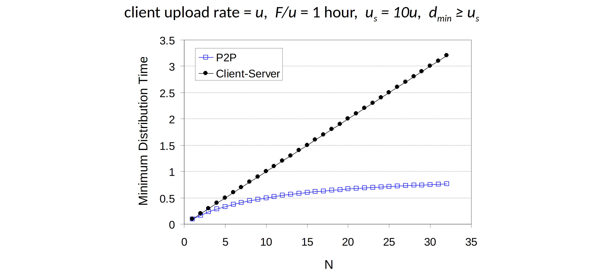

<!--toc:start-->
- [Principles of network applications](#principles-of-network-applications)
  - [Internet transport protocols services](#internet-transport-protocols-services)
- [Web and HTTP](#web-and-http)
  - [HTTP: two types](#http-two-types)
  - [Web cache aka proxy server](#web-cache-aka-proxy-server)
  - [HTTP generation](#http-generation)
    - [HTTP/1](#http1)
    - [HTTP/2](#http2)
    - [HTTP/3](#http3)
- [DNS](#dns)
  - [DNS name resolution](#dns-name-resolution)
    - [Iterated query](#iterated-query)
    - [Recursive query](#recursive-query)
  - [DNS records](#dns-records)
- [P2P applications](#p2p-applications)
  - [File distribution](#file-distribution)
    - [Real-world example of P2P file distribution: BitTorrent](#real-world-example-of-p2p-file-distribution-bittorrent)
- [Video streaming and CDN](#video-streaming-and-cdn)
  - [Streaming stored video](#streaming-stored-video)
  - [CDN](#cdn)
<!--toc:end-->

## Principles of network applications

**An application-layer protocol defines**:
- types of messages exchanged
- message syntax
- message semantics
- rules for when and how to send & response to messages

### Internet transport protocols services

**TCP**:
- reliable transport
- flow control
- congestion control
- connection-oriented

**UDP**:
- unreliable data transfer
- state-less

## Web and HTTP

### HTTP: two types

**Non-persistent HTTP**:
1. TCP connection opened
2. at most one object sent over TCP connection
3. TCP connection closed

**Persistent HTTP**:
1. TCP connection opened to a server
2. multiple objects can be sent over single TCP
3. TCP connection closed

**Maintaining user-server state**: cookies

### Web cache aka proxy server


performance:
- much lower access link utilization
- much shorter end-end delay

### HTTP generation

#### HTTP/1


#### HTTP/2


> decreased delay in multi-object HTTP requests  

Reduce HOL blocking by dividing objects into smaller chunks.

#### HTTP/3

Adds security, and per object error/congestion control over UDP.

## DNS

> - **distributed database** implemented in hierarchy of many **name servers**
> - **application-layer protocol**:
hosts, DNS servers communicate to **resolve** names (address/name translation)

**Services**:
- hostname to IP address translation
- host/mail-server aliasing
- load distribution

**Architecture**: distributed, hierarchical database


### DNS name resolution

#### Iterated query

> "I don't know this name, but ask this server."


#### Recursive query

> "I don't know this name, but I will ask it for you."


### DNS records

resource records (RR)

```
(name, value, type, ttl)
```

`type = A`
- `name` is hostname
- `value` is IP address

`type = NS`
- `name` is domain
- `value` is hostname of authoritative name server for this domain

`type = CNAME`
- `name` is alias name for some "canonical"(the real) name
- `www.ibm.com` is really `servereast.backup2.ibm.com`
- `value` is canonical name

`type = MX`
- `value` is name of SMTP mail server associated with `name`

## P2P applications

### File distribution

> client-server vs P2P

**client-server**
- server side
    - time to send 1 copy: $\frac{F}{u_s}$
    - time to send N copy: $N\cdot \frac{F}{u_s}$
- client side
    - $d_{min}$: min client download rate
    - min client download time: $\frac{F}{d_{min}}$
- time to distribute F to N clients: $max(\frac{NF}{u_s}, \frac{F}{d_{min}})$
increases linearly in N

**P2P**
- server side
    - time to send 1 copy: $\frac{F}{u_s}$
- client
    - min client download time: $\frac{F}{d_{min}}$
- clients: aggregate must download NF bits
    - max upload rate: $u_s + \sum{u_i}$
- time to distribute F to N clients:
$max(\frac{F}{u_s}, \frac{F}{d_{min}}, \frac{NF}{u_s + \sum{u_i}})$
which **does not** increases linearly in N



#### Real-world example of P2P file distribution: BitTorrent

- requesting chunks
- sending chunks

## Video streaming and CDN

### Streaming stored video

challenges:
- bandwidth vary over time
- packet loss and delay

### CDN

- stores copies of content at CDN nodes
- user request content, service provider returns manifest
    - client then retrieves content at highest supportable rate
    - may choose different rate or copy if network environment changed

