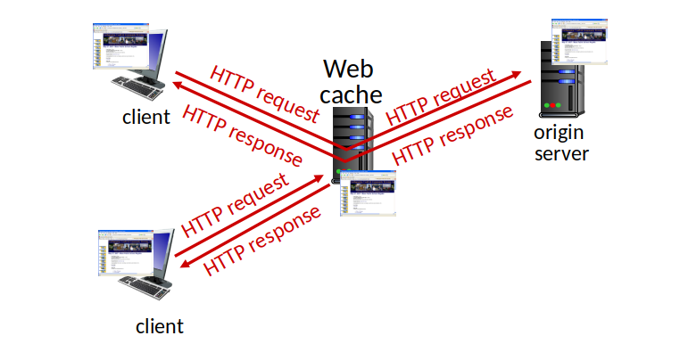
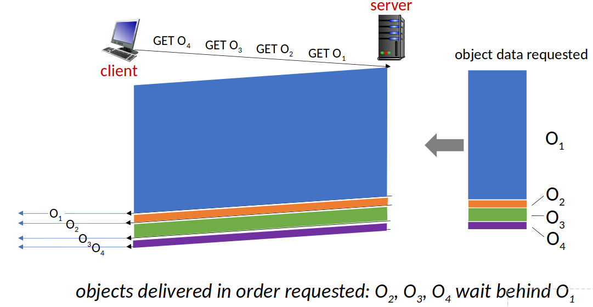
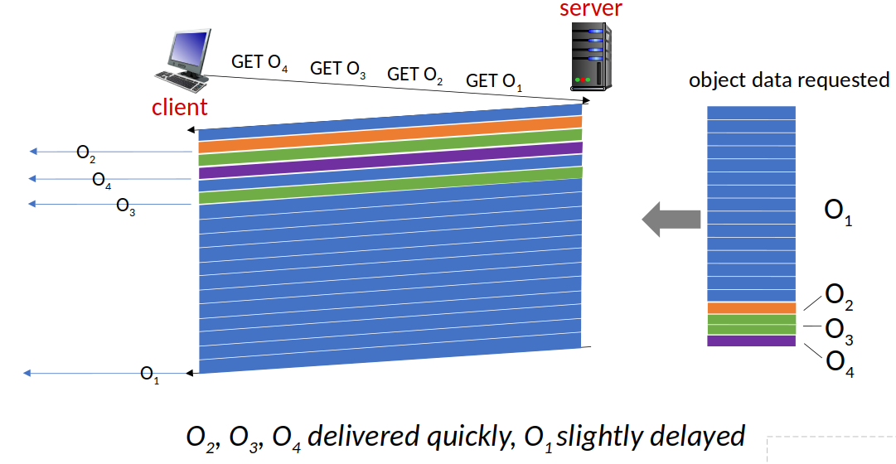
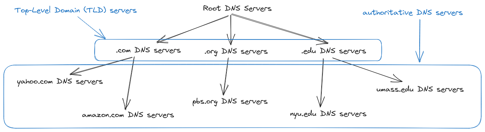
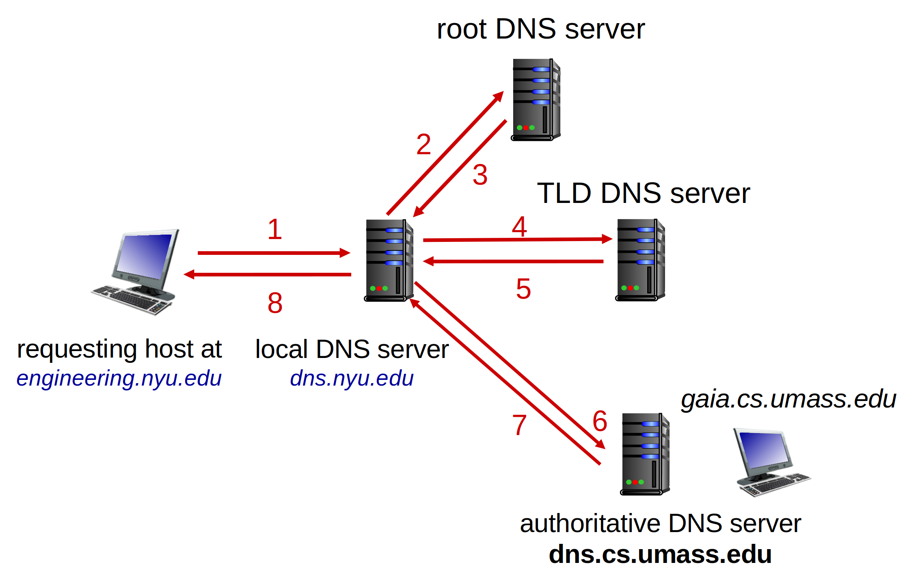
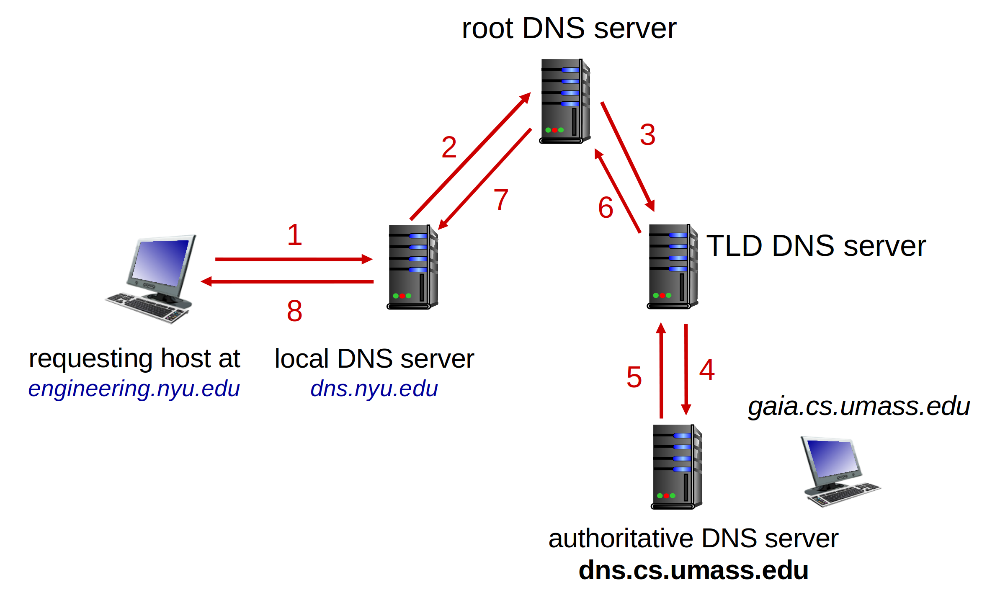

<!--toc:start-->
- [Principles of network applications](#principles-of-network-applications)
- [Web and HTTP](#web-and-http)
- [DNS](#dns)
- [P2P applications](#p2p-applications)
- [Video streaming and CDN](#video-streaming-and-cdn)
- [Socket programming with TCP and UDP](#socket-programming-with-tcp-and-udp)
<!--toc:end-->

## Principles of network applications

**An application-layer protocol defines**:
- types of messages exchanged
- message syntax
- message semantics
- rules for when and how to send & response to messages

### Internet transport protocols services

**TCP**:
- reliable transport
- flow control
- congestion control
- connection-oriented

**UDP**:
- unreliable data transfer
- state-less

## Web and HTTP

### HTTP: two types

**Non-persistent HTTP**:
1. TCP connection opened
2. at most one object sent over TCP connection
3. TCP connection closed

**Persistent HTTP**:
1. TCP connection opened to a server
2. multiple objects can be sent over single TCP
3. TCP connection closed

**Maintaining user-server state**: cookies

### Web cache aka proxy server



performance:
- much lower access link utilization
- much shorter end-end delay

### HTTP generation

#### HTTP/1



#### HTTP/2



> decreased delay in multi-object HTTP requests  

Reduce HOL blocking by dividing objects into smaller chunks.

#### HTTP/3

Adds security, and per object error/congestion control over UDP.

## DNS

> - **distributed database** implemented in hierarchy of many **name servers**
> - **application-layer protocol**:
hosts, DNS servers communicate to **resolve** names (address/name translation)

**Services**:
- hostname to IP address translation
- host/mail-server aliasing
- load distribution

**Architecture**: distributed, hierarchical database



### DNS name resolution

#### Iterated query

> "I don't know this name, but ask this server."



#### Recursive query

> "I don't know this name, but I will ask it for you."



### DNS records

resource records (RR)

```
(name, value, type, ttl)
```

## P2P applications

## Video streaming and CDN

## Socket programming with TCP and UDP

