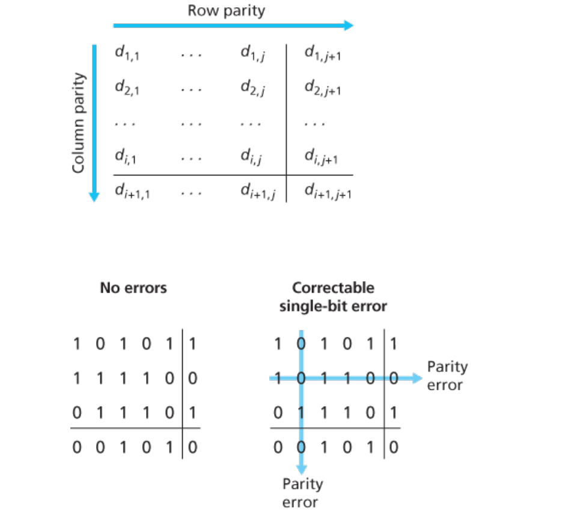
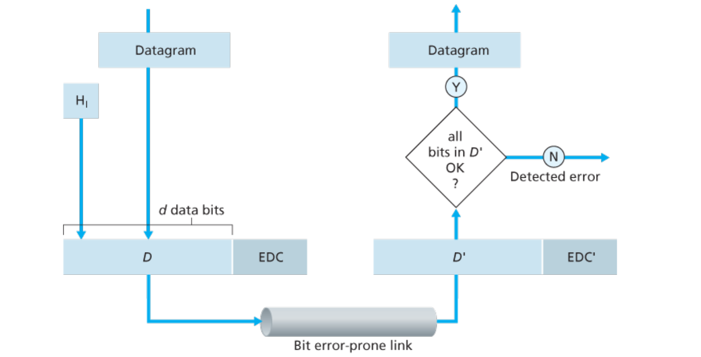
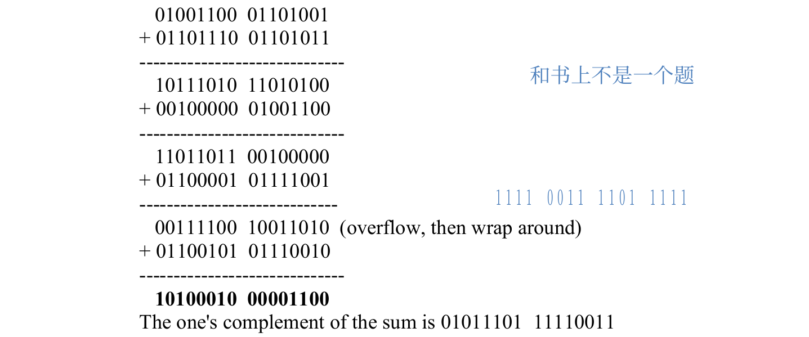
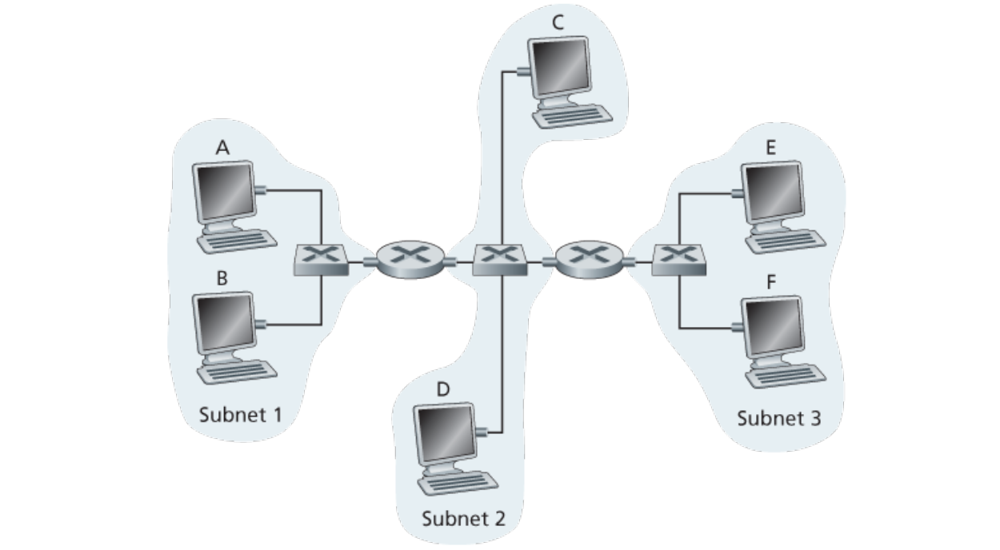
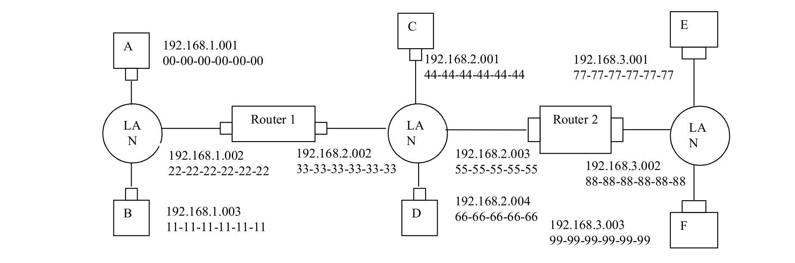

<!--toc:start-->
- [Error detection and correction](#error-detection-and-correction)
  - [Parity checking](#parity-checking)
  - [CRC](#crc)
- [Multiple access protocols](#multiple-access-protocols)
  - [Slotted ALOHA](#slotted-aloha)
  - [Pure ALOHA](#pure-aloha)
  - [CSMA/CD](#csmacd)
- [LAN](#lan)
  - [Addressing: MAC address](#addressing-mac-address)
    - [ARP](#arp)
  - [Ethernet](#ethernet)
  - [Switch](#switch)
    - [Switch vs routers](#switch-vs-routers)
- [Data center networking](#data-center-networking)
- [Exercise](#exercise)
  - [P1](#p1)
  - [P2](#p2)
  - [P3](#p3)
  - [P5](#p5)
  - [P6](#p6)
  - [P7](#p7)
  - [P8](#p8)
  - [P9](#p9)
  - [P12](#p12)
  - [P14](#p14)
  - [P15](#p15)
  - [P16](#p16)
<!--toc:end-->

## Error detection and correction

### Parity checking

- single bit parity: detect single bit errors
- two-dimensional bit parity: detect and correct single bit errors

### CRC

> Cyclic Redundancy Check

See [the exercise section](#exercise).

## Multiple access protocols

> Multiple access protocol is distributed algorithm that determines how nodes share channel,
> i.e., determine when node can transmit. And communication about channel sharing must use channel itself.
> - channel partitioning: TDMA, FDMA, CDMA
> - random access: ALOHA, S-ALOCA, CSMA, CSMA/CD
> - taking turns

### Slotted ALOHA

When node obtains fresh frame, transmits in next slot.
If no collision, node can send new frame in next slot.
If there is a collision, node retransmits frame in each subsequent slot with probability p until success.

**Efficiency**: N nodes with many frames to send, each transmits in slot with probability p
- prob that given node has success in a slot: $p(1-p)^{N-1}$
- prob that any node has a success: $Np(1-p)^{N-1}$
- max efficiency: find $p^*$ that maximizes $Np(1-p)^{N-1}$
- for many nodes, take limit of $Np^*(1-p^*)^{N-1}$ as N goes to $\infty$,
gives: $max \; efficiency = \frac{1}{e}$

### Pure ALOHA

Similar with Slotted ALOHA, but no synchronization. With efficiency of only 18%.

### CSMA/CD

> Carrier sense multiple access, reduces the amount of time wasted in collisons.


**Efficiency**:
- $t_{prop}$: max prop delay between 2 nodes in LAN
- $t_{trans}$: time to transmit max-size frame

$$
efficienty = \frac{1}{1 + 5 \frac{t_{prop}}{t_{trans}}}
$$

Better performance than ALOHA: and simple, cheap, decentralized!

## LAN

### Addressing: MAC address

> 48-bit MAC address, e.g. 1A-2F-BB-76-09-AD

Each interface on LAN has unique MAC address, and a locally unique 32-bit IP address.

#### ARP

> Address resolution protocol: determine interface’s MAC address, knowing its IP address.

### Ethernet

Physical topology: bus connected or switched.


Ethernet is unreliable and connectionless.

### Switch

> A link layer device
> - store, forward Ethernet frames
> - examine incoming frame’s MAC address,
selectively forward frame to one-or-more outgoing links when frame is to be forwarded on segment,
uses CSMA/CD to access segment


Switch forwarding table: stored in the switch, self learning.  
Contains entry: `(MAC addr, interface, TTL)`

#### Switch vs routers

| Switch | Router |
|--------|--------|
| link layer | network layer |
| learn forwarding table using flooding | compute tables using routing algorithms |

## Data center networking

- Border routers
- Tier 1 switches
- Tier 2 switches
- Top of rack switch
- Server racks


**Multipath**: rich interconnection among switches and racks.

---

## Exercise

> From [*Computer Networking: A Top Down Approach 7th Edition*](https://gaia.cs.umass.edu/kurose_ross/online_lectures.htm)

Chapter 6

### P1

*Suppose the information content of a packet is the bit pattern 1110 0110 1001 1101 and an
even parity scheme is being used. What would the value of the field containing the parity bits be
for the case of a two-dimensional parity scheme? Your answer should be such that a minimum
length checksum field is used.*

```
11101
01100
10010
11011
11000
```

### P2

*Show (give an example other than the one in Figure 6.5) that two-dimensional parity checks
can correct and detect a single bit error. Show (give an example of) a double-bit error that can
be detected but not corrected.*



Suppose we begin with the initial two-dimensional parity matrix:

```
0000
1111
0101
1010
```

With a bit error in row 2, column 3, the parity of row 2 and column 3 is now wrong in the
matrix below:

```
0000
1101
0101
1010
```

Now suppose there is a bit error in row 2, column 2 and column 3. The parity of row 2 is
now correct! The parity of columns 2 and 3 is wrong, but we can't detect in which rows
the error occurred!0000

```
0000
1001
0101
1010
```

The above example shows that a double bit error can be detected (if not corrected).

### P3

*Suppose the information portion of a packet (D in Figure 6.3) contains 10 bytes consisting
of the 8-bit unsigned binary ASCII representation of string “Networking.” Compute the Internet
checksum for this data.*





### P5

*Consider the 5-bit generator, G=10011, and suppose that D has the value 1010101010.
What is the value of R?*

If we divide 10011 into 1010101010 0000, we get 1011011100, with a remainder of
R=0100. Note that, G=10011 is CRC-4-ITU standard.

### P6

*Consider the previous problem, but suppose that D has the value*

*a. 1001010101*

1000110000, with a remainder of R=0000.

*b. 0101101010*

0101010101, with a remainder of R=1111.

*c. 1010100000*

1011010111, with a remainder of R=1001.

### P7

*In this problem, we explore some of the properties of the CRC. For the ­generator G(=1001)
given in Section 6.2.3, answer the following questions.*

*a. Why can it detect any single bit error in data D?*

*b. Can the above G detect any odd number of bit errors? Why?*

a.

Without loss of generality, suppose ith bit is flipped, where 0<= i <= d+r-1 and
assume that the least significant bit is 0th bit.
A single bit error means that the received data is K=D*2r XOR R + 2i. It is clear that
if we divide K by G, then the reminder is not zero. In general, if G contains at least
two 1’s, then a single bit error can always be detected.

b.

The key insight here is that G can be divided by 11 (binary number), but any number
of odd-number of 1’s cannot be divided by 11. Thus, a sequence (not necessarily
contiguous) of odd-number bit errors cannot be divided by 11, thus it cannot be
divided by G.

### P8

*In Section 6.3, we provided an outline of the derivation of the efficiency of slotted ALOHA.
In this problem we’ll complete the derivation.*

*a. Recall that when there are N active nodes, the efficiency of slotted ALOHA is
Np(1−p)N−1. Find the value of p that maximizes this expression.*

$$
\begin{align}
E(p) &= Np(1-p)^{N-1} \\
E'(p) &= N(1-p)^{N-1} - Np(N-1)(1-p)^{N-2} \\
      &= N(1-p)^{N-2}((1-p) - p(N-1)) \\

E'(p) &= 0 \Rightarrow p^* = \frac{1}{N}
\end{align}
$$

*b. Using the value of p found in (a), find the efficiency of slotted ALOHA by letting N
approach infinity. Hint: (1−1/N)N approaches 1/e as N approaches infinity.*

$$
\begin{align}
E(p^*) &= N\frac{1}{N}(1-\frac{1}{N})^{N-1} = (1-\frac{1}{N})^{N-1}
= \frac{(1-\frac{1}{N})^N}{1-\frac{1}{N}} \\
\lim_{N \rightarrow \infty}(1-\frac{1}{N}) &= 1 \\
\lim_{N \rightarrow \infty}(1-\frac{1}{N})^N &= \frac{1}{e} \\

Thus: \lim_{N \rightarrow \infty}E(p^*) &= \frac{1}{e}
\end{align}
$$

### P9

*Show that the maximum efficiency of pure ALOHA is 1/(2e). Note: This problem is easy if
you have completed the problem above!*

$$
\begin{align}
E(p) &= Np(1-p)^{2(N-1)} \\
E'(p) &= N(1-p)^{2(N-2)} - Np2(N-1)(1-p)^{2(N-3)} \\
      &= N(1-p)^{2(N-3)}((1-p) - p2(N-1)) \\
E'(p) &= 0 \Rightarrow p^* = \frac{1}{2N-1} \\
E(p^*) &= \frac{N}{2N-1}(1-\frac{1}{2N-1})^{2(N-1)} \\
\lim_{N \rightarrow \infty}E(P^*) &= \frac{1}{2} \cdot \frac{1}{e} = \frac{1}{2e}
\end{align}
$$

### P12

*Graph the efficiency of slotted ALOHA and pure ALOHA as a function of p for the following
values of N:*

*a. N=15*

*b. N=25*

*c. N=35*

```python
import matplotlib.pyplot as plt

def slotted_efficiency(N: int) -> float:
    return (1 - 1/N)**(N - 1)

def pure_efficiency(N: int) -> float:
    return (N / (2*N - 1)) * ((1 - 1/(2*N - 1))**(2 * (N - 1)))

N = [i for i in range(1, 36)]
pure = [pure_efficiency(i) for i in N]
slotted = [slotted_efficiency(i) for i in N]

plt.plot(N, pure, c="orange", label="pure")
plt.plot(N, slotted, c="blue", label="slotted")
plt.title('The efficiency of slotted ALOHA and pure ALOHA')
plt.xlabel('N')
plt.ylabel('efficiency')
plt.legend()
plt.show()
```

![](data:image/png;base64,iVBORw0KGgoAAAANSUhEUgAAAjcAAAHHCAYAAABDUnkqAAAAOXRFWHRTb2Z0d2FyZQBNYXRwbG90bGliIHZlcnNpb24zLjcuMSwgaHR0cHM6Ly9tYXRwbG90bGliLm9yZy/bCgiHAAAACXBIWXMAAA9hAAAPYQGoP6dpAABkfUlEQVR4nO3dfXyN9f8H8Nc5Zzs7u7GzyW6MMaYIczdZI3dZhlLq2y9SzNKUL0UromSoLIkIUSJChUjfItKYkJS73OTemLTNFttsYzfnfH5/XDvHznY2Z9s559rOXs/H43qc63yum/M+l4vz9rm7FEIIASIiIiIHoZQ7ACIiIiJrYnJDREREDoXJDRERETkUJjdERETkUJjcEBERkUNhckNEREQOhckNERERORQmN0RERORQmNwQERGRQ2Fy46ASExOhUCjwzTffyB2KUVFRESZOnIjAwEAolUoMGjQIAJCTk4Pnn38e/v7+UCgUGD9+PC5evAiFQoEVK1ZU6jNWrFgBhUKBixcvWj3+mmrVqlVo1aoVnJ2d4eXlVa1z9erVC7169bJKXPYQFBSEESNGyB1GnVcX/95RzcbkphZRKBQWLYmJiXKHatby5csxe/ZsPPnkk1i5ciVeeeUVAMDMmTOxYsUKjB49GqtWrcKwYcNkjrT2OHXqFEaMGIHg4GAsXboUn376qSxx5OXlYdq0aWbvvS1btmDatGl2j8mczMxMaDQaKBQKnDx50uw+I0aMgIeHxx3PlZubi7fffhvt2rWDm5sbtFotunfvji+++ALmnmqjUCgwduxYs+cyJAcHDhwwu33ixIlQKBQYPHjwHeMi67vT9Tf8Z+yDDz6447n27t2Lxx9/HH5+fnBxcUFQUBBeeOEFJCcnl9l32rRpUCgUyMjIMHuuoKAgPPLII2a3WXKvOzInuQMgy61atcrk/RdffIHt27eXKb/33ntr5M28Y8cONGrUCB9++GGZ8vvvvx9xcXHGMiEEbt68CWdn50p9xrBhwzBkyBC4uLhYJeaaLjExEXq9HvPnz0eLFi1kiyMvLw/Tp08HgDI1P1u2bMGiRYtqRIKzfv16KBQK+Pv7Y82aNXjnnXeqdJ60tDT06dMHJ0+exJAhQzB27FjcunULGzZsQFRUFLZs2YI1a9ZApVJVO2YhBL766isEBQXh+++/x40bN1CvXr1qn5csY83rv2DBAowbNw7NmzfHSy+9hIYNG+LkyZP47LPPsHbtWmzZsgVdu3a1StzWutdrKyY3tcizzz5r8v63337D9u3by5QDqJHJzdWrV802m1y9ehWtW7c2KVMoFNBoNJX+DJVKZZUflNri6tWrAFDt5qi6YvXq1RgwYACaNm2KL7/8ssr/4EdFReHkyZP49ttv8eijjxrLX375ZUyYMAEffPABOnbsiNdff73aMScmJuLvv//Gjh07EBkZiY0bNyIqKqra53Vkubm5cHd3t8q5rHX99+7di/Hjx+OBBx7A1q1b4ebmZtw2evRodOvWDU8++SROnDgBb2/vasdtrXu9tmKzlIPT6/V499130bhxY2g0GvTp0wfnzp0rs9/+/fvRr18/aLVauLm5oWfPnti7d69Fn5Gfn4+4uDi0aNECLi4uCAwMxMSJE5Gfnw/gdpXtzp07ceLECZPmM4VCgaSkJGzevNlYfvHixXL73Jw6dQpPPfUUfHx84OrqipYtW+LNN980bi+v7f/HH39E9+7d4e7ujnr16uHhhx/GiRMnTPYxNEdcuXIFgwYNgoeHB3x8fPDaa69Bp9OVua7z589HSEgINBoNfHx80K9fP2OzQs+ePdG+fXuz16tly5aIjIy843X9+OOP0aZNG7i4uCAgIABjxoxBZmamcXtQUJCxtsvHxwcKhaLC2pHU1FRER0ejcePGcHFxQcOGDfHYY4/dsZ/E1atXMXLkSPj5+UGj0aB9+/ZYuXKlcfvFixfh4+MDAJg+fbrxz3HatGkYMWIEFi1aBMC0WdVAr9dj3rx5aNOmDTQaDfz8/PDCCy/g+vXrJjEIIfDOO++gcePGcHNzQ+/evcv8+d1JcnIydu/ejSFDhmDIkCFISkrCr7/+WqlzANJ/KrZt24YRI0aYJDYG8fHxuPvuuzFr1izcvHmz0ucvbc2aNWjdujV69+6NiIgIrFmzxuJjP//8czz44IPw9fWFi4sLWrdujcWLF5fZz9C8sWfPHnTp0gUajQbNmzfHF198UWbfEydO4MEHH4SrqysaN26Md955B3q93qJ4DH/HLly4gMjISLi7uyMgIAAzZswwacoz/NtQupnT3L8LhnOeP38eAwYMQL169fDMM88AsPz+qkh1rn9Jb7/9NhQKBVauXGmS2ABAcHAw3n//faSkpOCTTz6p0vlLsta9Xpux5sbBvffee1AqlXjttdeQlZWF999/H8888wz2799v3GfHjh3o378/QkNDERcXB6VSafxHcffu3ejSpUu559fr9Xj00UexZ88ejBo1Cvfeey+OHTuGDz/8EGfOnMGmTZvg4+ODVatW4d1330VOTg7i4+MBSM1nq1atwiuvvILGjRvj1VdfBSD9UKenp5f5rKNHj6J79+5wdnbGqFGjEBQUhPPnz+P777/Hu+++W26Mq1atQlRUFCIjIzFr1izk5eVh8eLFeOCBB3D48GEEBQUZ99XpdIiMjERYWBg++OAD/Pzzz5gzZw6Cg4MxevRo434jR47EihUr0L9/fzz//PMoKirC7t278dtvv6Fz584YNmwYYmJicPz4cbRt29Z43B9//IEzZ85gypQpFf65TZs2DdOnT0dERARGjx6N06dPY/Hixfjjjz+wd+9eODs7Y968efjiiy/w7bffYvHixfDw8EC7du3KPed//vMfnDhxAi+99BKCgoJw9epVbN++HcnJySbXoKSbN2+iV69eOHfuHMaOHYtmzZph/fr1GDFiBDIzMzFu3Dj4+Phg8eLFGD16NB5//HE88cQTAIB27dohNzcX//zzj9nmUwB44YUXsGLFCkRHR+Pll19GUlISFi5ciMOHDxu/JwBMnToV77zzDgYMGIABAwbg0KFD6Nu3LwoKCiq8jiV99dVXcHd3xyOPPAJXV1cEBwdjzZo1lW4G+P777wEAw4cPN7vdyckJQ4cOxfTp07F3715EREQYt926dcts/4mcnByz58rPz8eGDRuMfzeefvppREdHIzU1Ff7+/neMdfHixWjTpg0effRRODk54fvvv8d///tf6PV6jBkzxmTfc+fO4cknn8TIkSMRFRWF5cuXY8SIEQgNDUWbNm0ASAly7969UVRUhEmTJsHd3R2ffvopXF1d7xiLgU6nQ79+/XD//ffj/fffx9atWxEXF4eioiLMmDHD4vOUVFRUhMjISDzwwAP44IMPjMmDpfdXeap7/Q3y8vKQkJCA7t27o1mzZmb3GTx4MEaNGoUffvgBkyZNMtl27do1s8eUl1Ra616v1QTVWmPGjBHl/RHu3LlTABD33nuvyM/PN5bPnz9fABDHjh0TQgih1+vF3XffLSIjI4Verzful5eXJ5o1ayYeeuihCmNYtWqVUCqVYvfu3SblS5YsEQDE3r17jWU9e/YUbdq0KXOOpk2biocfftikLCkpSQAQn3/+ubGsR48eol69euLSpUsm+5aM+/PPPxcARFJSkhBCiBs3bggvLy8RExNjckxqaqrQarUm5VFRUQKAmDFjhsm+HTt2FKGhocb3O3bsEADEyy+/XOa7GGLJzMwUGo1GvP766ybbX375ZeHu7i5ycnLKHGtw9epVoVarRd++fYVOpzOWL1y4UAAQy5cvN5bFxcUJACI9Pb3c8wkhxPXr1wUAMXv27Ar369mzp+jZs6fx/bx58wQAsXr1amNZQUGBCA8PFx4eHiI7O1sIIUR6eroAIOLi4sqcs7z7dPfu3QKAWLNmjUn51q1bTcoN1+Phhx82+bN+4403BAARFRVV4XcyCAkJEc8884zJ8Q0aNBCFhYUm+0VFRQl3d/dyzzNo0CABQFy/fr3cfTZu3CgAiI8++shYBuCOyx9//GFynm+++UYAEGfPnhVCCJGdnS00Go348MMPLfrOeXl5ZcoiIyNF8+bNTcqaNm0qAIhffvnFWHb16lXh4uIiXn31VWPZ+PHjBQCxf/9+k/20Wq3J37vyGP6OvfTSS8YyvV4vHn74YaFWq433seHfr507d5ocb+7fBcM5J02aZLKvpfdXRSy9/oa4yvv7deTIEQFAjBs3rsLPa9eunahfv77xveHvd0VL6X87hbD8XndkbJZycNHR0VCr1cb33bt3BwBcuHABAHDkyBGcPXsWQ4cOxb///ouMjAxkZGQgNzcXffr0wS+//FJhlfP69etx7733olWrVsZjMzIy8OCDDwIAdu7caZXvkZ6ejl9++QXPPfccmjRpYrKtZDNHadu3b0dmZiaefvppk/hUKhXCwsLMxvfiiy+avO/evbvxegHAhg0boFAoTDpAl45Fq9Xisccew1dffWWsbtfpdFi7di0GDRpUYX+An3/+GQUFBRg/fjyUytt/RWNiYuDp6YnNmzeXe2x5XF1doVarkZiYWKkq+S1btsDf3x9PP/20sczZ2Rkvv/wycnJysGvXrkrHYrB+/XpotVo89NBDJn82oaGh8PDwMP7ZGK7HSy+9ZPJnPX78eIs/6+jRozh27JjJ9zDcE9u2batU3Ddu3ACACjuVGrZlZ2eblD/22GPYvn17mWXChAlmz7NmzRp07tzZ2Fnc0KRqadNIyRqVrKwsZGRkoGfPnrhw4QKysrJM9m3durXx3wdAqkFt2bKlyb2/ZcsW3H///Sa1uT4+PsZmIEuVHDVmGEVWUFCAn3/+uVLnKalkzSpg+f1VkepefwNL7hnD9tL3DCD9m2PuvvHz8yuzrzXv9dqMzVIOrnQiYOioZviBO3v2LABU2EEuKyur3A5uZ8+excmTJ419LkozdHitLsM/sCWbeCxh+H6GZKs0T09Pk/eG/jMleXt7myQE58+fR0BAAOrXr1/hZw8fPhxr167F7t270aNHD/z8889IS0u741D3S5cuAZD65pSkVqvRvHlz4/bKcHFxwaxZs/Dqq6/Cz88P999/Px555BEMHz68wur1S5cu4e677zZJsgCpSbFkrFVx9uxZZGVlwdfX1+x2w71j+Iy7777bZLuPj4/FHS9Xr14Nd3d3NG/e3NjnTKPRICgoCGvWrMHDDz9scdyGH6gbN26U25G7vB+zxo0bmzRTGfz9999lyjIzM7FlyxaMHTvWpJ9ct27dsGHDBpw5cwb33HNPhbHu3bsXcXFx2LdvH/Ly8ky2ZWVlQavVGt+X/rcCKHvvX7p0CWFhYWX2K32vVkSpVKJ58+YmZYbvUdV5cpycnNC4cWOTMkvvr/JY4/oblLxnKlLeSKwePXqgQYMGZcrNDbqw5r1emzG5cXDljRwy1CYYamVmz56NDh06mN23ojk/9Ho9QkJCMHfuXLPbAwMDKxGt9Rm+36pVq8z+iDs5mf4VsOZIq8jISPj5+WH16tXo0aMHVq9eDX9/f7M/bvYwfvx4DBw4EJs2bcK2bdvw1ltvIT4+Hjt27EDHjh3tHo9er4evr2+5/wsuL2GuLFE8lDc3N7fMqDxA+pHLycmxaG4bQErsNm3ahKNHj6JHjx5m9zl69CgAmP08S61fvx75+fmYM2cO5syZU2b7mjVrjMPvzTl//jz69OmDVq1aYe7cuQgMDIRarcaWLVvw4YcflqmRvdO/FfZUXm1s6Y79Bi4uLmUS8OreX9W9/iW1aNECTk5OxvvCnPz8fJw+fRqdO3e26JzmWPter82Y3NRxwcHBAKQajKr86AYHB+PPP/9Enz59Kmweqi7D//SOHz9eqeMM38/X19dqSUVwcDC2bduGa9euVVh7o1KpMHToUKxYsQKzZs3Cpk2bEBMTc8cEqmnTpgCA06dPm/wPt6CgAElJSdX6HsHBwXj11Vfx6quv4uzZs+jQoQPmzJmD1atXlxvL0aNHodfrTX48Tp06ZRJrRX/25W0LDg7Gzz//jG7dulXYIdXwGWfPnjW5Hunp6RY1se3atQt///03ZsyYYaxxMrh+/TpGjRqFTZs2mZ1SwZxHHnkE8fHx+OKLL8wmNzqdDl9++SW8vb3RrVs3i85pzpo1a9C2bVuzzZ+ffPIJvvzyywp/XL///nvk5+fjf//7n0mtTHWaips2bWqsDS3p9OnTFp9Dr9fjwoULJrUeZ86cAQBjx3ZDjVzJ0YFA5WoKLb2/ylPd61+Su7s7evfujR07duDSpUvGe7qkdevWIT8/v9xJ+Sxh7Xu9NmOfmzouNDQUwcHB+OCDD8yO2DA3aqmkp556CleuXMHSpUvLbLt58yZyc3OtEqePjw969OiB5cuXl5nJs6L/WUZGRsLT0xMzZ85EYWFhme13+n7m/Oc//4EQwuw/bKVjGTZsGK5fv44XXngBOTk5Fv2jEhERAbVajY8++sjkfMuWLUNWVlaVqpXz8vJw69Ytk7Lg4GDUq1fPOGTfnAEDBiA1NRVr1641lhUVFWHBggXw8PBAz549AcA4OqX0jxEAY/+i0tueeuop6HQ6vP3222WOKSoqMu4fEREBZ2dnLFiwwOR6zJs3r9y4SzJU00+YMAFPPvmkyRITE4O77767Un0ounbtioiICHz++ef44Ycfymx/8803cebMGUycOLFKP6oAcPnyZfzyyy946qmnysT85JNPIjo6GufOnTMZ9ViaIYkuec2ysrLw+eefVykmQLoffvvtN/z+++/GsvT09Er3QVm4cKFxXQiBhQsXwtnZGX369AEgJVEqlQq//PKLyXEff/yxxZ9h6f1ljjWuf2lTpkyBEAIjRowoM0VAUlISJk6ciIYNG+KFF16w+JylWfter81Yc1PHKZVKfPbZZ+jfvz/atGmD6OhoNGrUCFeuXMHOnTvh6elpHPpqzrBhw7Bu3Tq8+OKL2LlzJ7p16wadTodTp05h3bp12LZtW7WqWUv66KOP8MADD6BTp04YNWoUmjVrhosXL2Lz5s04cuSI2WM8PT2xePFiDBs2DJ06dcKQIUPg4+OD5ORkbN68Gd26dTP5h9YSvXv3xrBhw/DRRx/h7Nmz6NevH/R6PXbv3o3evXubdJbs2LEj2rZta+x43alTpzue38fHB5MnT8b06dPRr18/PProozh9+jQ+/vhj3HfffVX6X9eZM2fQp08fPPXUU2jdujWcnJzw7bffIi0tDUOGDCn3uFGjRuGTTz7BiBEjcPDgQQQFBeGbb77B3r17MW/ePGP/AFdXV7Ru3Rpr167FPffcg/r166Nt27Zo27YtQkNDAUgT3EVGRkKlUmHIkCHo2bMnXnjhBcTHx+PIkSPo27cvnJ2dcfbsWaxfvx7z58/Hk08+aZxrKD4+Ho888ggGDBiAw4cP48cffzTbD6Ekw1Dehx56qNxJIR999FHMnz8fV69eNfbPKCwsNDvpWf369fHf//4XX3zxBfr06YPHHnsMQ4cORffu3ZGfn4+NGzciMTERgwcPLreTsCW+/PJLCCHMzqMDSEmGk5MT1qxZY7YPDAD07dsXarUaAwcONCbXS5cuha+vL1JSUqoU18SJE7Fq1Sr069cP48aNMw4FN9TwWUKj0WDr1q2IiopCWFgYfvzxR2zevBlvvPGGsalIq9Xi//7v/7BgwQIoFAoEBwfjhx9+qFQfPkvvL3Oqev0TEhLK/CcCAAYNGoQePXrggw8+QGxsLNq1a4cRI0agYcOGOHXqFJYuXQq9Xo8tW7ZUeQK/qt7rDkuGEVpkJZYMBV+/fr1JubmhlEIIcfjwYfHEE0+Iu+66S7i4uIimTZuKp556SiQkJNwxjoKCAjFr1izRpk0b4eLiIry9vUVoaKiYPn26yMrKMu5X3aHgQghx/Phx8fjjjwsvLy+h0WhEy5YtxVtvvWXcXnooeMnrERkZKbRardBoNCI4OFiMGDFCHDhwwLhPeUOADcMxSyoqKhKzZ88WrVq1Emq1Wvj4+Ij+/fuLgwcPljn+/fffFwDEzJkzy168CixcuFC0atVKODs7Cz8/PzF69Ogyw48tHQqekZEhxowZI1q1aiXc3d2FVqsVYWFhYt26dSb7lR4KLoQQaWlpIjo6WjRo0ECo1WoREhJS5s9FCCF+/fVXERoaKtRqtcmw8KKiIvHSSy8JHx8foVAoylzLTz/9VISGhgpXV1dRr149ERISIiZOnCj++ecf4z46nU5Mnz5dNGzYULi6uopevXqJ48ePi6ZNm1Y4FHzDhg0CgFi2bFm5+yQmJgoAYv78+UKI20OLzS3BwcHG427cuCGmTZsm2rRpY4y9W7duYsWKFSZD1g0AiDFjxpiNwXDfGoaCh4SEiCZNmpQbsxBC9OrVS/j6+lY4vPd///ufaNeundBoNCIoKEjMmjVLLF++vMzfEXN/B4Uwfz8cPXpU9OzZU2g0GtGoUSPx9ttvi2XLllk8FNzd3V2cP39e9O3bV7i5uQk/Pz8RFxdnMu2BENL0Av/5z3+Em5ub8Pb2Fi+88II4fvy42aHgFQ3dt+T+Kq2y19/w71V5y6pVq4zH/fLLL+Kxxx4TDRo0EM7OzqJJkyYiJiZGXLx4scxn3Onvd8k/t6rc645MIYQMvcWI6pD58+fjlVdewcWLF82OSCGqK0aMGIFvvvmm3EkLiayFfW6IbEgIgWXLlqFnz55MbIiI7IR9bohsIDc3F//73/+wc+dOHDt2DN99953cIRER1RlMbohsID09HUOHDoWXlxfeeOONcjsmEhGR9bHPDRERETkU9rkhIiIih8LkhoiIiBxKnetzo9fr8c8//6BevXo2fVwAERERWY8QAjdu3EBAQECZZ4mVVueSm3/++Uf2hzkSERFR1Vy+fLnMU+BLq3PJjWG6+MuXL8PT01PmaIiIiMgS2dnZCAwMNP6OV6TOJTeGpihPT08mN0RERLWMJV1K2KGYiIiIHAqTGyIiInIoTG6IiIjIodS5PjdEREQV0el0KCwslDuMOkmtVt9xmLclmNwQERFBmkclNTUVmZmZcodSZymVSjRr1gxqtbpa52FyQ0REBBgTG19fX7i5uXGiVzszTLKbkpKCJk2aVOv6M7khIqI6T6fTGRObu+66S+5w6iwfHx/8888/KCoqgrOzc5XPww7FRERU5xn62Li5uckcSd1maI7S6XTVOg+TGyIiomJsipKXta4/kxsiIiJyKLImN7/88gsGDhyIgIAAKBQKbNq06Y7HJCYmolOnTnBxcUGLFi2wYsUKm8dJREREtYesyU1ubi7at2+PRYsWWbR/UlISHn74YfTu3RtHjhzB+PHj8fzzz2Pbtm02jpSIiIhqC1lHS/Xv3x/9+/e3eP8lS5agWbNmmDNnDgDg3nvvxZ49e/Dhhx8iMjLSVmFapPBWAdKvZCD/lkCzNo1kjYWIiKg6CgsLqzVaSW61qs/Nvn37EBERYVIWGRmJffv2lXtMfn4+srOzTRZb2PvjSTRqEYAB/W7Z5PxERETm9OrVC2PHjsXYsWOh1WrRoEEDvPXWWxBCAIDZbh9eXl7Gbh0XL16EQqHA2rVr0bNnT2g0GqxZswYA8Nlnn+Hee++FRqNBq1at8PHHH9vzq1VZrZrnJjU1FX5+fiZlfn5+yM7Oxs2bN+Hq6lrmmPj4eEyfPt3msXnfJQ1fy8zxsPlnERGRHQgB6PLk+WyVG1CJkUMrV67EyJEj8fvvv+PAgQMYNWoUmjRpgpiYGIvPMWnSJMyZMwcdO3Y0JjhTp07FwoUL0bFjRxw+fBgxMTFwd3dHVFRUVb6V3dSq5KYqJk+ejNjYWOP77OxsBAYGWv1zvOpLyc31XK3Vz01ERDLQ5QHrZPoP61M5gJO7xbsHBgbiww8/hEKhQMuWLXHs2DF8+OGHlUpuxo8fjyeeeML4Pi4uDnPmzDGWNWvWDH/99Rc++eQTJjfW5O/vj7S0NJOytLQ0eHp6mq21AQAXFxe4uLjYPDbvBtLn5xdqcOumgMaVcyUQEZF93H///SZzxISHh2POnDmVmgyvc+fOxvXc3FycP38eI0eONEmQioqKoNXW/P/E16rkJjw8HFu2bDEp2759O8LDw2WK6DYPL3coFTrohQrX/y1Aw8a2T6iIiMiGVG5SDYpcn20lCoXC2P/GwNxTz93db9cU5eRI33vp0qUICwszDU2lslpstiJrcpOTk4Nz584Z3yclJeHIkSOoX78+mjRpgsmTJ+PKlSv44osvAAAvvvgiFi5ciIkTJ+K5557Djh07sG7dOmzevFmur2CkVLtD65aF67n1kfnvTSY3RES1nUJRqaYhOe3fv9/k/W+//Ya7774bKpUKPj4+SElJMW47e/Ys8vIq7kvk5+eHgIAAXLhwAc8884xNYrYlWZObAwcOoHfv3sb3hr4xUVFRWLFiBVJSUpCcnGzc3qxZM2zevBmvvPIK5s+fj8aNG+Ozzz6TfRg4AEDpBG/3zOLkhiOmiIjIfpKTkxEbG4sXXngBhw4dwoIFC4zTpjz44INYuHAhwsPDodPp8Prrr1s0zHv69Ol4+eWXodVq0a9fP+Tn5+PAgQO4fv26SV/WmkjW5KZXr15lqspKMjf7cK9evXD48GEbRlV1Xh43gKvA9X8L5A6FiIjqkOHDh+PmzZvo0qULVCoVxo0bh1GjRgEA5syZg+joaHTv3h0BAQGYP38+Dh48eMdzPv/883Bzc8Ps2bMxYcIEuLu7IyQkBOPHj7fxt6m+WtXnpqbz9rgBAMi8VrYtk4iIyFacnZ0xb948LF68uMy2gICAMjP5Z2ZmGteDgoLKrWgYOnQohg4datVY7aFWTeJX03l5SG2Y169V71HtREREVHVMbqzIq95NAEDmdb3MkRAREdVdbJayIm9PqSNxZmb5/YiIiIisKTExUe4QahzW3FiRl6fUkfh6Ji8rERGRXPgrbEXeWqkjcWYWLysREZFc+CtsRV5aqSPx9Sy29hEREcmFyY0VeWmlvjaZ2WqZIyEiIqq7mNxYkbe39MrkhoiISD5MbqzIy0t6Iuv1bPNPKCciIiLbY3JjRd71pSelZuW6Qc+pboiISGYjRozAoEGD5A7DRK9evWz+CAcmN1bkdZf0IDK9XokbN2QOhoiIqJISExOhUChMHs8A2CchsSYmN1akcddA41w8S3GmvLEQERHVVUxurMnJA17umQCA69flDYWIiOqOb775BiEhIXB1dcVdd92FiIgI5ObmltkvPz8fL7/8Mnx9faHRaPDAAw/gjz/+AABcvHgRvXv3BgB4e3tDoVBgxIgRGDFiBHbt2oX58+dDoVBAoVDg4sWLAIDjx4+jf//+8PDwgJ+fH4YNG4aMjAzj5+Xm5mL48OHw8PBAw4YNMWfOHNtfDDC5sS4nd3i5ZQJgzQ0RUW0nBJCbK89SzkO6zUpJScHTTz+N5557DidPnkRiYiKeeOIJs0/6njhxIjZs2ICVK1fi0KFDaNGiBSIjI3Ht2jUEBgZiw4YNAIDTp08jJSUF8+fPx/z58xEeHo6YmBikpKQgJSUFgYGByMzMxIMPPoiOHTviwIED2Lp1K9LS0vDUU08ZP2/ChAnYtWsXvvvuO/z0009ITEzEoUOHqv1ncyecbc6anDzg7S5V2TC5ISKq3fLyAA8PeT47Jwdwd7ds35SUFBQVFeGJJ55A06ZNAQAhISFl9svNzcXixYuxYsUK9O/fHwCwdOlSbN++HcuWLcOECRNQv359AICvry+8vLyMx6rVari5ucHf399YtnDhQnTs2BEzZ840li1fvhyBgYE4c+YMAgICsGzZMqxevRp9+vQBAKxcuRKNGzeu1LWoCiY31uTkAS+3VABsliIiIvto3749+vTpg5CQEERGRqJv37548skn4W2YfK3Y+fPnUVhYiG7duhnLnJ2d0aVLF5w8ebLSn/vnn39i586d8DCTAZ4/fx43b95EQUEBwsLCjOX169dHy5YtK/1ZlcXkxpqc3G/X3FwXABTyxkNERFXm5ibVoMj12ZZSqVTYvn07fv31V/z0009YsGAB3nzzTezfv992AQLIycnBwIEDMWvWrDLbGjZsiHPnztn08yvC5MaanDyMfW6uX9OBl5eIqPZSKCxvGpKbQqFAt27d0K1bN0ydOhVNmzbFt99+a7JPcHAw1Go19u7da2y+KiwsxB9//GEc5q1WSzPs63Q6k2PVanWZsk6dOmHDhg0ICgqCk1PZ37vg4GA4Oztj//79aNKkCQDg+vXrOHPmDHr27GmV710edii2Jid342ipzOuF8sZCRER1wv79+zFz5kwcOHAAycnJ2LhxI9LT03Hvvfea7Ofu7o7Ro0djwoQJ2Lp1K/766y/ExMQgLy8PI0eOBAA0bdoUCoUCP/zwA9LT05FTXHUVFBSE/fv34+LFi8jIyIBer8eYMWNw7do1PP300/jjjz9w/vx5bNu2DdHR0dDpdPDw8MDIkSMxYcIE7NixA8ePH8eIESOgVNo+9WByY01KJ3h7SLP3ZV7X3WFnIiKi6vP09MQvv/yCAQMG4J577sGUKVMwZ84cY6fhkt577z385z//wbBhw9CpUyecO3cO27ZtM/bPadSoEaZPn45JkybBz88PY8eOBQC89tprUKlUaN26NXx8fJCcnIyAgADs3bsXOp0Offv2RUhICMaPHw8vLy9jAjN79mx0794dAwcOREREBB544AGEhoba/JoohLmxYg4sOzsbWq0WWVlZ8PT0tPr5Pxs9HjFL5uGRyBv4fms9q5+fiIis79atW0hKSkKzZs2g0WjkDqfOqujPoTK/36y5sTJvz1sAOBSciIhILkxurMzLswAAcD2TI6WIiIjkwOTGyry0Ul+bzCyVzJEQERHVTUxurMzbkNxkcxg4ERGRHJjcWJmXlx4AkJvnjEKOBiciqlXq2BibGsda15/JjZVptbf72rBTMRFR7eDs7AwAyMvLkzmSuq2gQOq3qlJVr2sH206sTOXiDk/XLGTf1OL6dcDHR+6IiIjoTlQqFby8vHD16lUAgJubGxQKDgyxJ71ej/T0dLi5uZmd8bgymNxYm5M7vNwykX1Ty5obIqJaxPDEa0OCQ/anVCrRpEmTaieWsic3ixYtwuzZs5Gamor27dtjwYIF6NKli9l9CwsLER8fj5UrV+LKlSto2bIlZs2ahX79+tk56go4ecDb/TqS/23K5IaIqBZRKBRo2LAhfH19UchOk7JQq9VWeTyDrMnN2rVrERsbiyVLliAsLAzz5s1DZGQkTp8+DV9f3zL7T5kyBatXr8bSpUvRqlUrbNu2DY8//jh+/fVXdOzYUYZvYIazh/H5UtevyxsKERFVnkqlqnafD5KXrB2K586di5iYGERHR6N169ZYsmQJ3NzcsHz5crP7r1q1Cm+88QYGDBiA5s2bY/To0RgwYADmzJlj58groHKHt7uU1bDmhoiIyP5kS24KCgpw8OBBRERE3A5GqURERAT27dtn9pj8/Pwyz5pwdXXFnj17yv2c/Px8ZGdnmyw25ewBL7dMAKy5ISIikoNsyU1GRgZ0Oh38/PxMyv38/JCammr2mMjISMydOxdnz56FXq/H9u3bsXHjRqSkpJT7OfHx8dBqtcYlMDDQqt+jjOI+NwBrboiIiORQq+a5mT9/Pu6++260atUKarUaY8eORXR0dIWdjyZPnoysrCzjcvnyZdsGWTxaCmDNDRERkRxkS24aNGgAlUqFtLQ0k/K0tDTjcLzSfHx8sGnTJuTm5uLSpUs4deoUPDw80Lx583I/x8XFBZ6eniaLTTndbpZizQ0REZH9yZbcqNVqhIaGIiEhwVim1+uRkJCA8PDwCo/VaDRo1KgRioqKsGHDBjz22GO2DtdybJYiIiKSlaxDwWNjYxEVFYXOnTujS5cumDdvHnJzcxEdHQ0AGD58OBo1aoT4+HgAwP79+3HlyhV06NABV65cwbRp06DX6zFx4kQ5v4YpJ3cOBSciIpKRrMnN4MGDkZ6ejqlTpyI1NRUdOnTA1q1bjZ2Mk5OTTfrT3Lp1C1OmTMGFCxfg4eGBAQMGYNWqVfDy8pLpG5hhUnMjAHD6biIiIntSiDr2CNTs7GxotVpkZWXZpv9NYTaOz+2KkEnH0aCBQHo6kxsiIqLqqszvd60aLVUrqNxNOhTXrdSRiIhIfkxurE2pgrfnTQBAUZECeXkyx0NERFTHMLmxATd3JZxU0kPX2KmYiIjIvpjc2IDCmc+XIiIikguTG1tw4vOliIiI5MLkxhY4SzEREZFsmNzYghObpYiIiOTC5MYW2CxFREQkGyY3tsDnSxEREcmGyY0t8PlSREREsmFyYwvsUExERCQbJje24MxmKSIiIrkwubEFJ3d2KCYiIpIJkxtbYIdiIiIi2TC5sQUnD3YoJiIikgmTG1vgJH5ERESyYXJjCyVGS2VnAzqdvOEQERHVJUxubKFEh2IAyMqSLxQiIqK6hsmNLTh5wNmpCO6aXABsmiIiIrInJje24OQBABwOTkREJAMmN7bg5A4A8Ha/BoA1N0RERPbE5MYWnFlzQ0REJBcmN7agkmpu+HwpIiIi+2NyYwtKFaDScK4bIiIiGTC5sZUSc92wWYqIiMh+mNzYCp8vRUREJAsmN7bi5M7nSxEREcmAyY2tlGiWYs0NERGR/TC5sRU2SxEREcmCyY2tlHi+FJuliIiI7Ef25GbRokUICgqCRqNBWFgYfv/99wr3nzdvHlq2bAlXV1cEBgbilVdewa1bt+wUbSWw5oaIiEgWsiY3a9euRWxsLOLi4nDo0CG0b98ekZGRuHr1qtn9v/zyS0yaNAlxcXE4efIkli1bhrVr1+KNN96wc+QWcOZQcCIiIjnImtzMnTsXMTExiI6ORuvWrbFkyRK4ublh+fLlZvf/9ddf0a1bNwwdOhRBQUHo27cvnn766TvW9shCdXu0VH4+UBMrl4iIiByRbMlNQUEBDh48iIiIiNvBKJWIiIjAvn37zB7TtWtXHDx40JjMXLhwAVu2bMGAAQPsEnOlOHugnuYGlEo9ANbeEBER2YuTXB+ckZEBnU4HPz8/k3I/Pz+cOnXK7DFDhw5FRkYGHnjgAQghUFRUhBdffLHCZqn8/Hzk5+cb32dnZ1vnC9yJkweUSgGtex6u3/BAZibQsKF9PpqIiKguk71DcWUkJiZi5syZ+Pjjj3Ho0CFs3LgRmzdvxttvv13uMfHx8dBqtcYlMDDQPsE6SQ/P9K6XA4CdiomIiOxFtuSmQYMGUKlUSEtLMylPS0uDv7+/2WPeeustDBs2DM8//zxCQkLw+OOPY+bMmYiPj4derzd7zOTJk5GVlWVcLl++bPXvYpaTBwDAy/0GADZLERER2YtsyY1arUZoaCgSEhKMZXq9HgkJCQgPDzd7TF5eHpRK05BVKhUAQAhh9hgXFxd4enqaLHZRnNx4e2QBYM0NERGRvcjW5wYAYmNjERUVhc6dO6NLly6YN28ecnNzER0dDQAYPnw4GjVqhPj4eADAwIEDMXfuXHTs2BFhYWE4d+4c3nrrLQwcONCY5NQYxc1SHA5ORERkX7ImN4MHD0Z6ejqmTp2K1NRUdOjQAVu3bjV2Mk5OTjapqZkyZQoUCgWmTJmCK1euwMfHBwMHDsS7774r11con6FZyo0T+REREdmTQpTXnuOgsrOzodVqkZWVZdsmqutHgB87YsK6j/HBd6Px2mvA7Nm2+zgiIiJHVpnf71o1WqpWURU3S2nSAbBZioiIyF6Y3NiKc3GHYjdpNBibpYiIiOyDyY2tGPrcuEpVNqy5ISIisg8mN7aicgMA4/OlWHNDRERkH0xubEWpAlSu8HbnaCkiIiJ7YnJjS04enOeGiIjIzpjc2JKTu7HmJisLKOcJEURERGRFTG5sqUTNjV4P3LghbzhERER1AZMbW3LygEadDxcXHQD2uyEiIrIHJje2VPx8KW/PAgBMboiIiOyByY0tFU/k51XvFgB2KiYiIrIHJje2VDyRn7fnTQCsuSEiIrIHJje2VNws5eWRC4A1N0RERPbA5MaWDDU39XIAsOaGiIjIHpjc2JLh+VLu2QBYc0NERGQPTG5sydAs5ZYFgDU3RERE9sDkxpYMzVJ8eCYREZHdMLmxJUOzlNs1AGyWIiIisgcmN7ZkmMTPLR0Aa26IiIjsgcmNLRlqblwzALDmhoiIyB6Y3NiSoUOxSxoA1twQERHZA5MbWyp+/IK3JgUAkxsiIiJ7YHJjS4ZmKU0qACA3FygslDMgIiIix8fkxpaKm6W06ivGItbeEBER2RaTG1sqrrlRKXXw9BQA2KmYiIjI1pjc2JLKzbjqpdUDYM0NERGRrTG5sSWlClC5AgC8vYoAMLkhIiKyNSY3tmboVOwp9SRmsxQREZFtMbmxNcPzpbQFAFhzQ0REZGtMbmzNMJFfvVsAWHNDRERka0xubM3QLOWRB4A1N0RERLZWI5KbRYsWISgoCBqNBmFhYfj999/L3bdXr15QKBRllocfftiOEVeCYZbierkAmNwQERHZmuzJzdq1axEbG4u4uDgcOnQI7du3R2RkJK5evWp2/40bNyIlJcW4HD9+HCqVCv/3f/9n58gtZGiW8sgBwGYpIiIiW5M9uZk7dy5iYmIQHR2N1q1bY8mSJXBzc8Py5cvN7l+/fn34+/sbl+3bt8PNza0GJzfFNTceWQBYc0NERGRrsiY3BQUFOHjwICIiIoxlSqUSERER2Ldvn0XnWLZsGYYMGQJ3d3ez2/Pz85GdnW2y2JWhz42b9LmsuSEiIrItWZObjIwM6HQ6+Pn5mZT7+fkhNTX1jsf//vvvOH78OJ5//vly94mPj4dWqzUugYGB1Y67UoqbpbzdrwFgzQ0REZGtyd4sVR3Lli1DSEgIunTpUu4+kydPRlZWlnG5fPmyHSNEiZqbfwGw5oaIiMjWnOT88AYNGkClUiEtLc2kPC0tDf7+/hUem5ubi6+//hozZsyocD8XFxe4uLhUO9YqMyQ3rlJyk5kJCAEoFPKFRERE5MhkrblRq9UIDQ1FQkKCsUyv1yMhIQHh4eEVHrt+/Xrk5+fj2WeftXWY1WNolnKVRn8VFQF5eXIGRERE5Nhkb5aKjY3F0qVLsXLlSpw8eRKjR49Gbm4uoqOjAQDDhw/H5MmTyxy3bNkyDBo0CHfddZe9Q66c4pobN9W/cCquJ2PTFBERke3I2iwFAIMHD0Z6ejqmTp2K1NRUdOjQAVu3bjV2Mk5OToZSaZqDnT59Gnv27MFPP/0kR8iVUzyJn0KfC29vID1dappq3FjesIiIiByV7MkNAIwdOxZjx441uy0xMbFMWcuWLSGEsHFUVqIqHqJemAMvLym5Yc0NERGR7cjeLOXwimtuUCQlNwCHgxMREdkSkxtbczIkN1KzFMDkhoiIyJaY3Nha8WipkjU3bJYiIiKyHSY3tlay5sZL6ifEmhsiIiLbYXJja4bkBgJe2iIArLkhIiKyJSY3tubkZlz1qpcPgDU3REREtlSl5Obzzz9HHqfZtYxCCaikBMdbewsAkxsiIiJbqlJyM2nSJPj7+2PkyJH49ddfrR2T4ykeDu7lISWEbJYiIiKynSolN1euXMHKlSuRkZGBXr16oVWrVpg1axZSU1OtHZ9jKJ7Iz9sjBwBrboiIiGypSsmNk5MTHn/8cXz33Xe4fPkyYmJisGbNGjRp0gSPPvoovvvuO+j1emvHWnsZam7qSckNa26IiIhsp9odiv38/PDAAw8gPDwcSqUSx44dQ1RUFIKDg80+OqFOKh4x5eWWBYA1N0RERLZU5eQmLS0NH3zwAdq0aYNevXohOzsbP/zwA5KSknDlyhU89dRTiIqKsmastVfxRH7e7pkAgOxsQKeTMR4iIiIHVqXkZuDAgQgMDMSKFSsQExODK1eu4KuvvkJERAQAwN3dHa+++iouX75s1WBrLWPNTaaxKCtLpliIiIgcXJWeCu7r64tdu3YhPDy83H18fHyQlJRU5cAcSnFy46zIhrs7kJsrNU3Vry9vWERERI6oSsnNsmXL7riPQqFA06ZNq3J6x1Pq+VK5uexUTEREZCtVapZ6+eWX8dFHH5UpX7hwIcaPH1/dmBwPnwxORERkN1VKbjZs2IBu3bqVKe/atSu++eabagflcIzJDZ8MTkREZGtVSm7+/fdfaLXaMuWenp7IyMiodlAOx9AsVXg7uWHNDRERkW1UKblp0aIFtm7dWqb8xx9/RPPmzasdlMMpnsQPOjZLERER2VqVOhTHxsZi7NixSE9Px4MPPggASEhIwJw5czBv3jxrxucYDM1ShWyWIiIisrUqJTfPPfcc8vPz8e677+Ltt98GAAQFBWHx4sUYPny4VQN0CCVGS7HmhoiIyLaqlNwAwOjRozF69Gikp6fD1dUVHh4e1ozLsZQYLcWaGyIiItuqcnJj4OPjY404HJuZ0VKsuSEiIrKNKnUoTktLw7BhwxAQEAAnJyeoVCqThUphsxQREZHdVKnmZsSIEUhOTsZbb72Fhg0bQqFQWDsux1KyWcpXWmWzFBERkW1UKbnZs2cPdu/ejQ4dOlg5HAdlrLnJhbeXHoCSNTdEREQ2UqVmqcDAQAghrB2L4zLU3EDAq94tAKy5ISIispUqJTfz5s3DpEmTcPHiRSuH46Cc3IyrXh65AID8fODWLbkCIiIiclxVapYaPHgw8vLyEBwcDDc3Nzg7O5tsv3btmlWCcxgKJaByA3R5qOd6A0qlD/R6qVOxv7/cwRERETmWKiU3nIW4Cpw9AF0elLocaLVSs9T160xuiIiIrK1KyU1UVJTVAli0aBFmz56N1NRUtG/fHgsWLECXLl3K3T8zMxNvvvkmNm7ciGvXrqFp06aYN28eBgwYYLWYbMLJA8BVqVOxt5TYsFMxERGR9VWpzw0AnD9/HlOmTMHTTz+Nq1evApAenHnixAmLz7F27VrExsYiLi4Ohw4dQvv27REZGWk8X2kFBQV46KGHcPHiRXzzzTc4ffo0li5dikaNGlX1a9hPibluOEsxERGR7VQpudm1axdCQkKwf/9+bNy4ETk5OQCAP//8E3FxcRafZ+7cuYiJiUF0dDRat26NJUuWwM3NDcuXLze7//Lly3Ht2jVs2rQJ3bp1Q1BQEHr27In27dtX5WvYF2cpJiIisosqJTeTJk3CO++8g+3bt0OtVhvLH3zwQfz2228WnaOgoAAHDx5ERETE7WCUSkRERGDfvn1mj/nf//6H8PBwjBkzBn5+fmjbti1mzpwJnU5X7ufk5+cjOzvbZJFFiYn8DLMUs+aGiIjI+qqU3Bw7dgyPP/54mXJfX19kZGRYdI6MjAzodDr4+fmZlPv5+SE1NdXsMRcuXMA333wDnU6HLVu24K233sKcOXPwzjvvlPs58fHx0Gq1xiUwMNCi+KzOTLMUa26IiIisr0rJjZeXF1JSUsqUHz582Kb9X/R6PXx9ffHpp58iNDQUgwcPxptvvoklS5aUe8zkyZORlZVlXC5fvmyz+CpUolmKz5ciIiKynSqNlhoyZAhef/11rF+/HgqFAnq9Hnv37sVrr72G4cOHW3SOBg0aQKVSIS0tzaQ8LS0N/uWMj27YsCGcnZ1NHs557733IjU1FQUFBSZNZAYuLi5wcXGpxLezkZLPl/KSVtksRUREZH1VqrmZOXMmWrVqhcDAQOTk5KB169bo0aMHunbtiilTplh0DrVajdDQUCQkJBjL9Ho9EhISEB4ebvaYbt264dy5c9Dr9cayM2fOoGHDhmYTmxqFTwYnIiKyiyolN2q1GkuXLsX58+fxww8/YPXq1Th16hRWrVplUqtyJ7GxsVi6dClWrlyJkydPYvTo0cjNzUV0dDQAYPjw4Zg8ebJx/9GjR+PatWsYN24czpw5g82bN2PmzJkYM2ZMVb6GfRlqbgo5FJyIiMiWqtQsZdCkSRM0adKkyscPHjwY6enpmDp1KlJTU9GhQwds3brV2Mk4OTkZSuXt/CswMBDbtm3DK6+8gnbt2qFRo0YYN24cXn/99ep8DftwLtssxZobIiIi61MICx/vHRsbi7fffhvu7u6IjY2tcN+5c+daJThbyM7OhlarRVZWFjw9Pe33wWcXA3/8F2j8OPY5b0TXrkDz5sD58/YLgYiIqLaqzO+3xTU3hw8fRmFhoXG9PAqFwtJT1i0lJ/HzkVbZLEVERGR9Fic3O3fuNLtOFjIziV9WFqDXA8oqPwSDiIiISqvSz2pWVhauXbtWpvzatWvyzQBc05mZxE+vB27ckC0iIiIih1Sl5GbIkCH4+uuvy5SvW7cOQ4YMqXZQDqlEs5RGAxim3mGnYiIiIuuqUnKzf/9+9O7du0x5r169sH///moH5ZBKNEsB4Fw3RERENlKl5CY/Px9FRUVlygsLC3Hz5s1qB+WQSjRLAeBcN0RERDZSpeSmS5cu+PTTT8uUL1myBKGhodUOyiGVrLkRetbcEBER2UiVJvF75513EBERgT///BN9+vQBACQkJOCPP/7ATz/9ZNUAHYZhEj8A0N2El5dUk8OaGyIiIuuqUs1Nt27dsG/fPgQGBmLdunX4/vvv0aJFCxw9ehTdu3e3doyOQeV6e73EIxhYc0NERGRdVX78QocOHbBmzRprxuLYFEqp301RbvHDM6VHTDC5ISIisi6Lk5vs7GzjdMd3msvGro81qE2cPIqTm1x2KCYiIrIRi5Mbb29vpKSkwNfXF15eXmYfsyCEgEKhgE6ns2qQDqPEiCl2KCYiIrINi5ObHTt2oH79+gD4+IUqK/l8KS9plTU3RERE1mVxcjN//nx07NgRnp6euHTpEgYPHgwXwzS7ZJkSw8HZoZiIiMg2LB4t9cMPPyA3V5pdNzo6GllZWTYLymGZaZZizQ0REZF1WVxz06pVK0yePBm9e/eGEALr1q0rt+Pw8OHDrRagQ2HNDRERkc1ZnNwsXrwYr776KjZv3gyFQoEpU6aY7VSsUCiY3JSnRJ8bdigmIiKyDYuTm27duuG3334DACiVSpw5cwa+vr42C8whGZqlCnPgJU1zg9xcoLAQcHaWLywiIiJHYnGfmyeeeMI4v83nn3+OevXq2Swoh2V4BIMuF1rt7WLW3hAREVlPlToUP/fcc7hx44bNgnJYhmapwhyoVIChyxI7FRMREVkPOxTbU4nRUgDg5QVkZ7PmhoiIyJosTm6WLFmC2NhYdiiujhKjpQDA2xtITmZyQ0REZE0WJzddu3Zlh+LqKjFaCgBnKSYiIrIBi/vclJSUlITTp0/j2WefRdeuXXHlyhUAwKpVq7Bnzx6rBuhQSjVLcTg4ERGR9VUpuTlw4AAiIyPh6uqKQ4cOIT8/HwCQlZWFmTNnWjVAh1KqWYo1N0RERNZXpeTmnXfewZIlS7B06VI4l5igpVu3bjh06JDVgnM45TRLseaGiIjIeqqU3Jw+fRo9evQoU67VapHJX+rysVmKiIjI5qqU3Pj7++PcuXNlyvfs2YPmzZtXOyiH5cxmKSIiIlurUnITExODcePGYf/+/VAoFPjnn3+wZs0avPbaaxg9erS1Y3QcKkPNTS4g9Ky5ISIisgGLh4KXNGnSJOj1evTp0wd5eXno0aMHXFxc8Nprr+Gll16ydoyOw1BzAwBFefDykt6z5oaIiMh6qpTcKBQKvPnmm5gwYQLOnTuHnJwctG7dGh4eHnc+uC5TuQJQABBAUa4xuWHNDRERkfVUqVnKQK1Wo3Xr1ujSpUu1EptFixYhKCgIGo0GYWFh+P3338vdd8WKFVAoFCaLRqOp8mfblUIJOLlJ60U5bJYiIiKygWolN9awdu1axMbGIi4uDocOHUL79u0RGRmJq1evlnuMp6cnUlJSjMulS5fsGHE1lRgOXrJDsRCyRURERORQZE9u5s6di5iYGERHR6N169ZYsmQJ3NzcsHz58nKPUSgU8Pf3Ny5+fn52jLiaSkzkZ6i5KSoC8vLkC4mIiMiRyJrcFBQU4ODBg4iIiDCWKZVKREREYN++feUel5OTg6ZNmyIwMBCPPfYYTpw4Ue6++fn5yM7ONllkVWKuGzc3wDAHYlKSfCERERE5ElmTm4yMDOh0ujI1L35+fkhNTTV7TMuWLbF8+XJ89913WL16NfR6Pbp27Yq///7b7P7x8fHQarXGJTAw0Orfo1JKNEspFMBDD0lv33pLvpCIiIgciezNUpUVHh6O4cOHo0OHDujZsyc2btwIHx8ffPLJJ2b3nzx5MrKysozL5cuX7RxxKaWeLzV7NqBSAZs2AT//LF9YREREjkLW5KZBgwZQqVRIS0szKU9LS4O/v79F53B2dkbHjh3NzpgMAC4uLvD09DRZZFXqEQytWwNjxkhF48dL/W+IiIio6mRNbtRqNUJDQ5GQkGAs0+v1SEhIQHh4uEXn0Ol0OHbsGBo2bGirMK3LUHNTmGMsiosD6tcHTpwAPv1UpriIiIgchOzNUrGxsVi6dClWrlyJkydPYvTo0cjNzUV0dDQAYPjw4Zg8ebJx/xkzZuCnn37ChQsXcOjQITz77LO4dOkSnn/+ebm+QuWUer4UICU2b78trb/1FnDtmgxxEREROYgqzVBsTYMHD0Z6ejqmTp2K1NRUdOjQAVu3bjV2Mk5OToZSeTsHu379OmJiYpCamgpvb2+Ehobi119/RevWreX6CpVTqlnKYNQoYPFi4PhxYNo04KOP7B8aERGRI1AIUbemj8vOzoZWq0VWVpY8/W+OTQeOTQNavAB0WWKyKSEBiIiQOhj/+SfQpo39wyMiIqqJKvP7LXuzVJ3jVLZZyqBPH2DQIECnA155hbMWExERVQWTG3srp1nK4IMPALUa2L4d+OEHO8ZFRETkIJjc2FuJSfzMCQ6Wam0AIDYWyM+3U1xEREQOgsmNvVXQLGXw5puAvz9w7hywYIGd4iIiInIQTG7s7Q7NUgBQrx4QHy+tz5gBlJrjkIiIiCrA5MbezEziZ87w4UDnzsCNG1JNDhEREVmGyY29GSbx05XfLAUASiUwf760vnw5cOiQjeMiIiJyEExu7M3QLHWHmhsA6NoVGDpUGhI+bhyHhhMREVmCyY29GZqldHmA0N9x9/feA1xdgT17gHXrbBwbERGRA2ByY2+G5AYAivLuuHtgIDBpkrQ+YQKQd+dDiIiI6jQmN/amcgWgkNYrGDFV0muvAU2aAJcvS5P8ERERUfmY3NibQmHRcPCS3NyA99+X1t97T0pyiIiIyDwmN3KwYCK/0p56CnjgAeDmTeD1120UFxERkQNgciOHStbcAFKFz/z50utXXwF799ooNiIiolqOyY0cLJzIr7ROnYCRI6X1ceMA/Z0HWxEREdU5TG7kYOFEfua88470eIaDB6Wmqn//tXJsREREtRyTGzmoLJ/IrzQ/P2DRIsDJCdiwAWjXDvj5ZyvHR0REVIsxuZGDoeamEn1uSho2DNi3D7jnHuCff4CHHgJiY4Fbt6wYIxERUS3F5EYOVRgtVVrnztLzpl58UXr/4YdAly7AsWNWiI+IiKgWY3IjhyqMljLH3R1YvBj4/nvAx0dKbDp3lhIddjYmIqK6ismNHJyq1yxV2iOPSInNww8DBQVSE1VkJHDlilVOT0REVKswuZGDFZqlSvPzk2pwFi+WHrT5889ASAjwzTdW+wgiIqJagcmNHKzULFWaQiH1wTl8GAgNBa5fB/7v/4DoaCA726ofRUREVGMxuZGDlZulSmvZEvj1V+DNNwGlElixAujQgbMaExFR3cDkRg42aJYqTa2WJvxLTASaNgWSkoAePYBnnwV27mSHYyIiclxMbuTgVPVJ/Cqre3fgzz+B4cOlhGbNGuDBB4EWLYC33waSk20eAhERkV0xuZFDNR6/UBVaLbByJfD771KfHE9PqSZn6lQgKEgaWbV2LScBJCIix8DkRg5VfHBmdd13nzSaKiUFWLUK6N0bEAL46SdgyBAgIAB46SWpQzIREVFtxeRGDjYaLWUpNzep782OHcD588BbbwGBgdLoqoULpaePd+wILFjAB3MSEVHtw+RGDnboUGyp5s2BGTOkZqpt24DBg6XOyEeOAC+/LNXmDBgAzJolPc+qoEDuiImIiCpWI5KbRYsWISgoCBqNBmFhYfj9998tOu7rr7+GQqHAoEGDbBugtRlqbnR5gF4nbyzFVCqgb1/g66+lZqsFC6Tam4IC4McfgUmTgK5dAS8vqUPytGlSzU9entyRExERmVIIIYScAaxduxbDhw/HkiVLEBYWhnnz5mH9+vU4ffo0fH19yz3u4sWLeOCBB9C8eXPUr18fmzZtsujzsrOzodVqkZWVBU9PTyt9i0oqygPWFSc4/5cNONeTJw4LHDsGJCQAv/wiLaWbqZycpOdZ9eghjczq1g3w9pYnViIiclyV+f2WPbkJCwvDfffdh4ULFwIA9Ho9AgMD8dJLL2HSpElmj9HpdOjRoweee+457N69G5mZmbUruREC+EoFQACPpwCu/vLEUUlCACdPArt33052/v7bdB+FAmjXDggPB9q2BVq3lhZfX2kbERFRVVTm99vJTjGZVVBQgIMHD2Ly5MnGMqVSiYiICOzbt6/c42bMmAFfX1+MHDkSu3fvrvAz8vPzkZ+fb3yfXROeQ6BQSE1TRTmydSquCoXidrLywgtSsnPpkpTkGBKeM2ekeXX+/NP02Lvuko5r08b01c+PSQ8REVmXrMlNRkYGdDod/Pz8TMr9/Pxw6tQps8fs2bMHy5Ytw5EjRyz6jPj4eEyfPr26oVqfk0etS25KUyikeXKCgqRJAgEgNVVKdA4dAv76CzhxArhwQWrO2r1bWkry9r6d6Nx7L9CsmTSjcpMm0jYmPkREVFmyJjeVdePGDQwbNgxLly5FgwYNLDpm8uTJiI2NNb7Pzs5GYGCgrUK0XA0aMWVN/v7Swzr/7/9ul928CZw6dTvZ+esvaTl/Xhp+vmePtJTm4SElOuUt/v7Ss7OIiIhKkjW5adCgAVQqFdLS0kzK09LS4O9fth/K+fPncfHiRQwcONBYpi9+SJKTkxNOnz6N4OBgk2NcXFzg4uJig+iryY6PYJCbq6s08qpjR9PymzelZixDwnPqlNTMdekSkJ4O5ORI206cMH9etVqanycgQGre8vcv++rvL/X3qYm3ABER2YasyY1arUZoaCgSEhKMw7n1ej0SEhIwduzYMvu3atUKx44dMymbMmUKbty4gfnz59eMGhlLOdv2yeC1gasr0L69tJSWlwdcvnw72Sm9XLkiDVM/f15a7sTb2zTx8fGR+gHddRdQv37ZV62WtUJERLWV7M1SsbGxiIqKQufOndGlSxfMmzcPubm5iI6OBgAMHz4cjRo1Qnx8PDQaDdq2bWtyvJeXFwCUKa/xHLRZylrc3ICWLaXFnKIiKcFJTpb6+aSmAmlppq+G9cJCqfnr+nWpdsgSSqWU5JRMeAxJT8nF07NsmVYrNamxvxARkTxkT24GDx6M9PR0TJ06FampqejQoQO2bt1q7GScnJwMpSP+F1rmRzDUdk5Ot/veVEQIKakpnfhkZEidnK9dk15LrufmSk9Qz8iQlqpQKm8nPvXqScmOh8ftdXNlJdfd3aXFzU1a3N0BjYa1SURElpB9nht7qxHz3ADAvigg6Qugwyyg9UT54qAy8vNvJzolX69dA7Ky7rzobDjptCHZMSQ8JV9dXc0vGk3F5RqN1CfJ3KuzM2ugiKhmqDXz3NRpbJaqsVxcgIYNpaWyhJD6CxkSnexsqWP0jRvSa8l1c2WG9bw8qQYpLw+4dev2+fPy7P/IC42mbOLj4iJ16K5o3VyZs7O0XnKpqKzka3mLWi09PoSIyIDJjVzYLOWQFIrbTUoBAdY5p04njSwrmfAYXg3rubnSPobl1i3T9+WV3bwp1VTl50vb8/PLPhz11i3TBKsmUijKJj1OTmXXKypzciq7XnIpr9zJSUqu7rRe8r1KVXa9om2l9ytvUSpZ00YEMLmRjxNHS5FlVKrbfXLsQa83TXgMSU/p14IC86/llRUWSu8NS+n3pcsMx5RezD2ZXojbx9V15hKeypaZWy/vtXRZVdYrW1bRUt7+CsWdjy1vH3PldyozrJd+tbSsvG1MXi3D5EYubJaiGkqpvN0vpyYSQqrNKp3wlHxfVGT+taJtRUXml/K2FRZKcRjel7de3ntDWUXrpV8t6c9l6X5Ue5VMdMpLjCzdVpX1O71XKoGQEODTT+W7Rkxu5MJmKaIqUShuN/PU1ATMlvT62wnMnRZz+96pzNx66dfytpW3v7ltOp2UqJbeVnIpXVb6mIr2NXdMeceWXAz7VHRcRe8tXa/uPVDTyV3DxORGLoaamzowQzERWY+hqcLZWe5IqDpKJzvmEqHyXkseU9G+lh5X0TGW7lv6vbe3vNeXyY1cjDMUs1mKiKiuUShu91ki6+OUYHJhsxQREZFNMLmRC0dLERER2QSTG7lwtBQREZFNMLmRC5uliIiIbILJjVwMNTe6m4Cek1IQERFZC5MbuRiSGwDQ2flhQURERA6MyY1cVBoAxbMcsWmKiIjIapjcyEWh4ER+RERENsDkRk6Gifx0HDFFRERkLUxu5KQqHjHFmhsiIiKrYXIjJ2dO5EdERGRtTG7kxIn8iIiIrI7JjZw4kR8REZHVMbmRE58vRUREZHVMbuTEZikiIiKrY3IjJzZLERERWR2TGzlxEj8iIiKrY3IjJydO4kdERGRtTG7k5MRJ/IiIiKyNyY2cOIkfERGR1TG5kRNHSxEREVkdkxs5cbQUERGR1TG5kRMn8SMiIrK6GpHcLFq0CEFBQdBoNAgLC8Pvv/9e7r4bN25E586d4eXlBXd3d3To0AGrVq2yY7RWxGYpIiIiq5M9uVm7di1iY2MRFxeHQ4cOoX379oiMjMTVq1fN7l+/fn28+eab2LdvH44ePYro6GhER0dj27Ztdo7cCtgsRUREZHUKIYSQM4CwsDDcd999WLhwIQBAr9cjMDAQL730EiZNmmTROTp16oSHH34Yb7/99h33zc7OhlarRVZWFjw9PasVe7XlXAT+1wxQaYDBN+WNhYiIqAarzO+3rDU3BQUFOHjwICIiIoxlSqUSERER2Ldv3x2PF0IgISEBp0+fRo8ePWwZqm0Yam50twC9Tt5YiIiIHISTnB+ekZEBnU4HPz8/k3I/Pz+cOnWq3OOysrLQqFEj5OfnQ6VS4eOPP8ZDDz1kdt/8/Hzk5+cb32dnZ1sneGsw9LkBpFmKlTLXJBERETkAWZObqqpXrx6OHDmCnJwcJCQkIDY2Fs2bN0evXr3K7BsfH4/p06fbP0hLqDSAQgkIPVCQCTgzuSEiIqouWZulGjRoAJVKhbS0NJPytLQ0+Pv7l3ucUqlEixYt0KFDB7z66qt48sknER8fb3bfyZMnIysry7hcvnzZqt+hWhQKwLO1tH5ytryxEBEROQhZkxu1Wo3Q0FAkJCQYy/R6PRISEhAeHm7xefR6vUnTU0kuLi7w9PQ0WWqU0A+l1zOLgIzf5I2FiIjIAcg+FDw2NhZLly7FypUrcfLkSYwePRq5ubmIjo4GAAwfPhyTJ0827h8fH4/t27fjwoULOHnyJObMmYNVq1bh2WeflesrVI9/BNAsCoAA9scA+kK5IyIiIqrVZO9zM3jwYKSnp2Pq1KlITU1Fhw4dsHXrVmMn4+TkZCiVt3Ow3Nxc/Pe//8Xff/8NV1dXtGrVCqtXr8bgwYPl+grV1/ED4J/NQNZxqXmqzRtyR0RERFRryT7Pjb3VqHluSkpaDewbBihdgAHHAM+75Y6IiIioxqg189xQCUHPAP59AX0+8McLQN3KOYmIiKyGyU1NoVAAXRYDKlcgbSdwYYXcEREREdVKTG5qEo/mQEjxnDyHXwVumX++FhEREZWPyU1N0+oVwLsDUHAdOPiK3NEQERHVOkxuahqlExD2mTRz8aUvgX9+lDsiIiKiWoXJTU1UPxRoOV5a/2M0UJQrazhERES1CZObmipkOuDeFMi9BByNkzsaIiKiWoPJTU3l7AHct1haP/0hcO2gvPEQERHVEkxuarKA/kDTp6Wnhu+PAfRFckdERERU4zG5qek6fQiovYHrh4HT8+WOhoiIqMZjclPTufpJz54CgKNTgZwkeeMhIiKq4Zjc1AbNowHfXoAuTxo9xUczEBERlYvJTW2gUABdPpEeqpmyDbj0ldwRERER1VhMbmoLz3uAtm9J6wfHA/n/yhoOERFRTcXkpja5dwKgbQvkpwOHX5M7GiIiohqJyU1tolIDYUsBKKSnhh95g7MXExERlcLkprZpcL9UgwMAf8UDP7QGkjewkzEREVExJje1UYf3gO7fSo9nyEsG9jwJ7IwEsk/LHRkREZHsmNzURgoFEDgIePgvqZOx0gVI3Q5sCQGOTAIKc+SOkIiISDZMbmozJzeg3Qzg4eNAwABAXwj8NQvYfC9waR2bqoiIqE5icuMI6rUAev4A9Pgf4N4MyPsb2DsY2PEQkHVS7uiIiIjsismNo1AogMYDgYdPACHTAJUGSEsAtrQDDk8ACm/IHSEREZFdMLlxNE6uQEiclOQ0GgiIIuDkB8APrYCLX7GpioiIHB6TG0fl0Rzo+T+pucojGLj5D/DrUOC7IODAOCAtEdAXyR0lERGR1SmEqFv/lc/OzoZWq0VWVhY8PT3lDsc+dLek2pu/3jOd9M/lLql2p/EgwL+vVOtDRERUA1Xm95vJTV1SdFMaMv73t8CV702fT6VyAxpGAoGPAwEPAy715YuTiIioFCY3FajTyU1J+iIgfQ/w9ybg8rfSZIAGChXg20uq0QkcBLg1lidGIiKiYkxuKsDkxgwhgOuHbyc6WcdNt3veC9TvBHh3Aup3BLw7AmovOSIlIqI6islNBZjcWODGuduJTsY+AGZuEY/mxclOJynZqd8J0PjaO1IiIqojmNxUgMlNJd26Cvx7ALh+SKrduXYIyL1ofl/XRrdreLxCgHrB0qSCaq1dQyYiIsfD5KYCTG6sIP8acP2IlPBcOyS9Zp+B2RoeAFDXl2p6jEuz2+tugYDS2Z7RExFRLVSZ328nO8VUoUWLFmH27NlITU1F+/btsWDBAnTp0sXsvkuXLsUXX3yB48elfiGhoaGYOXNmufuTDbjUB/wflBaDwhwg88/byU7WSSDnApCfDhRcA65dA64dKHsuhQpwa1Kc8DQDNA0B14aAq3/xuj+g8ecwdSIispjsyc3atWsRGxuLJUuWICwsDPPmzUNkZCROnz4NX9+yfTgSExPx9NNPo2vXrtBoNJg1axb69u2LEydOoFGjRjJ8AwIAOHsAPt2kpaTCHCA3SUp0jEvx+9wkaQ6e3CRpSavo/NqyCY9rQ+nVpYE0Z4+6vvTqrAWUKpt+XSIiqrlkb5YKCwvDfffdh4ULFwIA9Ho9AgMD8dJLL2HSpEl3PF6n08Hb2xsLFy7E8OHD77g/m6VqEKEHbqbeTnRyLgK3UqSymynAreJXfX4lT6wA1N63kx1zr2pvwNlT6g/k7CklRM6e0sJmMiKiGqfWNEsVFBTg4MGDmDx5srFMqVQiIiIC+/bts+gceXl5KCwsRP365iedy8/PR37+7R/H7Ozs6gVN1qNQAm4B0oIHzO8jBFCYJSU85hKfW6nSZIT5/0rNX0U5AIS0XnANyDlX+bhUriWSHe3tJMipHuDkIdVSOXkATu7Fr2bWS+6jdJEebEpERHYha3KTkZEBnU4HPz8/k3I/Pz+cOnXKonO8/vrrCAgIQEREhNnt8fHxmD59erVjJZkoFNKcOmovQNvqzvvr8oGC67eTHbOv/wIFWVLSVJhdvGQBupvF57gpLbdSrfUlACc3KWlSuUn9h1TF753cSq2XeFVpAKVGei25mCtTaaQkSqkGVC6315lUEVEdJHufm+p477338PXXXyMxMREajcbsPpMnT0ZsbKzxfXZ2NgIDA+0VItmbykXqk+PqX/lj9YWmyU5hdnESVOJ9UW7xklO8VLCuu1V8YnH7OHtTOkuJjjHhcQFU6hLrxUmQcXEu9b54URW/KpyldYVz8b7FS7nv1aXKnaRF6QwonYr3c7q9zbiPiokZEVWZrMlNgwYNoFKpkJZm2pM0LS0N/v4V/zh98MEHeO+99/Dzzz+jXbt25e7n4uICFxcXq8RLDk7pLPXJcbnLOufTFxUnOTcBXZ70bC9dHlCUV7ZMd7O43LDtVtlFX1HZTanWSpR60ru+UFqKcqzznexJ4VScADmZrpdbpiq1XXX7VVnBe+N6ycVMmbKccuOirGRZiW0oXaY0v7/JfsoSx1ZUXrwQ1SGyJjdqtRqhoaFISEjAoEGDAEgdihMSEjB27Nhyj3v//ffx7rvvYtu2bejcubOdoiWqJKVT8QSGdpzEUOgBfYGU6Ojzi18LSqybKyssfl96Ka+84HbSZFhEyfcFZsoKpcTL+FpUvL2obEJm/C5FgK6cbVR5xuRIaX5dqap4u0KBsglTeeuKsuV3LFNUUFb68xVly0ofX+65Sx9b8tXcOUqVV7St9LkqfR5z+yjKrpvbXtFnml1XlnNsZdZRfgwqTdVq0K1E9map2NhYREVFoXPnzujSpQvmzZuH3NxcREdHAwCGDx+ORo0aIT4+HgAwa9YsTJ06FV9++SWCgoKQmir1i/Dw8ICHh4ds34OoRlAob/fBqS2EAITOTAJU/Cp0t5Og0q/myvSF0jGGY43H60qdz9z7kouZMrP76aSksjJl0JvZr/Rr8X56w7q4vR0l9rX4OhuOs8mfIpGpBuFA319l+3jZk5vBgwcjPT0dU6dORWpqKjp06ICtW7caOxknJydDqbxdpbp48WIUFBTgySefNDlPXFwcpk2bZs/QicgaFAoYm4eo8kQ5SY/x1VCuL5Vc6UttNyRbopzthnVRzjlFqf3NnUeU+jxRqqzkMcL8eYz7W/hqWDe+FxUfY/Y4M9tNXkvGauazyt2nnOOM2yzcx5J1s2V6y4+/07lKryvl7Q4i+zw39sZ5boiIiGqfyvx+s5cZERERORQmN0RERORQmNwQERGRQ2FyQ0RERA6FyQ0RERE5FCY3RERE5FCY3BAREZFDYXJDREREDoXJDRERETkUJjdERETkUJjcEBERkUNhckNEREQOhckNERERORQmN0RERORQnOQOwN6EEACkR6cTERFR7WD43Tb8jlekziU3N27cAAAEBgbKHAkRERFV1o0bN6DVaivcRyEsSYEciF6vxz///IN69epBoVCUu192djYCAwNx+fJleHp62jHCmoXXQcLrIOF1uI3XQsLrIOF1uM1W10IIgRs3biAgIABKZcW9aupczY1SqUTjxo0t3t/T07PO36gAr4MBr4OE1+E2XgsJr4OE1+E2W1yLO9XYGLBDMRERETkUJjdERETkUJjclMPFxQVxcXFwcXGROxRZ8TpIeB0kvA638VpIeB0kvA631YRrUec6FBMREZFjY80NERERORQmN0RERORQmNwQERGRQ2FyQ0RERA6FyY0ZixYtQlBQEDQaDcLCwvD777/LHZLdTZs2DQqFwmRp1aqV3GHZ3C+//IKBAwciICAACoUCmzZtMtkuhMDUqVPRsGFDuLq6IiIiAmfPnpUnWBu603UYMWJEmfujX79+8gRrQ/Hx8bjvvvtQr149+Pr6YtCgQTh9+rTJPrdu3cKYMWNw1113wcPDA//5z3+QlpYmU8S2Ycl16NWrV5l74sUXX5QpYttZvHgx2rVrZ5ygLjw8HD/++KNxe124H4A7Xwe57wcmN6WsXbsWsbGxiIuLw6FDh9C+fXtERkbi6tWrcodmd23atEFKSopx2bNnj9wh2Vxubi7at2+PRYsWmd3+/vvv46OPPsKSJUuwf/9+uLu7IzIyErdu3bJzpLZ1p+sAAP369TO5P7766is7Rmgfu3btwpgxY/Dbb79h+/btKCwsRN++fZGbm2vc55VXXsH333+P9evXY9euXfjnn3/wxBNPyBi19VlyHQAgJibG5J54//33ZYrYdho3boz33nsPBw8exIEDB/Dggw/isccew4kTJwDUjfsBuPN1AGS+HwSZ6NKlixgzZozxvU6nEwEBASI+Pl7GqOwvLi5OtG/fXu4wZAVAfPvtt8b3er1e+Pv7i9mzZxvLMjMzhYuLi/jqq69kiNA+Sl8HIYSIiooSjz32mCzxyOnq1asCgNi1a5cQQvrzd3Z2FuvXrzfuc/LkSQFA7Nu3T64wba70dRBCiJ49e4px48bJF5SMvL29xWeffVZn7wcDw3UQQv77gTU3JRQUFODgwYOIiIgwlimVSkRERGDfvn0yRiaPs2fPIiAgAM2bN8czzzyD5ORkuUOSVVJSElJTU03uD61Wi7CwsDp5fyQmJsLX1xctW7bE6NGj8e+//8odks1lZWUBAOrXrw8AOHjwIAoLC03uiVatWqFJkyYOfU+Uvg4Ga9asQYMGDdC2bVtMnjwZeXl5coRnNzqdDl9//TVyc3MRHh5eZ++H0tfBQM77oc49OLMiGRkZ0Ol08PPzMyn38/PDqVOnZIpKHmFhYVixYgVatmyJlJQUTJ8+Hd27d8fx48dRr149ucOTRWpqKgCYvT8M2+qKfv364YknnkCzZs1w/vx5vPHGG+jfvz/27dsHlUold3g2odfrMX78eHTr1g1t27YFIN0TarUaXl5eJvs68j1h7joAwNChQ9G0aVMEBATg6NGjeP3113H69Gls3LhRxmht49ixYwgPD8etW7fg4eGBb7/9Fq1bt8aRI0fq1P1Q3nUA5L8fmNyQWf379zeut2vXDmFhYWjatCnWrVuHkSNHyhgZ1QRDhgwxroeEhKBdu3YIDg5GYmIi+vTpI2NktjNmzBgcP368TvQ9q0h512HUqFHG9ZCQEDRs2BB9+vTB+fPnERwcbO8wbaply5Y4cuQIsrKy8M033yAqKgq7du2SOyy7K+86tG7dWvb7gc1SJTRo0AAqlapMz/a0tDT4+/vLFFXN4OXlhXvuuQfnzp2TOxTZGO4B3h9lNW/eHA0aNHDY+2Ps2LH44YcfsHPnTjRu3NhY7u/vj4KCAmRmZprs76j3RHnXwZywsDAAcMh7Qq1Wo0WLFggNDUV8fDzat2+P+fPn17n7obzrYI697wcmNyWo1WqEhoYiISHBWKbX65GQkGDSjlgX5eTk4Pz582jYsKHcocimWbNm8Pf3N7k/srOzsX///jp/f/z999/4999/He7+EEJg7Nix+Pbbb7Fjxw40a9bMZHtoaCicnZ1N7onTp08jOTnZoe6JO10Hc44cOQIADndPmKPX65Gfn19n7ofyGK6DOXa/H2TrylxDff3118LFxUWsWLFC/PXXX2LUqFHCy8tLpKamyh2aXb366qsiMTFRJCUlib1794qIiAjRoEEDcfXqVblDs6kbN26Iw4cPi8OHDwsAYu7cueLw4cPi0qVLQggh3nvvPeHl5SW+++47cfToUfHYY4+JZs2aiZs3b8ocuXVVdB1u3LghXnvtNbFv3z6RlJQkfv75Z9GpUydx9913i1u3bskdulWNHj1aaLVakZiYKFJSUoxLXl6ecZ8XX3xRNGnSROzYsUMcOHBAhIeHi/DwcBmjtr47XYdz586JGTNmiAMHDoikpCTx3XffiebNm4sePXrIHLn1TZo0SezatUskJSWJo0ePikmTJgmFQiF++uknIUTduB+EqPg61IT7gcmNGQsWLBBNmjQRarVadOnSRfz2229yh2R3gwcPFg0bNhRqtVo0atRIDB48WJw7d07usGxu586dAkCZJSoqSgghDQd/6623hJ+fn3BxcRF9+vQRp0+fljdoG6joOuTl5Ym+ffsKHx8f4ezsLJo2bSpiYmIc8j8A5q4BAPH5558b97l586b473//K7y9vYWbm5t4/PHHRUpKinxB28CdrkNycrLo0aOHqF+/vnBxcREtWrQQEyZMEFlZWfIGbgPPPfecaNq0qVCr1cLHx0f06dPHmNgIUTfuByEqvg414X5QCCGEfeqIiIiIiGyPfW6IiIjIoTC5ISIiIofC5IaIiIgcCpMbIiIicihMboiIiMihMLkhIiIih8LkhoiIiBwKkxsiIiJyKExuiKhWGzFiBBQKBd577z2T8k2bNkGhUMgUFRHJickNEdV6Go0Gs2bNwvXr1+UOhYhqACY3RFTrRUREwN/fH/Hx8XKHQkQ1AJMbIqr1VCoVZs6ciQULFuDvv/+WOxwikhmTGyJyCI8//jg6dOiAuLg4uUMhIpkxuSEihzFr1iysXLkSJ0+elDsUIpIRkxsichg9evRAZGQkJk+eLHcoRCQjJ7kDICKypvfeew8dOnRAy5Yt5Q6FiGTCmhsicighISF45pln8NFHH8kdChHJhMkNETmcGTNmQK/Xyx0GEclEIYQQcgdBREREZC2suSEiIiKHwuSGiIiIHAqTGyIiInIoTG6IiIjIoTC5ISIiIofC5IaIiIgcCpMbIiIicihMboiIiMihMLkhIiIih8LkhoiIiBwKkxsiIiJyKExuiIiIyKH8PxDGDhKY2kVAAAAAAElFTkSuQmCC)

### P14

*Consider three LANs interconnected by two routers, as shown in Figure 6.33.*



*a. Assign IP addresses to all of the interfaces. For Subnet 1 use addresses of the form
192.168.1.xxx; for Subnet 2 uses addresses of the form 192.168.2.xxx; and for Subnet 3
use addresses of the form 192.168.3.xxx.*

*b. Assign MAC addresses to all the adapters.*



*c. Consider sending an IP datagram from Host E to Host B. Suppose all the ARP tables
are up-to-date. Enumerate all the steps, as done for the single-router example in Section
6.4.1.*

1. Forwarding table in E determines that the datagram should be routed to interface
192.168.3.002.
2. The adapter in E creates and Ethernet packet with Ethernet destination address 88-
88-88-88-88-88.
3. Router 2 receives the packet and extracts the datagram. The forwarding table in
this router indicates that the datagram is to be routed to 198.162.2.002.
4. Router 2 then sends the Ethernet packet with the destination address of 33-33-33-
33-33-33 and source address of 55-55-55-55-55-55 via its interface with IP
address of 198.162.2.003.
5. The process continues until the packet has reached Host B.

*d. Repeat (c), now assuming that the ARP table in the sending host is empty (and the other
tables are up-to-date).*

ARP in E must now determine the MAC address of 198.162.3.002. Host E sends out
an ARP query packet within a broadcast Ethernet frame. Router 2 receives the query
packet and sends to Host E an ARP response packet. This ARP response packet is
carried by an Ethernet frame with Ethernet destination address 77-77-77-77-77-77.

### P15

*Consider Figure 6.33. Now we replace the router between subnets 1 and 2 with a switch
S1, and label the router between subnets 2 and 3 as R1.*

*a. Consider sending an IP datagram from Host E to Host F. Will Host E ask router R1 to
help forward the datagram? Why? In the Ethernet frame containing the IP datagram,
what are the source and destination IP and MAC addresses?*

No. E can check the subnet prefix of Host F’s IP address, and then learn that F is on
the same LAN. Thus, E will not send the packet to the default router R1.
Ethernet frame from E to F:
- Source IP = E’s IP address
- Destination IP = F’s IP address
- Source MAC = E’s MAC address
- Destination MAC = F’s MAC address

*b. Suppose E would like to send an IP datagram to B, and assume that E’s ARP cache
does not contain B’s MAC address. Will E perform an ARP query to find B’s MAC address? Why?
In the Ethernet frame (containing the IP datagram destined to B) that is
delivered to router R1, what are the source and destination IP and MAC addresses?*

No, because they are not on the same LAN. E can find this out by checking B’s IP
address.
Ethernet frame from E to R1:
- Source IP = E’s IP address
- Destination IP = B’s IP address
- Source MAC = E’s MAC address
- Destination MAC = The MAC address of R1’s interface connecting to Subnet 3.

*c. Suppose Host A would like to send an IP datagram to Host B, and neither A’s ARP cache
contains B’s MAC address nor does B’s ARP cache contain A’s MAC address. Further,
suppose that the switch S1’s forwarding table contains entries for Host B and router R1
only. Thus, A will broadcast an ARP request message. What actions will switch S1
perform once it receives the ARP request message?  
Will router R1 also receive this ARP request message?  
If so, will R1 forward the message to Subnet 3?  
Once Host B receives this ARP request message, it will send back to Host A an ARP response message.
But will it send an ARP query message to ask for A’s MAC address? Why?  
What will switch S1 do once it receives an ARP response message from Host B?*

Switch S1 will broadcast the Ethernet frame via both its interfaces as the received
ARP frame’s destination address is a broadcast address. And it learns that A resides
on Subnet 1 which is connected to S1 at the interface connecting to Subnet 1. And, S1
will update its forwarding table to include an entry for Host A.

Yes, router R1 also receives this ARP request message, but R1 won’t forward the
message to Subnet 3.

B won’t send ARP query message asking for A’s MAC address, as this address can
be obtained from A’s query message.

Once switch S1 receives B’s response message, it will add an entry for host B in its
forwarding table, and then drop the received frame as destination host A is on the
same interface as host B (i.e., A and B are on the same LAN segment).

### P16

*Consider the previous problem, but suppose now that the router between subnets 2 and 3
is replaced by a switch. Answer questions (a)–(c) in the previous problem in this new context.*

Let's call the switch between subnets 2 and 3 S2. That is, router R1 between subnets 2 and
3 is now replaced with switch S2.

a.

No. E can check the subnet prefix of Host F’s IP address, and then learn that F is on
the same LAN segment. Thus, E will not send the packet to S2.
Ethernet frames from E to F:
- Source IP = E’s IP address
- Destination IP = F’s IP address
- Source MAC = E’s MAC address
- Destination MAC = F’s MAC address

b.

Yes, because E would like to find B’s MAC address. In this case, E will send an ARP
query packet with destination MAC address being the broadcast address.
This query packet will be re-broadcast by switch 1, and eventually received by Host
B.
Ethernet frame from E to S2:
- Source IP = E’s IP address
- Destination IP = B’s IP address
- Source MAC = E’s MAC address
- Destination MAC = broadcast MAC address: (B's MAC address).

c.

Switch S1 will broadcast the Ethernet frame via both its interfaces as the received
ARP frame’s destination address is a broadcast address. And it learns that A resides
on Subnet 1 which is connected to S1 at the interface connecting to Subnet 1. And, S1
will update its forwarding table to include an entry for Host A.
Yes, router S2 also receives this ARP request message, and S2 will broadcast this
query packet to all its interfaces.
B won’t send ARP query message asking for A’s MAC address, as this address can
be obtained from A’s query message.
Once switch S1 receives B’s response message, it will add an entry for host B in its
forwarding table, and then drop the received frame as destination host A is on the
same interface as host B (i.e., A and B are on the same LAN segment).

