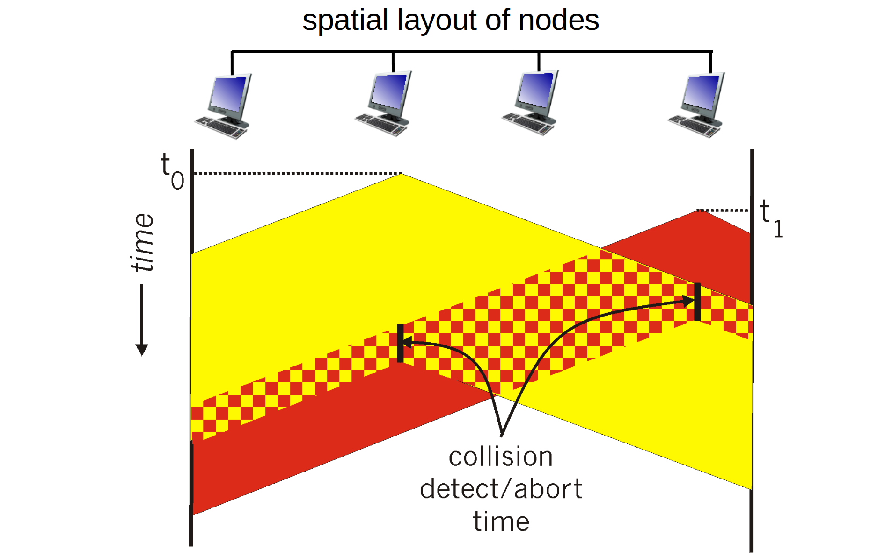
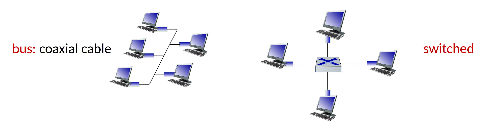
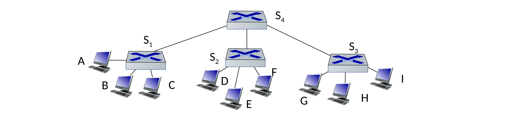
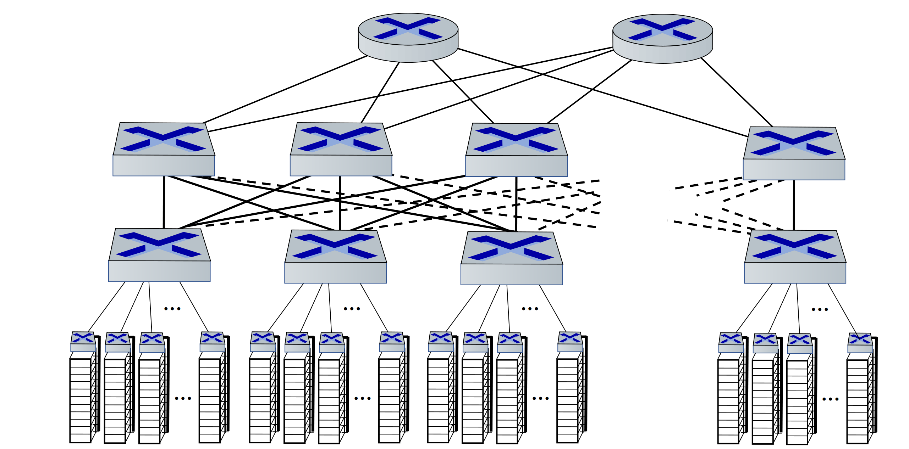

## Error detection and correction

### Parity checking

- single bit parity: detect single bit errors
- two-dimensional bit parity: detect and correct single bit errors

### CRC

> Cyclic Redundancy Check

See [the exercise section](#exercise).

## Multiple access protocols

> Multiple access protocol is distributed algorithm that determines how nodes share channel,
> i.e., determine when node can transmit. And communication about channel sharing must use channel itself.
> - channel partitioning: TDMA, FDMA, CDMA
> - random access: ALOHA, S-ALOCA, CSMA, CSMA/CD
> - taking turns

### Slotted ALOHA

When node obtains fresh frame, transmits in next slot.
If no collision, node can send new frame in next slot.
If there is a collision, node retransmits frame in each subsequent slot with probability p until success.

**Efficiency**: N nodes with many frames to send, each transmits in slot with probability p
- prob that given node has success in a slot: $p(1-p)^{N-1}$
- prob that any node has a success: $Np(1-p)^{N-1}$
- max efficiency: find $p^*$ that maximizes $Np(1-p)^{N-1}$
- for many nodes, take limit of $Np^*(1-p^*)^{N-1}$ as N goes to $\infty$,
gives: $max \; efficiency = \frac{1}{e}$

### Pure ALOHA

Similar with Slotted ALOHA, but no synchronization. With efficiency of only 18%.

### CSMA/CD

> Carrier sense multiple access, reduces the amount of time wasted in collisons.

**Efficiency**:
- $t_{prop}$: max prop delay between 2 nodes in LAN
- $t_{trans}$: time to transmit max-size frame

$$
efficienty = \frac{1}{1 + 5 \frac{t_{prop}}{t_{trans}}}
$$

Better performance than ALOHA: and simple, cheap, decentralized!

## LAN

### Addressing: MAC address

> 48-bit MAC address, e.g. 1A-2F-BB-76-09-AD

Each interface on LAN has unique MAC address, and a locally unique 32-bit IP address.

#### ARP

> Address resolution protocol: determine interface’s MAC address, knowing its IP address.

### Ethernet

Physical topology: bus connected or switched.

Ethernet is unreliable and connectionless.

### Switch

> A link layer device
> - store, forward Ethernet frames
> - examine incoming frame’s MAC address,
selectively forward frame to one-or-more outgoing links when frame is to be forwarded on segment,
uses CSMA/CD to access segment

Switch forwarding table: stored in the switch, self learning.  
Contains entry: `(MAC addr, interface, TTL)`

#### Switch vs routers

| Switch | Router |
|--------|--------|
| link layer | network layer |
| learn forwarding table using flooding | compute tables using routing algorithms |

## Data center networking

- Border routers
- Tier 1 switches
- Tier 2 switches
- Top of rack switch
- Server racks

**Multipath**: rich interconnection among switches and racks.

---

## Exercise

> From [*Computer Networking: A Top Down Approach 7th Edition*](https://gaia.cs.umass.edu/kurose_ross/online_lectures.htm)

Chapter 6

