<!--toc:start-->
- [Routing](#routing)
  - [Link state](#link-state)
    - [Oscillations possible](#oscillations-possible)
  - [Distance vector](#distance-vector)
    - [Link cost changes](#link-cost-changes)
  - [Comparison of LS and DV](#comparison-of-ls-and-dv)
- [Intra-ISP routing: OSPF](#intra-isp-routing-ospf)
- [Routing among ISPs: BGP](#routing-among-isps-bgp)
- [SDN control plane](#sdn-control-plane)
  - [OpenFlow protocol](#openflow-protocol)
- [ICMP](#icmp)
- [Network management configuration](#network-management-configuration)
  - [Components](#components)
  - [SNMP protocol](#snmp-protocol)
  - [NETCONF / YANG](#netconf-yang)
- [Exercise](#exercise)
  - [P3](#p3)
  - [P7](#p7)
  - [P11](#p11)
  - [P16](#p16)
  - [P21](#p21)
  - [P22](#p22)
<!--toc:end-->

> Network layer functions
> - forwarding: [**data** plane](/blog/computer_network/network_layer_data_plane/)
> - routing: **control** plane

There are 2 approaches to structuring network control plane:
1. per-router control (traditional)
2. logically centralized control ([SDN](#sdn-control-plane))

## Routing

> Goal: determine “good” paths (equivalently, routes),
> from sending hosts to receiving host, through network of routers.

In the following section,
a [graph](https://en.wikipedia.org/wiki/Graph_(discrete_mathematics))
abstraction of link costs is used.

### Link state

> Basically,
> [Dijkstra's algorithm](https://en.wikipedia.org/wiki/Dijkstra%27s_algorithm).

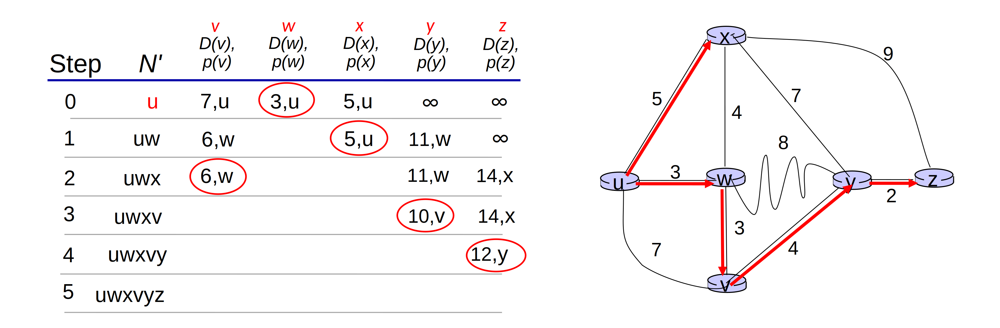

Algorithm complexity
- The simple version: $O(n^2)$
- More efficient implementations: $O(n \cdot logn)$

Message complexity
- Each router must broadcast its link state information to other n routers.
- Efficient broadcast algorithms:
$O(n)$ link crossings to disseminate a broadcast message from one source
- Each router’s message crosses O(n) links: overall message complexity: $O(n^2)$

#### Oscillations possible

> 振荡  
> When link costs depend on traffic volume, **route oscillations** possible.

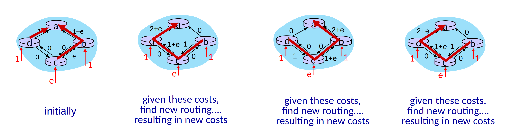

### Distance vector

> Based on
> [Bellman-Ford algorithm](https://en.wikipedia.org/wiki/Bellman%E2%80%93Ford_algorithm)
> (dynamic programming).

$$
D_x(y) = min_V \{c_{X,V} + D_V(y)\}
$$

- $D_V(y)$: estimated least-cost-path cost to $y$
- $c_{X,V}$: direct cost of link from $X$ to $V$

#### Link cost changes

> May cause distance count up to $\infty$.

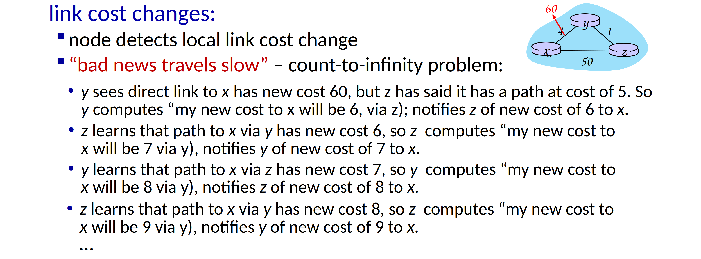

### Comparison of LS and DV

- message complexity
    - LS: n routers, $O(n^2)$ messages sent
    - DV: exchange between neighbors, convergence time varies
- speed of convergence
    - LS: $O(n^2)$ algorithm, $O(n^2)$ messages
        - may have oscillations
    - DV: convergence time varies
        - may have routing loops
        - count-to-infinity problem
- robustness
    - LS
        - router can advertise incorrect link cost
        - each router computes only its own table
    - DV
        - router can advertise incorrect path cost
        - each router's table used by others: error propagate through network

## Intra-ISP routing: OSPF

> Making routing scalable

Open Shortest Path First
- "open": publicly available
- classic link-state
    - each router floods OSPF link-state advertisements
    (directly over IP rather than using TCP/UDP) to all other routers in entire AS
    - multiple link costs metrics possible: bandwidth, delay
    - each router has full topology, uses Dijkstra’s algorithm to compute forwarding table
- security: all OSPF messages authenticated (to prevent malicious intrusion)

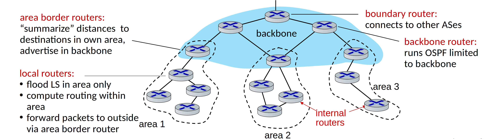

## Routing among ISPs: BGP

> Border Gateway Protocol: glue that holds the Internet together

- eBGP: obtain subnet reachability information from neighboring ASes
- iBGP: propagate reachability information to all AS-internal routers

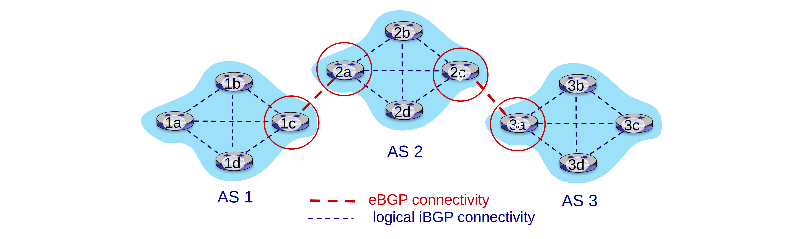

**BGP session**: two BGP routers ("peers")
exchange BGP messages over semi-permanent TCP connection

- BGP advertised route: prefix + attributes
    - prefix: destination being advertised
    - two important attributes
        - `AS-PATH`: list of ASes through which prefix advertisement has passed
        - `NEXT-HOP`: indicates specific internal-AS router to next-hop AS
- *policy-based routing*
    - gateway receiving route advertisement uses import policy
    to accept/decline path (e.g., never route through AS Y)
    - AS policy also determines whether to advertise path to other other neighboring ASes

**BGP messages**: exchanged between peers over TCP connection
- `OPEN`: opens TCP connection to remote BGP peer and authenticates sending BGP peer
- `UPDATE`: advertises new path (or withdraws old)
- `KEEPALIVE`: keeps connection alive in absence of UPDATES; also ACKs OPEN request
- `NOTIFICATION`: reports errors in previous msg; also used to close connection

The difference of intra and inter AS routing is as follows
- policy
    - inter: admin wants control over how its traffic routed, who routes through its network
    - intra: single admin, so policy less of an issue
- scale
    - hierarchical routing saves table size, reduced update traffic
- performance
    - intra: focus on performance
    - inter: policy dominates over performance

## SDN control plane

> Remote controller computes, installs forwarding tables in routers.

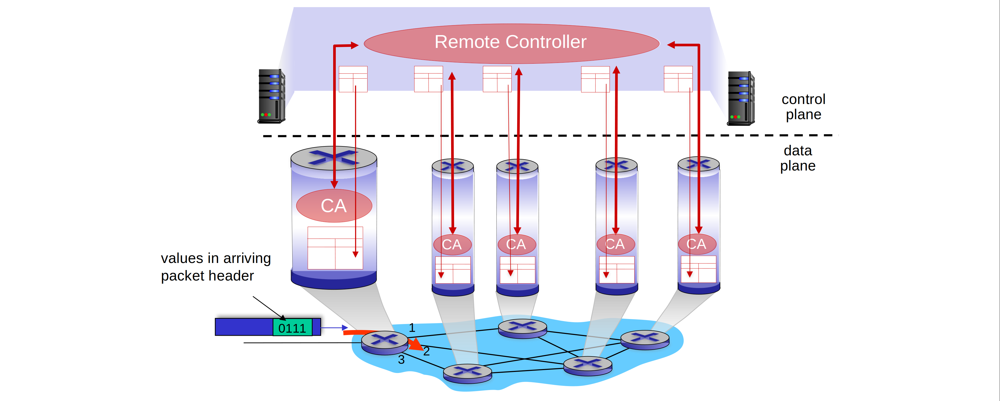

Why a logically centralized control plane?
- Easier network management
- Table-based forwarding easier
- Open implementation of control plane

SDN control plain makes traffic engineering which is difficult in traditional
distributed control plain rather easier.

### OpenFlow protocol
- operates between controller, switch
- TCP used to exchange messages
- 3 classes of OpenFlow messages
    - controller-to-switch
    - asynchronous (switch to controller)
    - symmetric (misc.)
- distinct from OpenFlow API
    - API used to specify generalized forwarding actions

## ICMP

> Internet control message protocol
> - used by hosts and routers to communicate network-level information
> - network-layer “above” IP (ICMP messages carried in IP datagrams)

ICMP message:
- type
- code
- first 8 bytes of IP data gram causing error

| Type | Code | description |
|------|------|------------------------------|
| 0  |     0    |    echo reply (ping)         |
| 3  |     0    |    dest network unreachable |
| 3  |     1    |    dest host unreachable     |
| 3  |     2    |    dest protocol unreachable |
| 3  |     3    |    dest port unreachable     |
| 3  |     6    |    dest network unknown      |
| 3  |     7    |    dest host unknown         |
| 4  |     0    |    source quench (congestion control not used) |
| 8  |     0    |    echo request (ping)       |
| 9  |     0    |    route advertisement       |
| 10 |    0     |   router discovery           |
| 11 |    0     |   TTL expired                |
| 12 |    0     |   bad IP header              |

## Network management configuration

### Components

1. Managing server
2. Network management protocol
3. Managed device
4. Data

### SNMP protocol

### NETCONF / YANG

---

## Exercise

> From [*Computer Networking: A Top Down Approach 7th Edition*](https://gaia.cs.umass.edu/kurose_ross/online_lectures.htm)

Chapter 5

### P3

*Consider the following network. With the indicated link costs, use Dijkstra’s shortest-path
algorithm to compute the shortest path from x to all network nodes. Show how the algorithm
works by computing a table.*

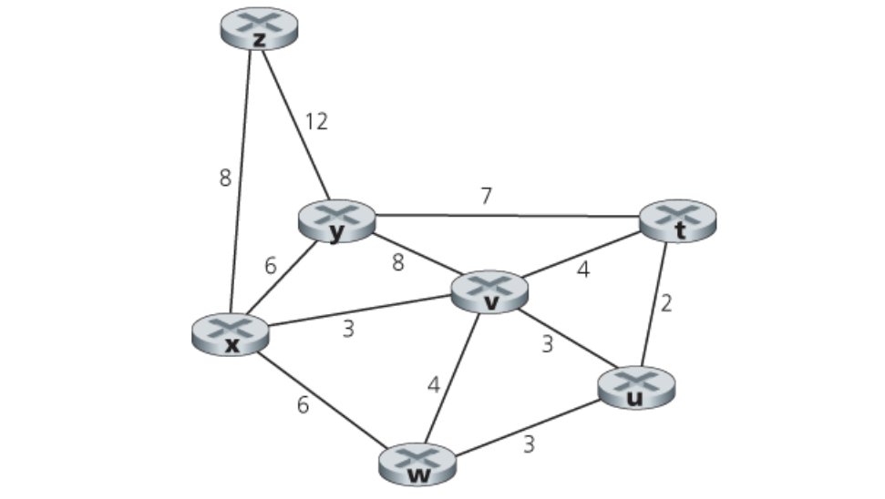

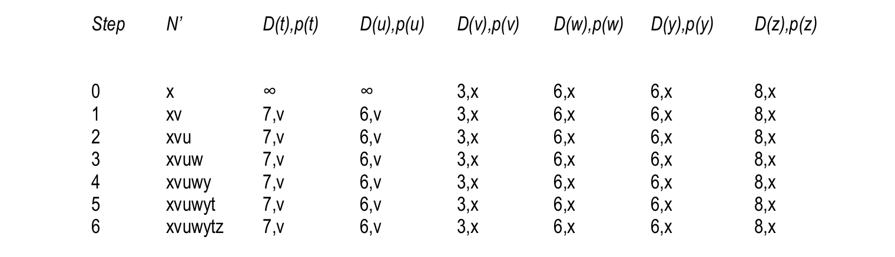

### P7

*Consider the network fragment shown below. x has only two attached neighbors, w and y. w
has a minimum-cost path to destination u (not shown) of 5, and y has a minimum-cost path to u
of 6. The complete paths from w and y to u (and between w and y) are not shown. All link costs
in the network have strictly positive integer values.*

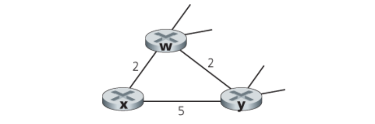

*a. Give x’s distance vector for destinations w, y, and u.*

*b. Give a link-cost change for either c(x, w) or c(x, y) such that x will inform its neighbors of
a new minimum-cost path to u as a result of executing the distance-vector algorithm.*

*c. Give a link-cost change for either c(x, w) or c(x, y) such that x will not inform its neighbors
of a new minimum-cost path to u as a result of executing the distance-vector algorithm.*

a. $D_x(w) = 2$, $D_x(y) = 4$, $D_x(u) = 7$

b. First consider what happens if $c(x,y)$ changes. If $c(x,y)$ becomes larger or smaller (as
long as $c(x,y) \geq 1$) , the least cost path from x to u will still have cost at least 7. Thus,
a change in $c(x,y)$ (if $c(x,y) \geq 1$) will not cause x to inform its neighbors of any
changes.
If $c(x,y)= \xi<1$, then the least cost path now passes through y and has cost $\xi + 6$.
Now consider if $c(x,w)$ changes. If $c(x,w) = \epsilon \leq 1$, then the least-cost path to u
continues to pass through w and its cost changes to $5 + \epsilon$; x will inform its neighbors
of this new cost. If $c(x,w) = \xi > 6$, then the least cost path now passes through y and
has cost 11; again x will inform its neighbors of this new cost.

### P11

*Consider Figure 5.7. Suppose there is another router w, connected to router y and z. The
costs of all links are given as follows: $c(x,y)=4$, $c(x,z)=50$, $c(y,w)=1$, $c(z,w)=1$,
$c(y,z)=3$. Suppose that poisoned reverse is used in the distance-vector routing algorithm.*

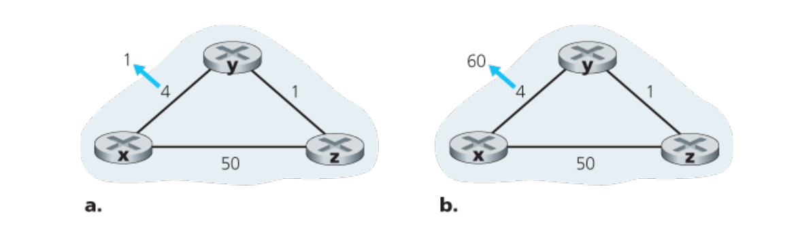

*a. When the distance vector routing is stabilized, router w, y, and z inform their distances to
x to each other. What distance values do they tell each other?*

*b. Now suppose that the link cost between x and y increases to 60. Will there be a count-to-
infinity problem even if poisoned reverse is used? Why or why not? If there is a count-to-
infinity problem, then how many iterations are needed for the distance-vector routing to
reach a stable state again? Justify your answer.*

*c. How do you modify $c(y, z)$ such that there is no count-to-infinity problem at all if $c(y,x)$
changes from 4 to 60?*

a. 

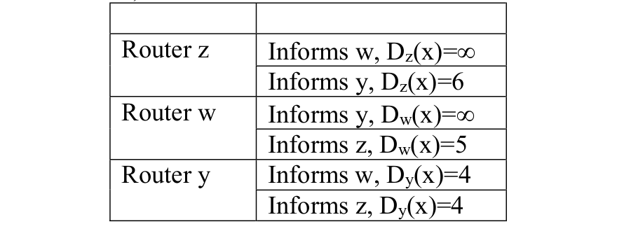

b. Yes, there will be a count-to-infinity problem. The following table shows the routing
converging process. Assume that at time t0, link cost change happens. At time t1, y
updates its distance vector and informs neighbors w and z. In the following table,
"→" stands for "informs".

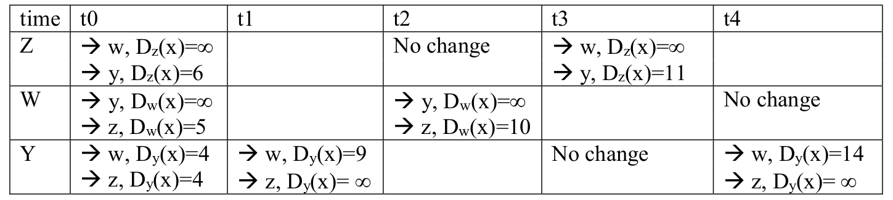

We see that w, y, z form a loop in their computation of the costs to router x. If we
continue the iterations shown in the above table, then we will see that, at t27, z detects
that its least cost to x is 50, via its direct link with x. At t29, w learns its least cost to x is
51 via z. At t30, y updates its least cost to x to be 52 (via w). Finally, at time t31, no
updating, and the routing is stabilized.

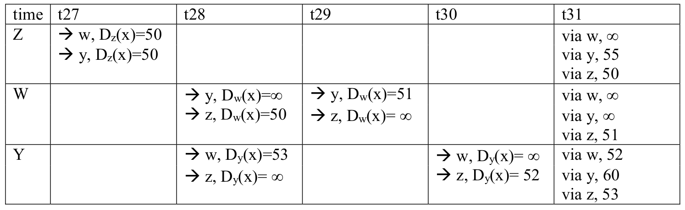

c. Cut the link between y and z.

### P16

*Consider the following network. ISP B provides national backbone service to regional ISP
A. ISP C provides national backbone service to regional ISP D. Each ISP consists of one AS. B
and C peer with each other in two places using BGP. Consider traffic going from A to D. B would
prefer to hand that traffic over to C on the West Coast (so that C would have to absorb the cost
of carrying the traffic cross-country), while C would prefer to get the traffic via its East Coast
peering point with B (so that B would have carried the traffic across the country). What BGP
mechanism might C use, so that B would hand over A-to-D traffic at its East Coast peering
point? To answer this question, you will need to dig into the BGP ­specification.*

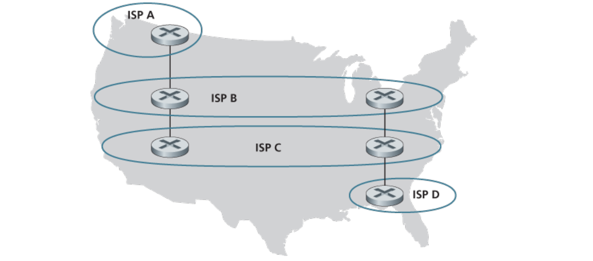

One way for C to force B to hand over all of B’s traffic to D on the east coast is for C to
only advertise its route to D via its east coast peering point with C.

### P21

*Consider the two ways in which communication occurs between a managing entity and a
managed device: request-response mode and trapping. What are the pros and cons of these two
approaches, in terms of (1) overhead, (2) notification time when exceptional events occur, and
(3) robustness with respect to lost messages between the managing entity and the device?*

Request response mode will generally have more overhead (measured in terms of the
number of messages exchanged) for several reasons. First, each piece of information
received by the manager requires two messages: the poll and the response. Trapping
generates only a single message to the sender. If the manager really only wants to be
notified when a condition occurs, polling has more overhead, since many of the polling
messages may indicate that the waited-for condition has not yet occurred. Trapping
generates a message only when the condition occurs.
Trapping will also immediately notify the manager when an event occurs. With polling,
the manager needs will need to wait for half a polling cycle (on average) between when
the event occurs and the manager discovers (via its poll message) that the event has
occurred.
If a trap message is lost, the managed device will not send another copy. If a poll
message, or its response, is lost the manager would know there has been a lost message
(since the reply never arrives). Hence, the manager could repoll, if needed.

### P22

*In Section 5.7 we saw that it was preferable to transport SNMP messages in unreliable
UDP datagrams. Why do you think the designers of SNMP chose UDP rather than TCP as the
transport protocol of choice for SNMP?*

Often, the time when network management is most needed is in times of stress, when the
network may be severely congested and packets are being lost. With SNMP running over
TCP, TCP's congestion control would cause SNMP to back-off and stop sending
messages at precisely the time when the network manager needs to send SNMP
messages.

