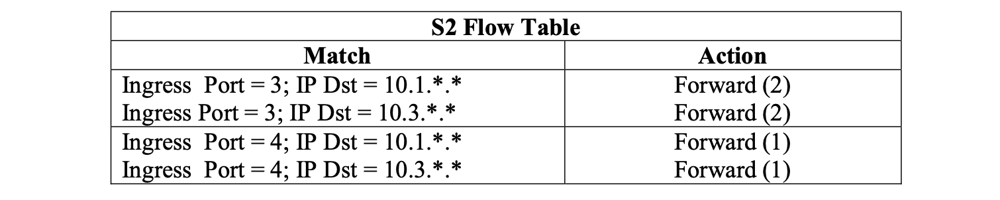

<!--toc:start-->
- [Routing](#routing)
  - [Link state](#link-state)
    - [Oscillations possible](#oscillations-possible)
  - [Distance vector](#distance-vector)
    - [Link cost changes](#link-cost-changes)
  - [Comparison of LS and DV](#comparison-of-ls-and-dv)
- [Intra-ISP routing: OSPF](#intra-isp-routing-ospf)
- [Routing among ISPs: BGP](#routing-among-isps-bgp)
- [SDN control plane](#sdn-control-plane)
  - [OpenFlow protocol](#openflow-protocol)
- [ICMP](#icmp)
- [Network management configuration](#network-management-configuration)
  - [Components](#components)
  - [SNMP protocol](#snmp-protocol)
  - [NETCONF / YANG](#netconf-yang)
- [Exercise](#exercise)
  - [P12](#p12)
  - [P15](#p15)
  - [P16](#p16)
  - [P18](#p18)
  - [P19](#p19)
  - [P20](#p20)
<!--toc:end-->

> Network layer functions
> - forwarding: [**data** plane](/blog/computer_network/network_layer_data_plane/)
> - routing: **control** plane

There are 2 approaches to structuring network control plane:
1. per-router control (traditional)
2. logically centralized control ([SDN](#sdn-control-plane))

## Routing

> Goal: determine “good” paths (equivalently, routes),
> from sending hosts to receiving host, through network of routers.

In the following section,
a [graph](https://en.wikipedia.org/wiki/Graph_(discrete_mathematics))
abstraction of link costs is used.

### Link state

> Basically,
> [Dijkstra's algorithm](https://en.wikipedia.org/wiki/Dijkstra%27s_algorithm).

Algorithm complexity
- The simple version: $O(n^2)$
- More efficient implementations: $O(n \cdot logn)$

Message complexity
- Each router must broadcast its link state information to other n routers.
- Efficient broadcast algorithms:
$O(n)$ link crossings to disseminate a broadcast message from one source
- Each router’s message crosses O(n) links: overall message complexity: $O(n^2)$

#### Oscillations possible

> 振荡  
> When link costs depend on traffic volume, **route oscillations** possible.

### Distance vector

> Based on
> [Bellman-Ford algorithm](https://en.wikipedia.org/wiki/Bellman%E2%80%93Ford_algorithm)
> (dynamic programming).

$$
D_x(y) = min_V \{c_{X,V} + D_V(y)\}
$$

- $D_V(y)$: estimated least-cost-path cost to $y$
- $c_{X,V}$: direct cost of link from $X$ to $V$

#### Link cost changes

> May cause distance count up to $\infty$.

### Comparison of LS and DV

- message complexity
    - LS: n routers, $O(n^2)$ messages sent
    - DV: exchange between neighbors, convergence time varies
- speed of convergence
    - LS: $O(n^2)$ algorithm, $O(n^2)$ messages
        - may have oscillations
    - DV: convergence time varies
        - may have routing loops
        - count-to-infinity problem
- robustness
    - LS
        - router can advertise incorrect link cost
        - each router computes only its own table
    - DV
        - router can advertise incorrect path cost
        - each router's table used by others: error propagate through network

## Intra-ISP routing: OSPF

> Making routing scalable

Open Shortest Path First
- "open": publicly available
- classic link-state
    - each router floods OSPF link-state advertisements
    (directly over IP rather than using TCP/UDP) to all other routers in entire AS
    - multiple link costs metrics possible: bandwidth, delay
    - each router has full topology, uses Dijkstra’s algorithm to compute forwarding table
- security: all OSPF messages authenticated (to prevent malicious intrusion)

## Routing among ISPs: BGP

> Border Gateway Protocol: glue that holds the Internet together

- eBGP: obtain subnet reachability information from neighboring ASes
- iBGP: propagate reachability information to all AS-internal routers

**BGP session**: two BGP routers ("peers")
exchange BGP messages over semi-permanent TCP connection

- BGP advertised route: prefix + attributes
    - prefix: destination being advertised
    - two important attributes
        - `AS-PATH`: list of ASes through which prefix advertisement has passed
        - `NEXT-HOP`: indicates specific internal-AS router to next-hop AS
- *policy-based routing*
    - gateway receiving route advertisement uses import policy
    to accept/decline path (e.g., never route through AS Y)
    - AS policy also determines whether to advertise path to other other neighboring ASes

**BGP messages**: exchanged between peers over TCP connection
- `OPEN`: opens TCP connection to remote BGP peer and authenticates sending BGP peer
- `UPDATE`: advertises new path (or withdraws old)
- `KEEPALIVE`: keeps connection alive in absence of UPDATES; also ACKs OPEN request
- `NOTIFICATION`: reports errors in previous msg; also used to close connection

The difference of intra and inter AS routing is as follows
- policy
    - inter: admin wants control over how its traffic routed, who routes through its network
    - intra: single admin, so policy less of an issue
- scale
    - hierarchical routing saves table size, reduced update traffic
- performance
    - intra: focus on performance
    - inter: policy dominates over performance

## SDN control plane

> Remote controller computes, installs forwarding tables in routers.

Why a logically centralized control plane?
- Easier network management
- Table-based forwarding easier
- Open implementation of control plane

SDN control plain makes traffic engineering which is difficult in traditional
distributed control plain rather easier.

### OpenFlow protocol
- operates between controller, switch
- TCP used to exchange messages
- 3 classes of OpenFlow messages
    - controller-to-switch
    - asynchronous (switch to controller)
    - symmetric (misc.)
- distinct from OpenFlow API
    - API used to specify generalized forwarding actions

## ICMP

> Internet control message protocol
> - used by hosts and routers to communicate network-level information
> - network-layer “above” IP (ICMP messages carried in IP datagrams)

ICMP message:
- type
- code
- first 8 bytes of IP data gram causing error

| Type | Code | description |
|------|------|------------------------------|
| 0  |     0    |    echo reply (ping)         |
| 3  |     0    |    dest network unreachable |
| 3  |     1    |    dest host unreachable     |
| 3  |     2    |    dest protocol unreachable |
| 3  |     3    |    dest port unreachable     |
| 3  |     6    |    dest network unknown      |
| 3  |     7    |    dest host unknown         |
| 4  |     0    |    source quench (congestion control not used) |
| 8  |     0    |    echo request (ping)       |
| 9  |     0    |    route advertisement       |
| 10 |    0     |   router discovery           |
| 11 |    0     |   TTL expired                |
| 12 |    0     |   bad IP header              |

## Network management configuration

### Components

1. Managing server
2. Network management protocol
3. Managed device
4. Data

### SNMP protocol

### NETCONF / YANG

---

## Exercise

> From [*Computer Networking: A Top Down Approach 7th Edition*](https://gaia.cs.umass.edu/kurose_ross/online_lectures.htm)

Chapter 4

### P12

*Consider the topology shown in Figure 4.20. Denote the three subnets with hosts (starting
clockwise at 12:00) as Networks A, B, and C. Denote the subnets without hosts as Networks D,
E, and F.*

*a. Assign network addresses to each of these six subnets, with the following constraints: All
addresses must be allocated from 214.97.254/23; Subnet A should have enough
addresses to support 250 interfaces; Subnet B should have enough addresses to
support 120 interfaces; and Subnet C should have enough addresses to support 120
interfaces. Of course, subnets D, E and F should each be able to support two interfaces.
For each subnet, the assignment should take the form a.b.c.d/x or a.b.c.d/x – e.f.g.h/y.*

*b. Using your answer to part (a), provide the forwarding tables (using longest prefix
matching) for each of the three routers.*

a.

Subnet A: 214.97.255/24 (256 addresses)  
Subnet B: 214.97.254.0/25 - 214.97.254.0/29 (128-8 = 120 addresses)  
Subnet C: 214.97.254.128/25 (128 addresses)  
Subnet D: 214.97.254.0/31 (2 addresses)  
Subnet E: 214.97.254.2/31 (2 addresses)  
Subnet F: 214.97.254.4/30 (4 addresses)  

b. To simplify the solution, assume that no datagrams have router interfaces as
ultimate destinations. Also, label D, E, F for the upper-right, bottom, and upper
left interior subnets, respectively.

Router 1

| Longest Prefix Match               | Outgoing Interface |
|------------------------------------|--------------------|
| 11010110 01100001 11111111         | Subnet A           |
| 11010110 01100001 11111110 0000000 | Subnet D           |
| 11010110 01100001 11111110 000001  | Subnet F           |

Router 2

| Longest Prefix Match               | Outgoing Interface |
|------------------------------------|--------------------|
| 11010110 01100001 11111111 0000000 | Subnet D           |
| 11010110 01100001 11111110 0       | Subnet B           |
| 11010110 01100001 11111110 0000001 | Subnet E           |

Router 3

| Longest Prefix Match               | Outgoing Interface |
|------------------------------------|--------------------|
| 11010110 01100001 11111111 000001  | Subnet F           |
| 11010110 01100001 11111110 0000001 | Subnet E           |
| 11010110 01100001 11111110 1       | Subnet C           |

### P15

*Suppose datagrams are limited to 1,500 bytes (including header) between source Host A
and destination Host B. Assuming a 20-byte IP header, how many datagrams would be required
to send an MP3 consisting of 5 million bytes? Explain how you computed your answer.*

MP3 file size = 5 million bytes.
Assume the data is carried in TCP segments,
with each TCP segment also having 20 bytes of header.
Then each datagram can carry 1500 - 40 = 1460 bytes
of the MP3 file.

Number of datagrams required:
$\lceil \frac{5 \times 10^6}{1460} \rceil = 3425$.

All but the last datagram will be 1,500 bytes;
the last datagram will be 960+40 = 1000 bytes.
Note that here there is no fragmentation
– the source host does not create datagrams
larger than 1500 bytes,
and these datagrams are smaller than
the MTUs of the links.

### P16

*Consider the network setup in Figure 4.25.
Suppose that the ISP instead assigns the router
the address 24.34.112.235 and that the network address
of the home network is 192.168.1/24.*

*a. Assign addresses to all interfaces in the home network.*

*b. Suppose each host has two ongoing TCP connections,
all to port 80 at host 128.119.40.86.
Provide the six corresponding entries in the
NAT translation table.*

a. Home addresses: 192.168.1.1, 192.168.1.2,
192.168.1.3 with the router interface being 192.168.1.4

b. NAT Translation Table

| WAN side            | LAN side          |
|---------------------|-------------------|
| 24.34.112.235, 4000 | 192.168.1.1, 3345 |
| 24.34.112.235, 4001 | 192.168.1.1, 3346 |
| 24.34.112.235, 4002 | 192.168.1.2, 3345 |
| 24.34.112.235, 4003 | 192.168.1.2, 3346 |
| 24.34.112.235, 4004 | 192.168.1.3, 3345 |
| 24.34.112.235, 4005 | 192.168.1.3, 3346 |

### P18

*In this problem we’ll explore the impact of NATs on P2P applications.
Suppose a peer with username Arnold discovers through querying
that a peer with username Bernard has a file it
wants to download. Also suppose that Bernard and
Arnold are both behind a NAT. Try to devise a technique
that will allow Arnold to establish a TCP connection with
Bernard without application specific NAT configuration.
If you have difficulty devising such a technique,
discuss why.*

It is not possible to devise such a technique.
In order to establish a direct TCP connection between
Arnold and Bernard, either Arnold or Bob must initiate
a connection to the other.
But the NATs covering Arnold and Bob drop SYN packets
arriving from the WAN side.
Thus neither Arnold nor Bob can initiate a TCP
connection to the other if they are both behind NATs.

### P19

*Consider the SDN OpenFlow network shown in Figure 4.30.
Suppose that the desired forwarding behavior for
datagrams arriving at s2 is as follows:*

- *any datagrams arriving on input port 1 from hosts
h5 or h6 that are destined to hosts h1 or h2 should
be forwarded over output port 2;*
- *any datagrams arriving on input port 2 from hosts
h1 or h2 that are destined to hosts h5 or h6 should
be forwarded over output port 1;*
- *any arriving datagrams on input ports 1 or 2 and
destined to hosts h3 or h4 should be delivered
to the host specified;*
- *hosts h3 and h4 should be able to send datagrams to each other.*

*Specify the flow table entries in s2 that implement this forwarding behavior.*

### P20

*Consider again the SDN OpenFlow network shown in Figure 4.30.
Suppose that the desired forwarding behavior for
datagrams arriving from hosts h3 or h4 at s2 is as
follows:*

- *any datagrams arriving from host h3 and destined for h1, h2, h5 or h6 should be forwarded in a clockwise direction in the network;*
- *any datagrams arriving from host h4 and destined for h1, h2, h5 or h6 should be forwarded in a counter-clockwise direction in the network.*

*Specify the flow table entries in s2 that implement this forwarding behavior.*

