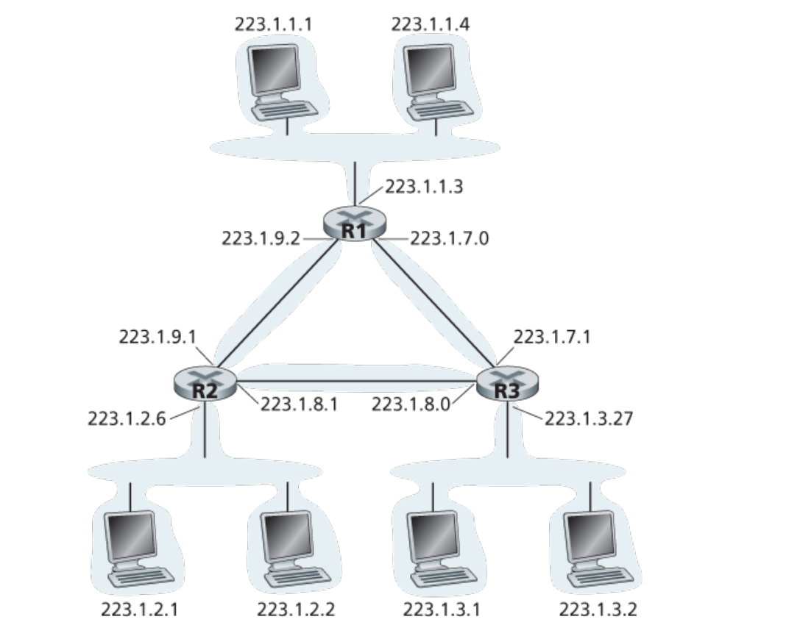
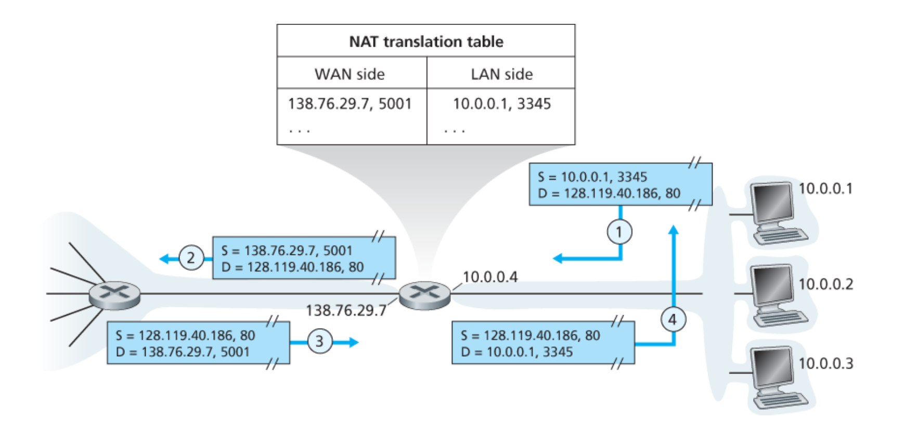
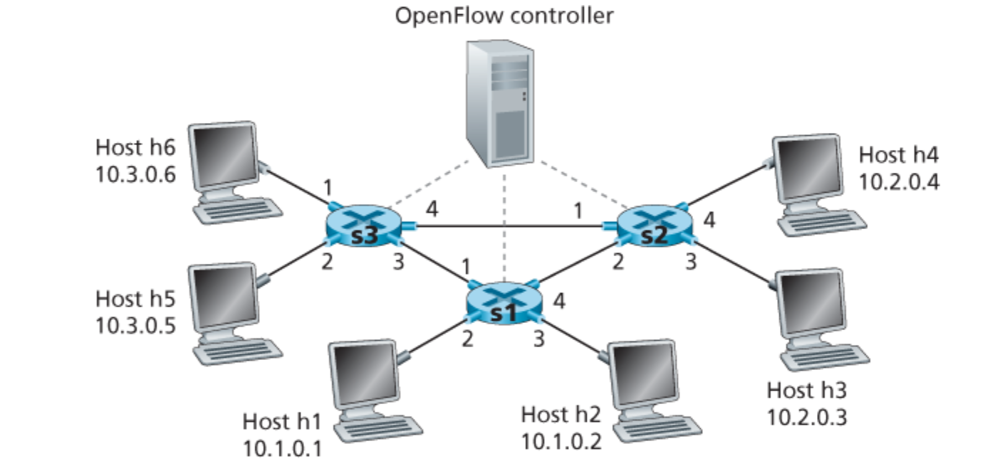
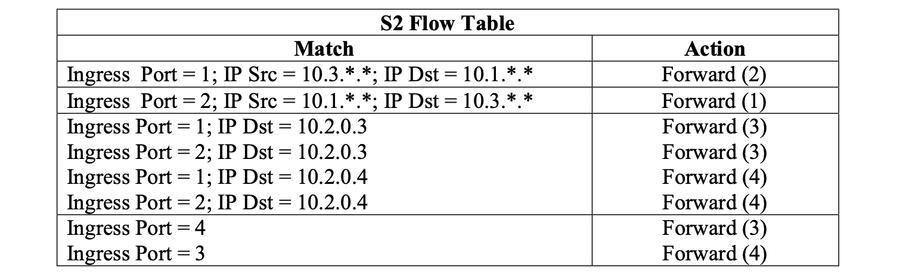

<!--toc:start-->
- [Network layer overview](#network-layer-overview)
- [Router](#router)
  - [Longest prefix matching](#longest-prefix-matching)
  - [Switching fabric](#switching-fabric)
- [IP](#ip)
  - [IP addressing](#ip-addressing)
    - [DHCP: Dynamic Host Configuration Protocol](#dhcp-dynamic-host-configuration-protocol)
  - [NAT](#nat)
  - [IPv6](#ipv6)
- [SDN](#sdn)
- [Exercise](#exercise)
  - [P4](#p4)
  - [P5](#p5)
  - [P7](#p7)
  - [P12](#p12)
  - [P15](#p15)
  - [P16](#p16)
  - [P18](#p18)
  - [P19](#p19)
  - [P20](#p20)
<!--toc:end-->

## Network layer overview

**Two key network layer functions**: forwarding and routing.

- Data plane
    - local, per-router function
- [Control plane](/blog/computer_network/network_layer_control_plane/)
    - network-wide logic

> Best effort service: simplicity of mechanism,
sufficient provisioning of bandwidth, replicated application-layer distributed services,
congestion control of "elastic" services.

## Router

### Longest prefix matching

When looking for forwarding table entry for given destination address,
use the longest address prefix that matches destination address.

### Switching fabric

Output & input port queuing.

**How much buffering?**

A recent recommendation: with N flows, buffering equal to

$$
\frac{RTT \cdot C}{\sqrt{N}}
$$

**Scheduling policy**
- FCFS
- priority
- round-robin
- weighted fair queuing

## IP

> The Internet protocol

### IP addressing

IP address: 32 bit identifier associated with each host or router interface.

**How to get one?** Via DHCP

#### DHCP: Dynamic Host Configuration Protocol

- host broadcasts DHCP discover message
- DHCP server responds with DHCP offer message
- host requests IP address: DHCP request message
- DHCP server sends address: DHCP ACK message

DHCP: more than IP addresses
- address of first-hop router for client
- name and IP address of DNS server
- network mask (indicating network versus host portion of address)

### NAT

> Network address translation

The router maps each host in subnet to a port of itself.

### IPv6

**Transition from IPv4 to IPv6**: tunneling and encapsulation

## SDN

Software defined networking

---

## Exercise

> From [*Computer Networking: A Top Down Approach 7th Edition*](https://gaia.cs.umass.edu/kurose_ross/online_lectures.htm)

Chapter 4

### P4

*Consider the switch shown below. Suppose that all datagrams have the same fixed length,
that the switch operates in a slotted, synchronous manner, and that in one time slot a datagram
can be transferred from an input port to an output port. The switch fabric is a crossbar so that at
most one datagram can be transferred to a given output port in a time slot, but different output
ports can receive datagrams from different input ports in a single time slot. What is the minimal
number of time slots needed to transfer the packets shown from input ports to their output ports,
assuming any input queue scheduling order you want (i.e., it need not have HOL blocking)?
What is the largest number of slots needed, assuming the worst-case scheduling order you can
devise, assuming that a non-empty input queue is never idle?*

The minimal number of time slots needed is 3. The scheduling is as follows.

Slot 1: send X in top input queue, send Y in middle input queue.  
Slot 2: send X in middle input queue, send Y in bottom input queue.  
Slot 3: send Z in bottom input queue.

Largest number of slots is still 3. Actually, based on the assumption that a non-empty
input queue is never idle, we see that the first time slot always consists of sending X in
the top input queue and Y in either middle or bottom input queue, and in the second time
slot, we can always send two more datagram, and the last datagram can be sent in third
time slot.

NOTE: Actually, if the first datagram in the bottom input queue is X, then the worst case
would require 4 time slots.

### P5

*Consider a datagram network using 32-bit host addresses. Suppose a router has four links,
numbered 0 through 3, and packets are to be forwarded to the link interfaces as follows:*

a.

| Prefix Match        | Link Interface |
|---------------------|----------------|
| `11100000 00`       | 0              |
| `11100000 01000000` | 1              |
| `1110000`           | 2              |
| `11100001 1`        | 3              |
| otherwise           | 3              |

b.

Prefix match for first address is 5th entry: link interface 3  
Prefix match for second address is 3rd entry: link interface 2  
Prefix match for third address is 4th entry: link interface 3  

### P7

*Consider a data gram network using 8-bit host addresses.
Suppose a router uses longest prefix matching and has
the following forwarding table:*

*For each of the four interfaces,
give the associated range of destination host addresses and the
number of addresses in the range.*

| Destination Address Range                    | Link Interface |
|----------------------------------------------|----------------|
| `11000000` through `11011111` (32 addresses) | 0              |
| `10000000` through `10111111` (64 addresses) | 1              |
| `11100000` through `11111111` (32 addresses) | 2              |
| `00000000` through `01111111` (128 addresses)| 3              |

### P12

*Consider the topology shown in Figure 4.20. Denote the three subnets with hosts (starting
clockwise at 12:00) as Networks A, B, and C. Denote the subnets without hosts as Networks D,
E, and F.*

*a. Assign network addresses to each of these six subnets, with the following constraints: All
addresses must be allocated from 214.97.254/23; Subnet A should have enough
addresses to support 250 interfaces; Subnet B should have enough addresses to
support 120 interfaces; and Subnet C should have enough addresses to support 120
interfaces. Of course, subnets D, E and F should each be able to support two interfaces.
For each subnet, the assignment should take the form a.b.c.d/x or a.b.c.d/x – e.f.g.h/y.*

*b. Using your answer to part (a), provide the forwarding tables (using longest prefix
matching) for each of the three routers.*

a.

Subnet A: 214.97.255/24 (256 addresses)  
Subnet B: 214.97.254.0/25 - 214.97.254.0/29 (128-8 = 120 addresses)  
Subnet C: 214.97.254.128/25 (128 addresses)  
Subnet D: 214.97.254.0/31 (2 addresses)  
Subnet E: 214.97.254.2/31 (2 addresses)  
Subnet F: 214.97.254.4/30 (4 addresses)  

b. To simplify the solution, assume that no datagrams have router interfaces as
ultimate destinations. Also, label D, E, F for the upper-right, bottom, and upper
left interior subnets, respectively.

Router 1

| Longest Prefix Match               | Outgoing Interface |
|------------------------------------|--------------------|
| 11010110 01100001 11111111         | Subnet A           |
| 11010110 01100001 11111110 0000000 | Subnet D           |
| 11010110 01100001 11111110 000001  | Subnet F           |

Router 2

| Longest Prefix Match               | Outgoing Interface |
|------------------------------------|--------------------|
| 11010110 01100001 11111111 0000000 | Subnet D           |
| 11010110 01100001 11111110 0       | Subnet B           |
| 11010110 01100001 11111110 0000001 | Subnet E           |

Router 3

| Longest Prefix Match               | Outgoing Interface |
|------------------------------------|--------------------|
| 11010110 01100001 11111111 000001  | Subnet F           |
| 11010110 01100001 11111110 0000001 | Subnet E           |
| 11010110 01100001 11111110 1       | Subnet C           |

### P15

*Suppose datagrams are limited to 1,500 bytes (including header) between source Host A
and destination Host B. Assuming a 20-byte IP header, how many datagrams would be required
to send an MP3 consisting of 5 million bytes? Explain how you computed your answer.*

MP3 file size = 5 million bytes.
Assume the data is carried in TCP segments,
with each TCP segment also having 20 bytes of header.
Then each datagram can carry 1500 - 40 = 1460 bytes
of the MP3 file.

Number of datagrams required:
$\lceil \frac{5 \times 10^6}{1460} \rceil = 3425$.

All but the last datagram will be 1,500 bytes;
the last datagram will be 960+40 = 1000 bytes.
Note that here there is no fragmentation
– the source host does not create datagrams
larger than 1500 bytes,
and these datagrams are smaller than
the MTUs of the links.

### P16

*Consider the network setup in Figure 4.25.
Suppose that the ISP instead assigns the router
the address 24.34.112.235 and that the network address
of the home network is 192.168.1/24.*

*a. Assign addresses to all interfaces in the home network.*

*b. Suppose each host has two ongoing TCP connections,
all to port 80 at host 128.119.40.86.
Provide the six corresponding entries in the
NAT translation table.*

a. Home addresses: 192.168.1.1, 192.168.1.2,
192.168.1.3 with the router interface being 192.168.1.4

b. NAT Translation Table

| WAN side            | LAN side          |
|---------------------|-------------------|
| 24.34.112.235, 4000 | 192.168.1.1, 3345 |
| 24.34.112.235, 4001 | 192.168.1.1, 3346 |
| 24.34.112.235, 4002 | 192.168.1.2, 3345 |
| 24.34.112.235, 4003 | 192.168.1.2, 3346 |
| 24.34.112.235, 4004 | 192.168.1.3, 3345 |
| 24.34.112.235, 4005 | 192.168.1.3, 3346 |

### P18

*In this problem we’ll explore the impact of NATs on P2P applications.
Suppose a peer with username Arnold discovers through querying
that a peer with username Bernard has a file it
wants to download. Also suppose that Bernard and
Arnold are both behind a NAT. Try to devise a technique
that will allow Arnold to establish a TCP connection with
Bernard without application specific NAT configuration.
If you have difficulty devising such a technique,
discuss why.*

It is not possible to devise such a technique.
In order to establish a direct TCP connection between
Arnold and Bernard, either Arnold or Bob must initiate
a connection to the other.
But the NATs covering Arnold and Bob drop SYN packets
arriving from the WAN side.
Thus neither Arnold nor Bob can initiate a TCP
connection to the other if they are both behind NATs.

### P19

*Consider the SDN OpenFlow network shown in Figure 4.30.
Suppose that the desired forwarding behavior for
datagrams arriving at s2 is as follows:*

- *any datagrams arriving on input port 1 from hosts
h5 or h6 that are destined to hosts h1 or h2 should
be forwarded over output port 2;*
- *any datagrams arriving on input port 2 from hosts
h1 or h2 that are destined to hosts h5 or h6 should
be forwarded over output port 1;*
- *any arriving datagrams on input ports 1 or 2 and
destined to hosts h3 or h4 should be delivered
to the host specified;*
- *hosts h3 and h4 should be able to send datagrams to each other.*

*Specify the flow table entries in s2 that implement this forwarding behavior.*

### P20

*Consider again the SDN OpenFlow network shown in Figure 4.30.
Suppose that the desired forwarding behavior for
datagrams arriving from hosts h3 or h4 at s2 is as
follows:*

- *any datagrams arriving from host h3 and destined for h1, h2, h5 or h6 should be forwarded in a clockwise direction in the network;*
- *any datagrams arriving from host h4 and destined for h1, h2, h5 or h6 should be forwarded in a counter-clockwise direction in the network.*

*Specify the flow table entries in s2 that implement this forwarding behavior.*

