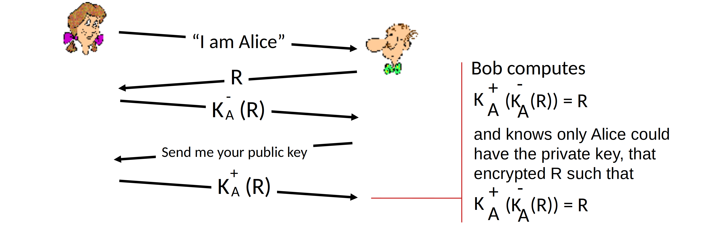
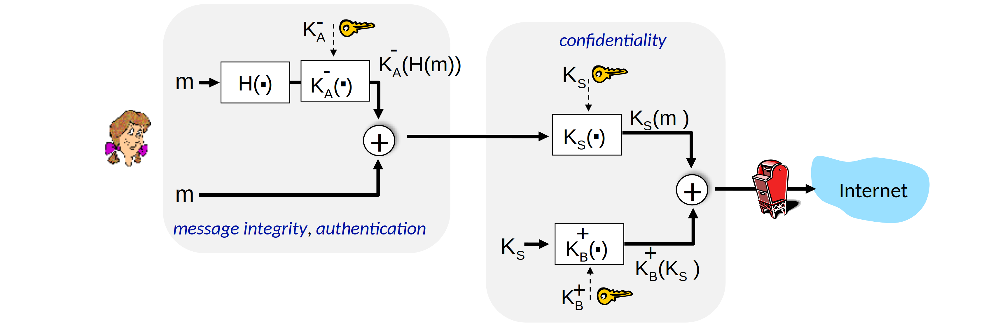

<!--toc:start-->

- [Principles](#principles)
  - [Simple encryption scheme](#simple-encryption-scheme)
    - [Symmetric key crypto](#symmetric-key-crypto)
    - [Public Key Cryptography](#public-key-cryptography)
- [Message integrity, authentication](#message-integrity-authentication)
  - [1.0 No authentication](#10-no-authentication)
  - [2.0 Alice provide her name](#20-alice-provide-her-name)
  - [3.0 Alice provide her name and her IP address](#30-alice-provide-her-name-and-her-ip-address)
  - [3.5 Alice provide an encrypted password in addition](#35-alice-provide-an-encrypted-password-in-addition)
  - [4.0 Bob sends Alice a nonce: R, Alice must return K(R)](#40-bob-sends-alice-a-nonce-r-alice-must-return-kr)
  - [5.0 Nonce with public key cryptography](#50-nonce-with-public-key-cryptography)
  - [6.0 Public key Certification Authority](#60-public-key-certification-authority)
- [Securing e-mail](#securing-e-mail)
- [Securing TCP: TLS](#securing-tcp-tls)
- [Network layer security: IPsec](#network-layer-security-ipsec)
- [Security in wireless and mobile networks](#security-in-wireless-and-mobile-networks)
- [Firewall and IDS](#firewall-and-ids)
<!--toc:end-->

> - Confidentiality 保密
> - Authentication
> - Message integrity
> - Access and availability

**Analogy used down below**: Alice, Bob, Trudy.
Alice wants to communicate with Bob, Trudy is the bad person.

## Principles

### Simple encryption scheme

#### Symmetric key crypto

> Caesar cipher

#### Public Key Cryptography

> - sender, receiver do not share secret key
> - public encryption key known to all
> - private decryption key known only to receiver

Requirements:

$$
K_B^+() \; and \; K_B^-() \; such \; that \; K_B^-(K_B^+(m)) = m
$$

- $K_B^+$: public key
- $K_B^-$: private key

Given public key, it should be impossible to compute private key.

RSA algorithm: another **important** property

$$
K_B^-(K_B^+(m)) = m = K_B^+(K_B^-(m))
$$

**In practice**, because DES is at least 100 times faster than RSA,
we actually use RSA to exchange a session specific symmetric key,
and communicate through symmetric encryption.

## Message integrity, authentication

### 1.0 No authentication

### 2.0 Alice provide her name

Still, Trudy can pretend to be Alice.

### 3.0 Alice provide her name and her IP address

Still, Trudy can pretend if she gets Alice's IP address,
which is not hard at all.

### 3.5 Alice provide an encrypted password in addition

Trudy can record Alice's packet, and "play it back" to Bob,
without knowing the encryption key at all.

### 4.0 Bob sends Alice a nonce: R, Alice must return K(R)

> K() is their shared symmetric key

Can we authenticate using public key techniques?

### 5.0 Nonce with public key cryptography

Still a flaw: **man in the middle attack**.
Trudy pretend to be Bob facing Alice, and pretend to be Alice facing Bob.

Solution: **Digital signatures certificate**

> Digital signature: signed message digest

### 6.0 Public key Certification Authority

In addition to 5.0, we add a 3rd party CA which binds public key to particular entity.

CA broadcast it's public key, so nobody can pretend to be CA.

## Securing e-mail

Alice uses three keys: her private key, Bob’s public key, new symmetric key.

## Securing TCP: TLS

> TLS: Transport Layer Security

1. Bob establishes TCP connection with Alice
2. Bob verifies that Alice is really Alice
3. Bob sends Alice a master secret key (MS), used to generate all other keys for TLS session
4. Potential issue: 3 RTT before client can start receiving data (including TCP handshake)

Use 4 keys for each cryptographic function

1. $K_c$ encryption key for data sent from client to server
2. $M_c$ MAC key for data sent from client to server
3. $K_s$ encryption key for data sent from server to client
4. $M_s$ MAC key for data sent from server to client

Possible attacks on data stream

1. re-ordering
2. replay

Solutions

1. add TLS sequence numbers
2. use nonce

## Network layer security: IPsec

> Provides datagram level encryption, authentication, integrity,
> for both user traffic and control traffic (e.g., BGP, DNS messages).  
> **With 2 modes**
>
> - transport mode: only datagram payload is encrypted, authenticated
> - tunnel mode: entire datagram is encrypted, authenticated,
>   encrypted datagram encapsulated in new datagram with new IP header, tunneled to destination

2 IPsec protocols

- Authentication Header (AH) protocol
- Encapsulation Security Protocol (ESP)

## Security in wireless and mobile networks

**WPA3 handshake**: used in 802.11

1. AS generates $Nonce_{AS}$, sends to mobile
2. Mobile receives $Nonce_{AS}$
   1. generates $Nonce_{M}$
   2. generates symmetric shared session key $K_{M-AP}$ using $Nonce_{AS}$, $Nonce_{M}$,
      and initial shared secret
   3. sends $Nonce_M$, and HMAC-signed value using $Nonce_{AS}$ and initial shared secret
3. AS derives symmetric shared session key $K_{M-AP}$

Authentication, encryption in **4G LTE** have notable differences.

1. Mobile’s SIM card provides global identity, contains shared keys.
2. Services in visited network depend on (paid) service subscription in home network.

## Firewall and IDS

> Firewall isolates organization’s internal network from larger Internet,
> allowing some packets to pass, blocking others
>
> - prevent denial of service attacks
> - prevent illegal modification/access of internal data
> - allow only authorized access to inside network
> - three types of firewalls
>   - stateless packet filters
>   - stateful packet filters
>   - application gateways
