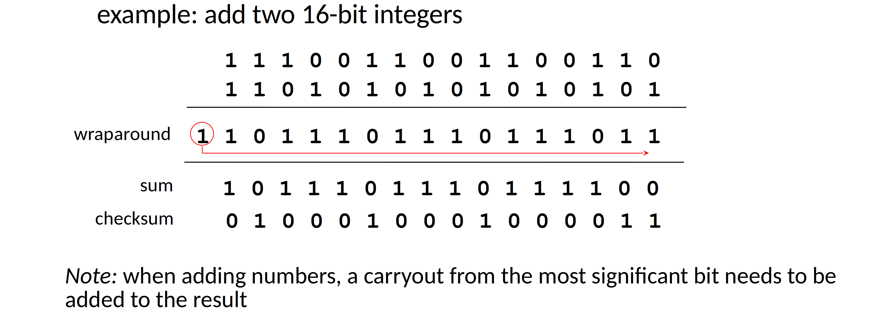
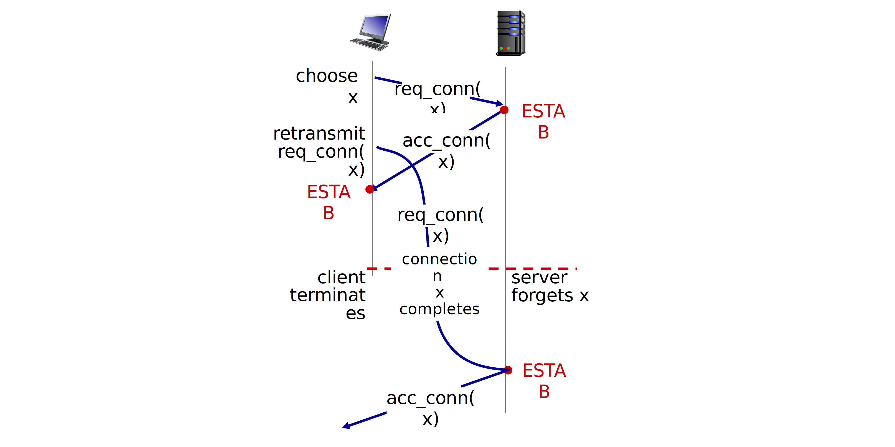
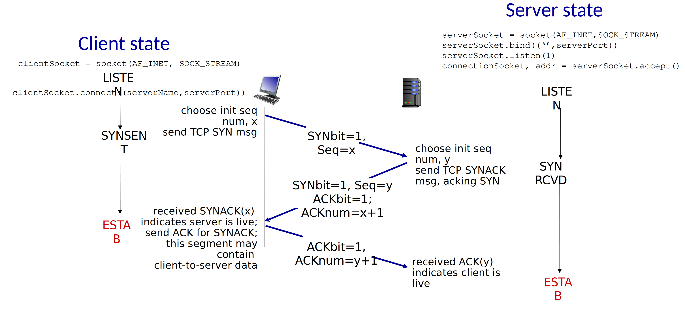
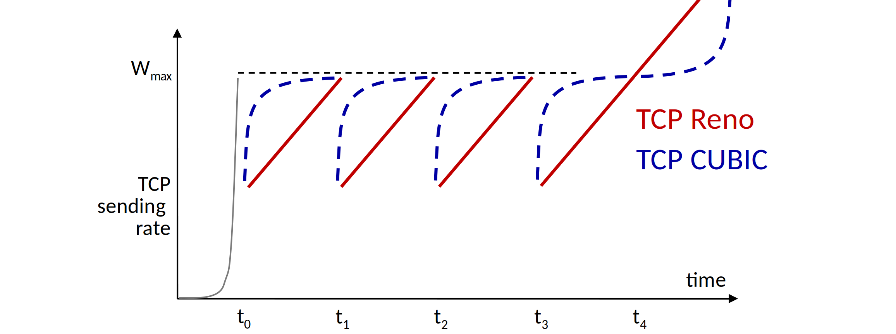
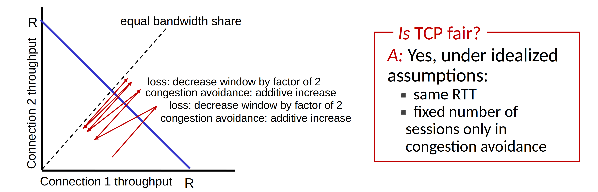

## Transport layer services

- provide **logical communication** between application processes running on different hosts
- transport protocols actions
    - sender: breaks messages into **segments**, passes to network layer
    - receiver: reassembles segments, passes to application layer
- 2 protocols
    - TCP
    - UDP

## Multiplexing and demultiplexing

> multiplexing: 复用

Sender handle data from multiple sockets,
add transport header (later used for demultiplexing).

Receiver use header info to deliver received segments to correct socket.

Host uses **IP addresses and port numbers** to direct segment to appropriate socket.

- UDP: demultiplexing using destination port number (only)
- TCP: demultiplexing using 4-tuple: source and destination IP addresses,
and port numbers

## Connectionless transport: UDP

> - "best effort" service
> - segment may be lost or out of order
> - connectionless, no hand shaking

### Why we need UDP?

- No connection establishment
- Simple: no state
- No congestion control

### Use case of UDP

- streaming multimedia apps
- DNS
- SNMP
- HTTP/3

If reliable transfer needed over UDP (e.g. HTTP/3):
- add reliability at application layer
- add congestion control at application layer

### Internet checksum

This is a weak protection, two flipped bits can have same checksum.

## Principles of reliable data transfer

> How to build reliable data transfer on top of unreliable channel?  
> **rdt**: reliable data transfer

### rdt 1.0

Reliable transfer over a reliable channel: easy.

### rdt 2.0

Channel with bit errors, how to recover?

- **ACK**: receiver explicitly tells sender that packet received OK
- **NAK - negative ACK**: receiver explicitly tells sender that packet had errors
    - sender then retransmits packet on receipt of NAK

**"Stop and wait"**:  
Sender sends one packet, then waits for receiver response.

**Flaw of rdt 2.0**:
- ACK or NAK can be corrupted
- stop and wait is slow

### rdt 2.1

**sender**
- seq added to each packet

### rdt 2.2

> No NAK, use ACK of last seq instead.

### rdt 3.0

Add a timer, which is set when a packet is sent, and sender will resend when timer goes off.

Still, performance is poor due to only one packet is in transfer each moment.

### Pipe lining: increased utilization

**Go Back N**

- sender
    - maintain a "window" of size up to N, with transmitted but unACKed packets
    - **cumulative ACK**: receiving ACK seq `n` means ACK all packets up to, including seq `n`
- receiver
    - ACK only
        - may generate duplicate ACKs
        - need only remember the seq of next needed packet (in order)
    - on receipt of out-of-order packet
        - can discard or buffer these packets
        - re-ACK the highest in-order seq

**Selective repeat**

- sender
    - data from above: if net available seq in window, send packet
    - timeout: resend packet `n`, restart timer
    - ACK `n` in `[sendbase, sendbase + N-1]`
        - mark packet `n` as received
        - if `n` smallest unACKed packet, advance window base to next unACKed seq
- receiver
    - packet `n` in `[rcvbase, rcvbase + N-1]`
        - send ACK `n`
        - out-of-order: buffer
        - in-order: deliver, advance window to next not-yet-received packet
    - packet `n` in `[rcvbase - N, rcvbase - 1]`
        - ACK `n`
    - otherwise: ignore

## Connection-oriented transport: TCP

> - point-to-point
> - reliable, in-order byte steam
> - full duplex data
> - cumulative ACKs
> - pipe lining
> - connection-oriented
> - flow controlled

### rdt in TCP

> Timer setting

TCP round trip time, timeout:

$$
\begin{align}
&EstimatedRTT = (1 - \alpha) \cdot EstimatedRTT + \alpha \cdot SampleRTT \\
&TimeoutInterval = EstimatedRTT + 4 \cdot DevRTT \\
&DevRTT = (1 - \beta) \cdot DevRTT + \beta \cdot |SampleRTT - EstimatedRTT|
\end{align}
$$

- $DevRTT$ here is a "safety margin"
- typically, $\alpha = 0.125$
- typically, $\beta = 0.25$

#### TCP fast retransmit

If sender receives 3 additional ACKs for same data (“triple duplicate ACKs”),
resend unACKed segment with smallest seq,
because it is likely that unACKed segment lost,
so don’t wait for timeout.

### Flow control

> Receiver controls sender,
> so sender won’t overflow receiver’s buffer by transmitting too much,
> too fast.

TCP receiver put the free buffer space left in `rwnd` field in TCP header,
sender limits amount of packets to the size of `rwnd`.

### Connection management

Before exchanging data, sender and receiver do "handshake".
- Agree to establish connection
- Agree on connection parameters (e.g. starting seq)

#### Establishing TCP connection

##### Why 2-way handshake don't work in all scenarios:

and here is a never ending half open connection with no client

##### TCP 3-way handshake

#### Closing TCP connection

- client, server each close their side of connection
    - send TCP segment with `FIN` bit = 1
- respond to received `FIN` with ACK
    - on receiving `FIN`, ACK can be combined with own `FIN`
- simultaneous `FIN` exchanges can be handled

## TCP congestion control

### Approaches towards congestion control

- End-end congestion control
- Network-assisted congestion control

### *Throughput based* TCP congestion control: AIMD

> **Additive** Increase and **Multiplicative** Decrease

Sending rate is cut in half on loss detected by triple duplicate ACK,
and cut to 1 MSS (maximum segment size) when loss detected by timeout.

**Why AIMD?**
- Optimize congested flow rates network wide
- have desirable stability properties

TCP sending behavior

$$
TCP \; rate \approx \frac{cwnd}{RTT} \; bytes/sec
$$

TCP sender limits transmission

$$
LastByteSent - LastByteAcked \leq cwnd
$$

**TCP slow start**:
When connection begins, increase rate exponentially until first loss event.
Initially, `cwnd = 1 MSS`, double `cwnd` every RTT.
Done by incrementing `cwnd` for every ACK received.

**TCP CUBIC**:
By contrast with TCP Reno, which increases linearly,
CUBIC increase TCP sending rate gradually slower when approaching K.

> K: point in time when TCP window size will reach $W_{max}$

### *Delay based* TCP congestion control

$$
measured\;throughput =
\frac{bytes\; sent \;in\;last\;RTT\;interval}{RTT_{measured}}
$$

Explicit congestion notification: "detect congestion before loss occurs".

### TCP fairness

**The general goal:** If K TCP sessions share same bottleneck link of bandwidth R,
each should have average rate of $\frac{R}{K}$.

## Evolution of transport-layer functionality

> Evolving transport layer functionality

**QUIC**: Quick UDP Internet Connections
