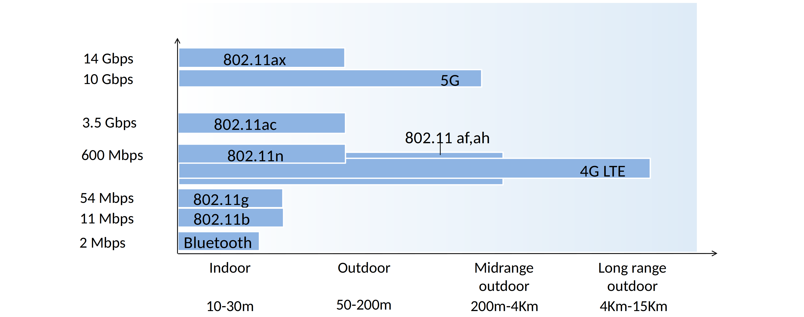
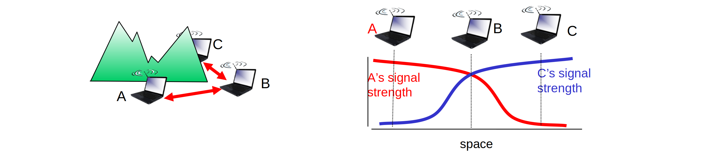
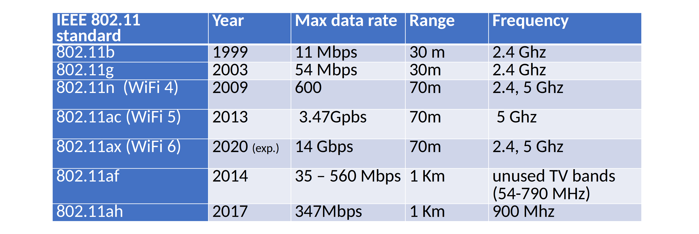
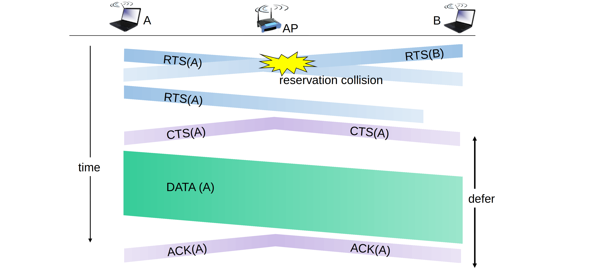
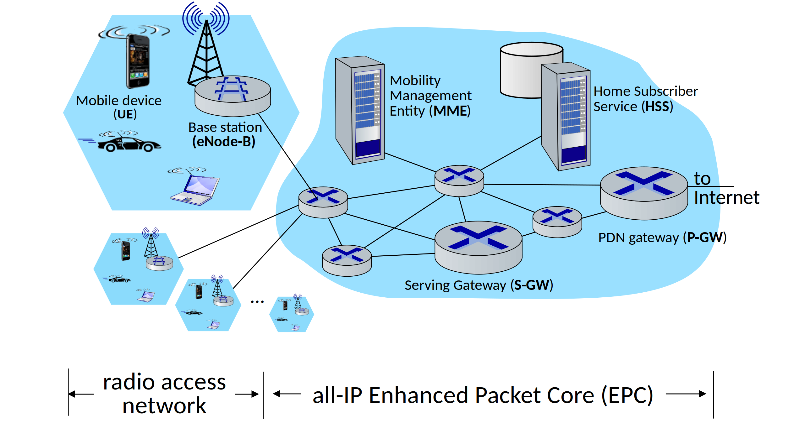

<!--toc:start-->
- [Wireless](#wireless)
  - [Wireless links and network characteristics](#wireless-links-and-network-characteristics)
  - [Wi-Fi: 802.11 wireless LAN](#wi-fi-80211-wireless-lan)
  - [Cellular networks: 4G and 5G](#cellular-networks-4g-and-5g)
- [Mobility](#mobility)
  - [Principles](#principles)
  - [Practice](#practice)
<!--toc:end-->

## Wireless

### Wireless links and network characteristics

- decreased signal strength
- interference from other sources
- multipath propagation
- hidden terminal problem
- signal attenuation

### Wi-Fi: 802.11 wireless LAN

All use CSMA/CA for multiple access, and have base-station and ad-hoc network versions.

**Collision Avoidance**: RTS-CTS exchange

### Cellular networks: 4G and 5G

- Mobile device
- Base station
- Home Subscriber Service
- Serving Gateway (S-GW)
- PDN Gateway (P-GW)
- Mobility Management Entity

## Mobility

### Principles

Let end-systems handle it: functionality at the "edge"

### Practice

Major tasks
1. base station association
2. control-plane configuration
3. data-plane configuration
4. mobile handover

