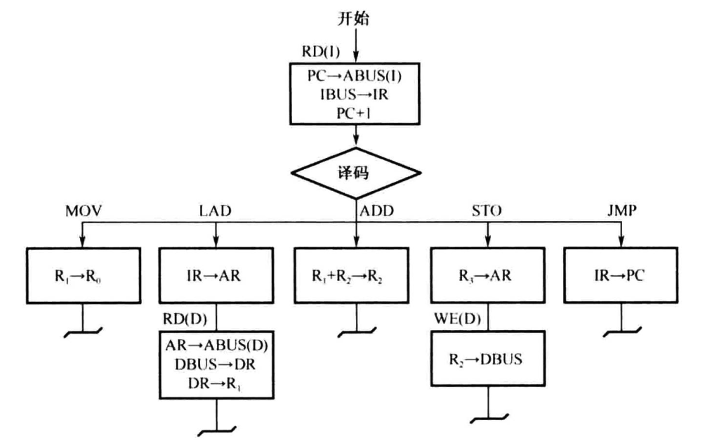
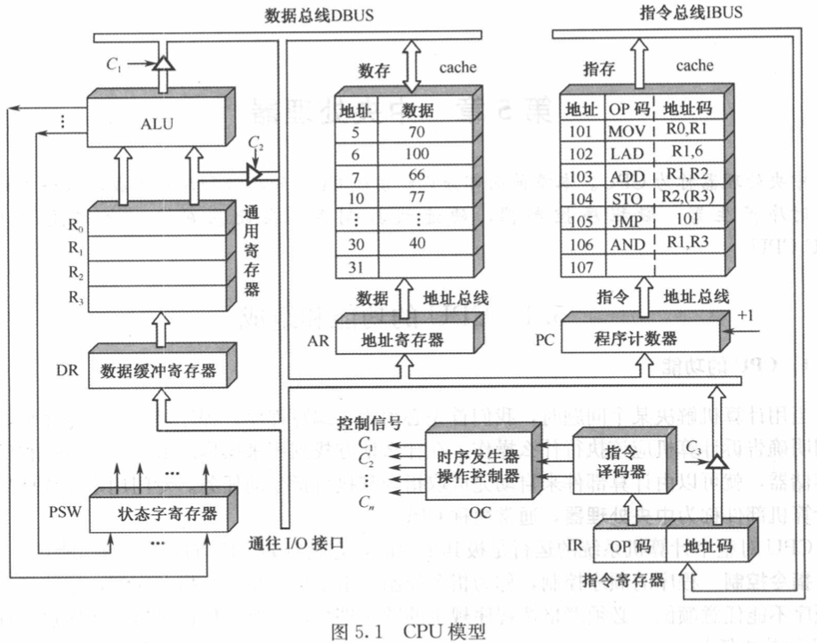

四方面基本功能
1. 指令控制
2. 操作控制
3. 时间控制
4. 数据加工

主要组成部分
- 控制器
- 运算器

## 用方框图语言表示指令周期

## 微程序控制器

微指令格式
1. 水平型微指令：一次能定义并执行多个并行操作微命令的微指令
2. 垂直型微指令：微指令中设置微操作码字段，采用微操作码编译法，由微操作码规定微指令的功能

## CPU 流水线

> 一条指令执行的4个阶段
> 1. IF 取指令
> 2. ID 指令译码
> 3. EX 执行运算
> 4. MEM 访存取数
> 5. WB 结果写回

### 流水线的冒险与处理

1. 结构冒险：多条指令在同一时刻争用同一资源，解决方法：
    1. 后一条指令暂停一个时钟周期
    2. 单独设置数据存储器和指令存储器，使取数和取指令操作在不同的存储器中进行
2. 数据冒险：
    1. 写后读
    2. 读后写
    3. 写后写
- 解决办法：数据旁路：在输出和输入之间有专门的通道可以执行结果到输入的操作，
解决了需要等待操作完成的问题
3. 控制冒险：指令不一定顺序执行，如果执行转移、调用或返回等指令时，会改变 PC 值

### 流水线的性能指标

流水线的吞吐率：

$$
TP = \frac{n}{(k + n - 1) \cdot \Delta t}
$$
- $n$: 总任务数
- $k$: 流水段的段数
- $\Delta t$: 时钟周期

流水线的加速比：

$$
S = \frac{T_0}{T_k}
$$
- $T_0$: 不使用流水线的总时间
- $T_k$: 使用流水线的总时间

## 习题

***参见下图的数据通路，画出取数指令“LAD （R3），RO”的指令周期流程图，
其含义是将（R3）为地址数存单元的内容取至寄存器Ro中，标出各微操作控制信号序列。***

1. C1
    1. PC -> IBUS PCout
    2. IBUS -> IR IRin
    3. PC -> PC+1 PC+1
2. C2 译码
3. C3
    1. (R2) -> AR R3out, ARin, C2
    2. Cache -> DR DRin
    3. (DR) -> R0 R0in

***假设某机器有80条指令，平均每条指令由4条微指令组成，其中有一条取指微指令是所有指令公用的。
已知微指令长度为32位，请估算控制存储器容量。***

$$
32 \times (80\times 3 + 1)
$$

***某计算机有如下部件：ALU，移位器，主存M，主存数据寄存器MDR，
主存地址寄存器MAR，指令寄存器IR，通用寄存器R0~R3，暂存器C和D。***

*(1) 画出“ADD R1，R2”指令的指令周期流程图（（R1）+（R2）-> R2 ）。*

- PC -> MAR
- M -> MDR
- MDR -> IR
- PC + 1
- 译码
- R1 -> C
- R2 -> D
- C + D -> R2

***已知某机采用微程序控制方式，控存容量为512X48位。
微程序可在整个控存中实现转移，控制微程序转移的条件共4个，微指令采用水平型格式，
后继微指令地址采用断定方式。请问：***

*(1) 微指令的三个字段分别应为多少位？*

控制 4 地址 9 操作 35

***今有4级流水线，分别完成取指、指令译码并取数、运算、送结果四步操作。
今假设完成各步操作的时间依次为100ns，100ns， 80ns， 50ns。 请问：***

*(1) 流水线的操作周期应设计为多少？*

100ns

*(2) 若相邻两条指令发生数据相关，硬件上不采取措施，那么第2条指令要推迟多少时间进行？*

两条指令发生冲突时，前一条指令的 EX 和 WB 冲突，因此第二条指令需要延迟两个时钟周期，也就是 200ns。

*(3) 如果在硬件设计上加以改进，至少需推迟多少时间*

如果改进，使用旁路技术，这样只需推迟 1 个操作时钟就能得到所需数据，即推迟 100ns。

