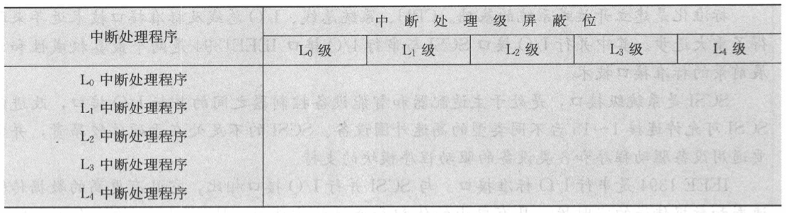

## IO 方式

### 程序查询方式

### 程序终中断方式

1. 设备发起中断请求
2. 中断响应判断优先级
3. 响应中断
4. 恢复中断，程序继续执行

中断屏蔽位设置：将中断处理次序从高到底排序，每一级的屏蔽位将自身以及自身右边对应位置1，其他位置0。

### DMA 方式

1. 设备发起 DMA 请求
2. CPU 响应请求，将总线交给设备控制，进入DMA 操作周期
3. 设备设置相关参数
4. 设备向主存中写入数据
5. 设备向 CPU 报告 DMA 操作结束
6. DMA 传送结束后的处理由中断服务程序完成

## 习题

**_在第6版教材图8.12中，假定CPU取指并执行一条指令的时间为t1，保护现场需t2， 恢复现场需t3，
中断周期需t4，每个设备的设备服务时间为tA，tB，...，tG。试计算只有设备A，D，G时的系统中断饱和时间。_**

$$
3\cdot (t_1+t_2+t_3+t_4)+t_A+t_D+t_G
$$

**_设某机有5级中断： L0，L1，L2，L3，L4，
其中断响应优先次序为： L0最高，L1次之，L4最低。现在要求将中断处理次序改为L1→L3→L0→L4→L2，试问：_**

_(1) 下表中各级中断处理程序的各中断级屏蔽值如何设置
（每级对应一位，该位为 0 表示允许中断，该位为 1 表示中断屏蔽）_

| 中断处理程序 | L0  | L1  | L2  | L3  | L4  |
| ------------ | --- | --- | --- | --- | --- |
| L0           | 1   | 0   | 1   | 0   | 1   |
| L1           | 1   | 1   | 1   | 1   | 1   |
| L2           | 0   | 0   | 1   | 0   | 0   |
| L3           | 1   | 0   | 1   | 1   | 1   |
| L4           | 0   | 0   | 1   | 0   | 1   |
