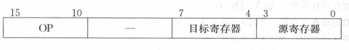
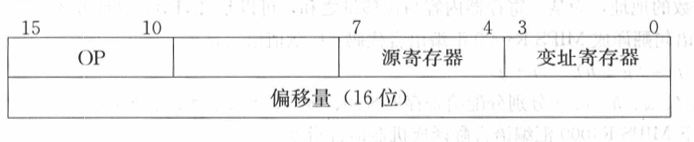
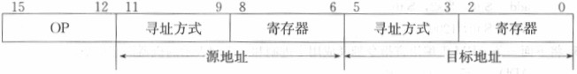
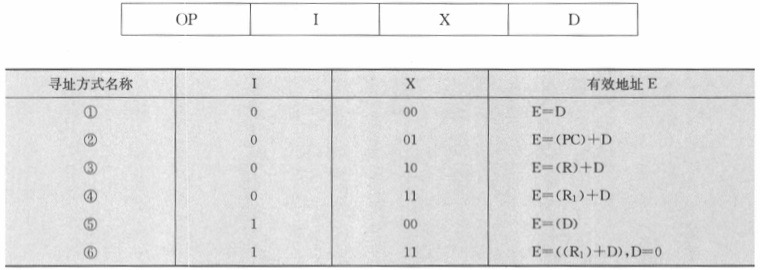

<!--toc:start-->

- [值令格式](#值令格式)
- [操作数类型](#操作数类型)
- [寻址方式](#寻址方式)
- [典型指令](#典型指令)
- [习题](#习题)
<!--toc:end-->

## 值令格式

- 操作码
- 地址码
  - 0、1、2、3地址指令
- 指令字长度

## 操作数类型

- 地址
- 数值
- 字符
- 逻辑

## 寻址方式

指令中包含一个特殊字段：寻址特征位，用来标识采用何种寻址方式。

- 指令的寻址方式
  1. 顺序寻址
  2. 跳跃寻址
- 操作数的寻址方式
  1. 隐含寻址：操作数在专用寄存器
  2. 立即寻址
  3. 直接寻址：EA = A
  4. 间接寻址：EA = (A)
  5. 寄存器寻址：EA = R
  6. 寄存器间接寻址：EA = (R)
  7. 偏移寻址：EA = A + (R)
     1. 相对寻址：EA = A + (PC)
     2. 基址寻址：EA = B + (R)，B 是专用寄存器中的值
     3. 变址寻址：主存地址位数大于变址寄存器和指令中地址码长度，
        主存中地址由变址寄存器中的值向左偏移后和指令地址码相加得到。
  8. 段寻址：EA = A + (R)
  9. 堆栈寻址：EA = 栈顶

## 典型指令

- 数据处理
- 数据存储
- 数据传送
- 程序控制

## 习题

**_假设某计算机指令长度为32位，具有双操作数、单操作数、无操作数三类指令形式，
指令系统共有70条指令，请设计满足要求的指令格式。_**

70 条指令，所以 OP 需要 7 位。

- 双操作数指令：OP 7, 操作数 12 \* 2
- 单操作数指令：OP 7, 操作数 25
- 无操作数指令：OP 7

**_指令格式结构如下所示，试分析指令格式及寻址方式特点_**



1. 单字长二地址指令
2. OP 可指定 64 种操作
3. RR 型指令，源和目标都是寄存器（可分别指向 16 个寄存器）

**_指令格式结构如下所示，试分析指令格式及寻址方式特点_**



1. 双字长二地址指令，用于访问存储器
2. OP 可指定 64 种操作
3. RS 型指令，第二个操作数的地址通过变址寻址方式得到

**_指令格式结构如下所示，试分析指令格式及寻址方式特点_**



1. 单字长双操作数指令
2. 每个操作数的寻址方式和寄存器均有 8 种不同选择，指令可以是 RR 型、RS 型、SS 型
3. OP 长 4 位，所以最多有 16 种不同的指令操作

**_一种单地址指令格式如下所示，其中I为间接特征，X为寻址模式，D为形式地址。
I，x，&nbsp;D组成该指令的操作数有效地址E。
设R为变址寄存器，R1为基址寄存器，PC为程序计数器，请写出下表第一列中1-6寻址方式名称。_**



1. 直接寻址
2. 相对寻址
3. 变址寻址
4. 基址寻址
5. 间接寻址
6. 先基址后间接寻址

**_某计算机字长为32位，主存按字编址其容量为64MB，采用单字长单地址指令，共有40条指令。
试采用直接、立即、基址和相对寻址四种方式设计指令格式。_**

- 40 种指令：OP 6
- 4 种寻址方式：寻址方式 2
- 主存 64MB：地址 16 位

**_某机字长为32位，主存容量为1MB，单字长指令，有50种操作码，采用寄存器寻址、
寄存器间接寻址、立即、直接等寻址方式。CPU中有PC，IR，AR，DR和16个通用寄存器。问：_**

_(1) 指令格式如何安排？_

- OP 6
- 寻址方式 2
- 寄存器 4
- 操作数 20

_(2) 能否增加其他寻址方式？_

若将形式地址的位数减少，则可以增加其他的寻址方式

**_设某机字长为32位，CPU中有16个32位通用寄存器，设计一种能容纳64种操作的指令系统。
如果采用通用寄存器作基址寄存器，则RS型指令的最大存储空间是多少？_**

- OP 6
- 寻址方式 2
- 源寄存器和目标寄存器 各 4
- 形式地址 16

最大地址空间：$2^{32} + 2^{22} = 4GB + 4MB$

**_将如下MIPS R4000汇编语言指令翻译成机器语言指令。_**

```asm
lw     $t0, 1200($t1)
add    $t0, $s2, $t0
sw     $t0, 1200($t1)
```
