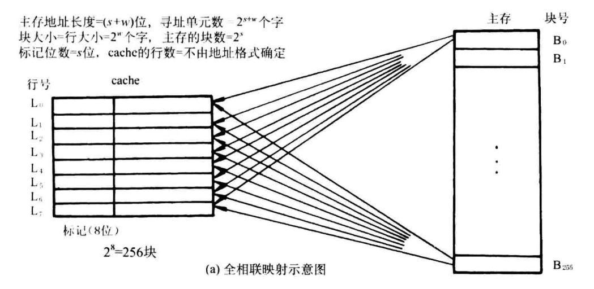
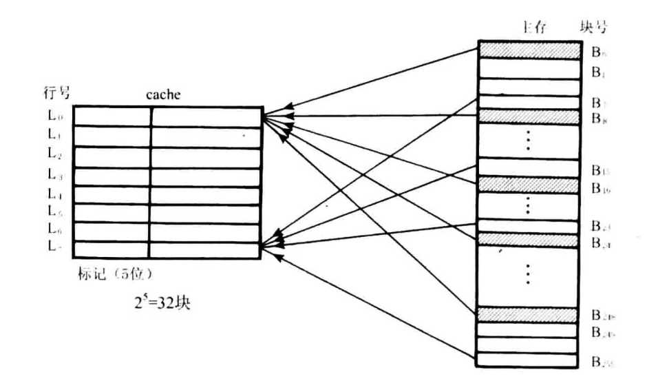
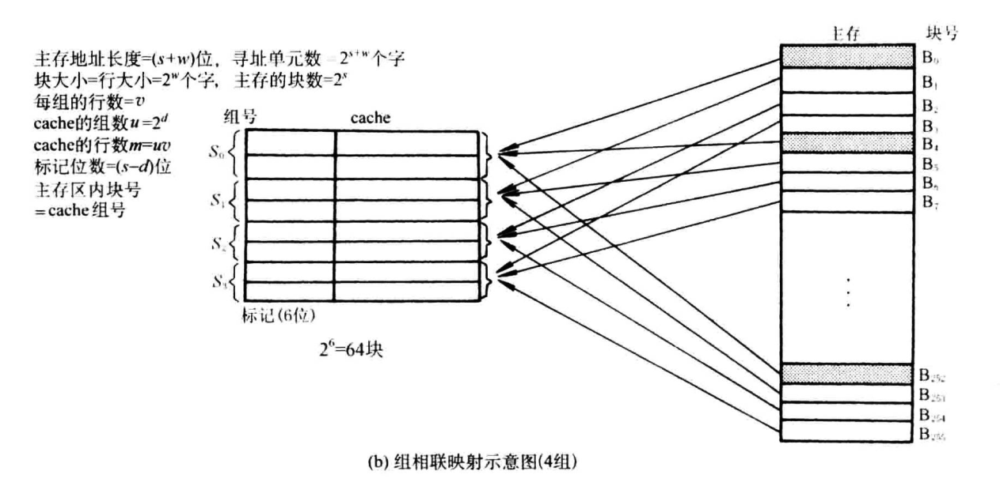

层次结构存储器系统
1. 寄存器
2. cache
3. 主存储器
4. 磁盘、光盘
5. 磁带

## SRAM

双译码，将地址分为 x 向、y 向两部分。

## DRAM

### 重要参数

- $t_{RAC}$: 读访问时间
- $t_{RC}$: 读/写周期
- $t_{CAC}$: 从 $\bar{CAS}$ 的读出时间
- $t_{PC}$: 页模式下的读/写周期

### DRAM 的刷新

- 集中式刷新：每一个刷新间隔的固定一段时间逐行刷新整个存储器
- 分散式刷新：必须在刷新周期内全部刷新一遍

刷新操作是对一行所有单元同时进行的

### 习题

***用16K x 8位的DRAM芯片构成64K x 32位存储器，假设DRAM芯片的存储阵列128 x 128，刷新周期2ms。***

*设存储器读/写周期为0.5μs， CPU在1μs内至少要访问一次。试问采用哪种刷新方式比较合理？
两次刷新的最大时间间隔是多少？对全部存储单元刷新一遍 所需的实际刷新时间是多少？*

若采用集中式刷新，每次刷新用时：$0.5\mu s \times 128 = 64\mu s > 1\mu s$ CPU 访问周期

因此采用分散式刷新，
最大刷新间隔为 $\frac{2ms}{128} = 15.6 \mu s$，取 $0.5 \mu s$ 的整数倍，为 $15.5 \mu s$，
则全部刷新一遍用时 $15.5\times 128 = 1984 \mu s$

## 对比 SRAM 与 DRAM

| DRAM | SRAM |
|------|------|
| 在主存中使用 | 在 cache 中使用 |
| 较慢访问时间（慢10倍） | 较快访问时间 |
| 高密度 | 低密度 |
| 低成本 | 高成本（高100倍） |
| 需要刷新（2~100ms） | 不需要刷新 |
| 读操作是破坏性的，需要写回 | 读操作不是破坏性的 |
| 地址线分时复用 | 地址线不是分时复用 |

## Cache 存储器

> 一种高速缓冲存储器，解决 CPU 和主存速度不匹配。
> 包括管理在内的全部功能由硬件实现，因此从软件角度来看，cache 是透明的。

### 基本原理

CPU 与 cache 之间的数据交换以字为单位，cache 与主存之间的数据交换以块为单位。
当 CPU 读取内存中的一个字时，将这个字的内存地址发送到 cache，cache 控制逻辑判断次字是否在 cache 中：
若是，则 cache 命中，此字立即传给 CPU，若非，则 cache 缺失，用主存读取周期把这个字从主存读出送到 CPU，
同时，把含有这个字的整个数据块从主存读出送到 cache 中。

Cache 的命中率为

$$
h = \frac{N_c}{N_c + N_m}
$$
- $N_c$: cache 完成存取的总次数
- $N_m$: 主存完成存取的总次数

Cache/主存系统的平均访问时间为

$$
t_a = h t_c + (1-h) t_m
$$
- $t_c$: 命中时的 cache 访问时间
- $t_m$: 未命中时的主存访问时间

访问效率为

$$
e = \frac{t_c}{t_a} = \frac{1}{r + (1-r)h}
$$
- $r = \frac{t_m}{t_c}$

### 主存与 cache 的地址映射

#### 全相联

#### 直接

i = j mod m
- i: cache 行号
- j: 主存块号
- m: cache 中总行数

#### 组相联

### Cache 冲突缺失和容量缺失的处理

- 随机替换
- 先进先出
- 最少使用
- 最久未使用

## 虚拟存储器

### 段式存储管理

> 给程序一个比实际内存大得多的编址空间

用段表来指明各段在主存中的位置，各段都有名称、起点、段长等

### 页式虚拟存储器

把虚拟空间和主存空间都分成大小相同的页，以页为单位进行虚存与主存之间的信息交换。
- 页号
- 页内地址

页号不同，页内地址相同。

