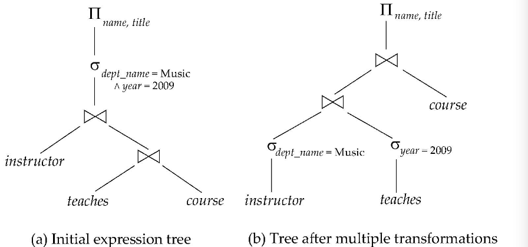

<!--toc:start-->
- [处理流程](#处理流程)
- [查询性能度量](#查询性能度量)
- [查询优化](#查询优化)
  - [Cost-based Optimization](#cost-based-optimization)
  - [Heuristic Optimization](#heuristic-optimization)
<!--toc:end-->

## 处理流程
1. Parser and translator generates relational algebra expression
2. Optimizer 结合数据特点进行优化，给出 execution plan
3. Evaluation engine 运行事物并给出输出

## 查询性能度量
目标：优化查询时间，目标分解：
- 磁盘访问
- CPU 执行
- 甚至是网络连接

其中最首要的开销是磁盘访问时间，同时这个也容易测量。
- seek 数量
- blocks read 数
- blocks written 数

## 查询优化

### Cost-based Optimization
1. 使用等价规则生成逻辑等价的表达式
2. 生成所有逻辑等价的表达式
3. 从所有等价的表达式中选择开销最小的执行

### Heuristic Optimization
启发式的优化，遵循以下这几个规则
1. 尽早进行选择操作（减少要操作的原组数量）
2. 尽早进行投影操作（减少要操作的原组中的属性）
3. 在多个操作（如连接操作）可按任意顺序先后执行时选择最严格的
（即输出结果数量最小的）先执行
4. 笛卡尔乘积和选择组合成连接操作
5. 投影和相邻的操作结合，减少为链投影而进行单独的 I/O 操作
6. 存储公共的常用的结果

有些系统只使用启发式优化，有些则结合启发式优化和 cost-based 优化。

启发式优化的前提
1. 选择串接律：多个选择同时进行和先后进行结果一致
2. 选择交换律：多个先后执行的选择调换顺序结果一致
3. 投影串接律：多个投影操作调换顺序执行结果一致

### Expression Tree
叶节点是关系，非叶节点是各种关系代数操作。

