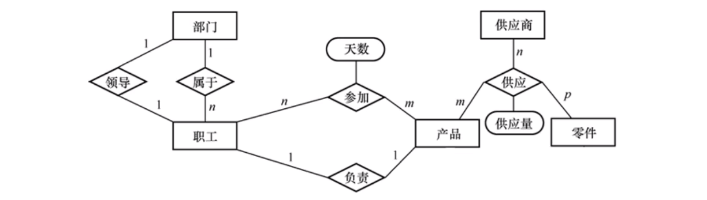

<!--toc:start-->
- [ER 图](#er-图)
- [ER 图转表](#er-图转表)
- [例子](#例子)
- [数据模型的优化](#数据模型的优化)
<!--toc:end-->

---

## ER 图
表示实体、属性和联系的方法
- 实体集：矩形，框内写明实体名
    - 强实体集：能够独立存在
    - 弱实体集：不能够脱离强实体集存在，至少要和一个强实体集存在联系
- 属性：写在实体型的框内或联系集的框内
- 联系集：用菱形画出

## ER 图转表
1. 一个实体转换为一张表
    - 如果有次级属性，单独拆一张表，主键是实体的主键
    - 如果有多值属性，单独拆一张表，主键是实体的主键和多值属性的一个值
2. 联系的处理
    - 1 对 1 联系可以转换为一个独立的表，也可以与任意一端的表合并
    - 1 对多联系可以转换为一个独立的关系模式，也可与 n 端对应的关系模式合并
    - 多对多联系一定要转换为一个独立的关系模式

不考虑效率为了应试的话，可以选择全拆成表。若考虑效率，则要尽可能不拆表。

## 例子

最简化操作拆表（全拆）：每个属性和联系全拆成表，共 10 张。

最高效拆表（尽可能不拆）：
- 五个实体集各一张表
- `领导` 关系可以并入部门或职工
- `属于` 关系并入职工（职工中存其所在部门的主键）
- `负责` 关系并入职工或产品，或作为 `参加` 关系中的一列表示
- `参加` 关系生成单独一张表
- `供应` 关系生成单独一张表

## 数据模型的优化
1. 将 ER 图拆成关系模型
2. 使用范式理论去除不合理的函数依赖和冗余

