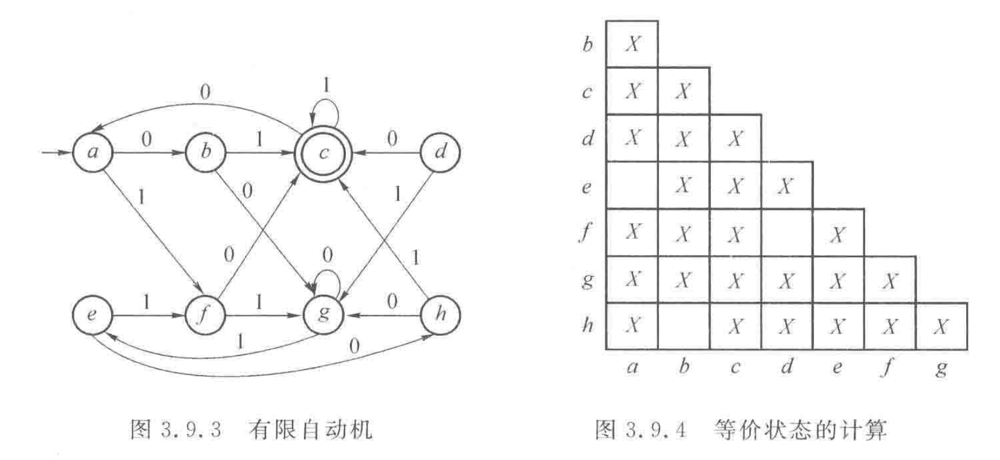
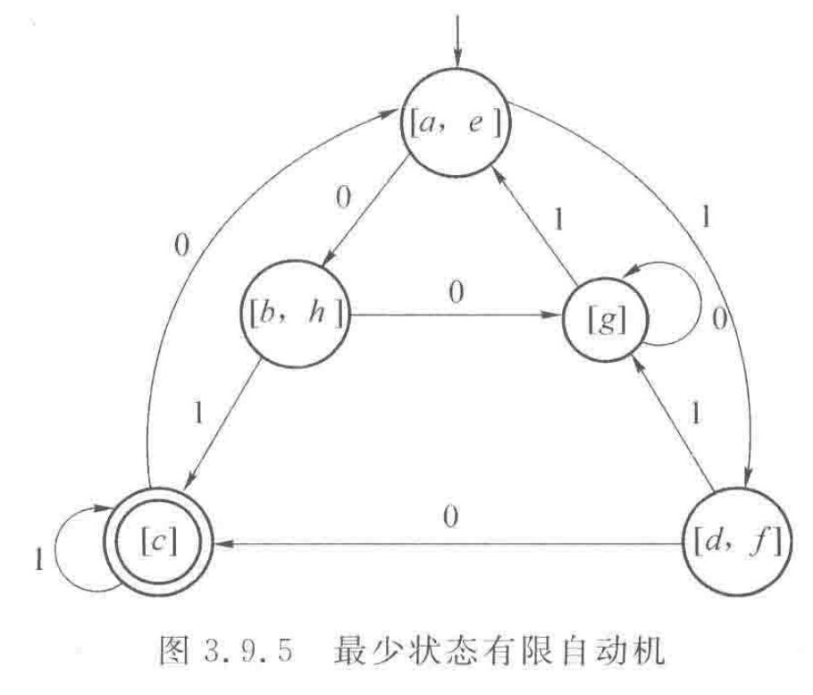

## NFA 转 DFA

NFA

$$
\delta(p, 0) = \{ q \} \\
\delta(p, 1) = \Theta  \\
\delta(q, 0) = \{ q \} \\
\delta(q, 1) = \{ q, r \} \\
\delta(r, 0) = \Theta \\
\delta(r, 1) = \Theta \\
$$

DFA

$$
\delta((q, r), 0) = \{ q \} \\
\delta((q, r), 1) = \{ q, r \} \\
$$

## $\epsilon$ NFA 转 无 $\epsilon$ NFA

$\epsilon$-闭包：每个状态的 $\epsilon$-闭包定义为此状态
仅接受空串能够到达的状态的集合（包括该状态自身）。

$$
\delta(q, a) = \epsilon\;闭包(\delta(q, a))
$$

## 由 DFA 构造正则表达式

状态消去法：消去状态，让转移条件是正则表达式。

## DFA 的化简

状态等价：两个状态接受相同的串能在最后达到同一终止状态，
则两状态等价。

### 填表法

1. 按照非终结符和终结符画出第一批不等价状态

2. 如果两个状态能通过相同的输入到达两个不等价状态，
则这两个状态也不等价

3. 重复第 2 步，最后剩下的几组即为等价状态，将每组分别写为
新的状态，如：[a, b]

## 有输出的有限自动机

### 米兰机

“输出在边上“

### 摩尔机

“输出在状态节点上”

### 从摩尔机构造等价米兰机

“把输出从节点按照箭头反方向写到边上”

## 泵引理

定理：设 $L$ 是正则集，存在常数 $n$，
对字符串 $\omega \isin L$ 且 $|\omega| \geq n $，
则 $\omega$ 可以写成 $\omega_0\omega_1\omega_2$，
其中 $|\omega_1\omega_0| \leq n$, $|\omega_0| > 0$，
且对所有的 $i \geq 0$ 有 $\omega_1\omega_0^i\omega_2 \isin L$。

**用泵引理证明某个语言不是正则语言**

证明方法：反证法。假设这个语言是正则语言，使用泵浦引理。
如果发现了某个i使循环体循环i次之后得到的串不满足语言要求，
则这个语言不是正则语言
（因为正则语言循环体循环任意次都满足要求）。

