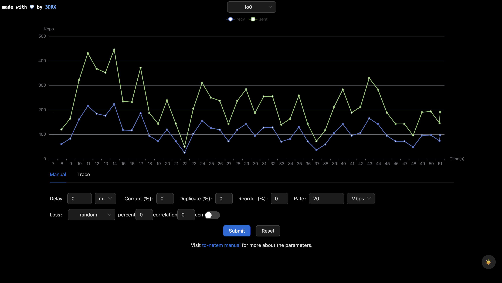

Changes:
1. Rewrite server in go, with better error handling.
2. Add more netem configuration support (e.g: loss distribution).
3. Display server error as a popup on webui.
4. Small usability improvements and bug fixes at frontend.

Future plans:
1. Investigate on [go-tc](https://github.com/florianl/go-tc)
for controlling tc netem, instead of executing commands as for now.
2. Add more fields in the form.
3. Update trace file feature.
4. Create a seperate client (maybe a phone app), that's able to record
a trace file based on real-time network conditions. The underlying
tool is probably going to be [iperf](https://iperf.fr/).
