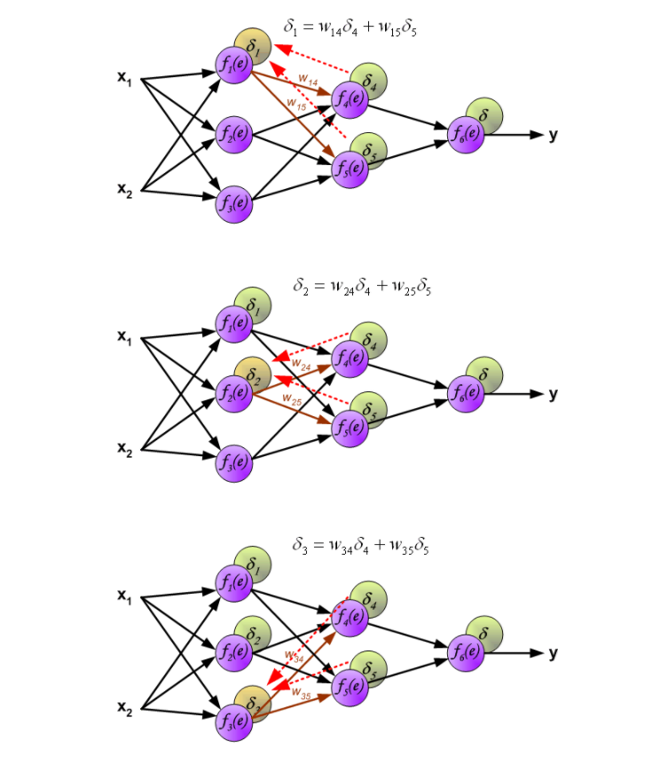
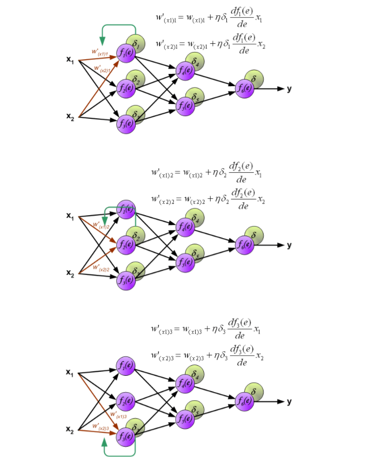
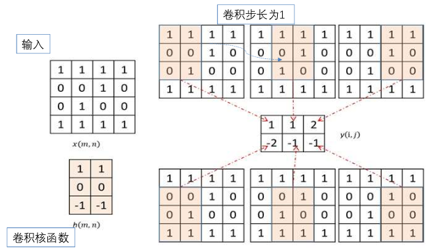

<!--toc:start-->
- [概述](#概述)
  - [常见的机器学习模型及分类](#常见的机器学习模型及分类)
- [几何模型](#几何模型)
  - [线性回归](#线性回归)
  - [线性分类器](#线性分类器)
  - [SVM](#svm)
  - [KNN](#knn)
  - [K-means](#k-means)
- [神经网络](#神经网络)
  - [神经元模型](#神经元模型)
  - [单层神经网络](#单层神经网络)
  - [多层网络](#多层网络)
    - [前向传播](#前向传播)
    - [反向传播](#反向传播)
- [模型评估与选择](#模型评估与选择)
- [逻辑模型](#逻辑模型)
- [计算学习理论](#计算学习理论)
  - [PAC (Probably Approximately Correct) 可学习性](#pac-probably-approximately-correct-可学习性)
  - [有限假设空间的样本复杂度](#有限假设空间的样本复杂度)
  - [VC 维](#vc-维)
  - [无限假设空间的样本复杂度](#无限假设空间的样本复杂度)
- [概率模型](#概率模型)
  - [朴素贝叶斯模型](#朴素贝叶斯模型)
- [卷积神经网络 CNN](#卷积神经网络-cnn)
- [循环神经网络 RNN](#循环神经网络-rnn)
- [集成模型](#集成模型)
  - [集成学习思想](#集成学习思想)
  - [Bagging 算法](#bagging-算法)
    - [自助采样 Bagging](#自助采样-bagging)
    - [随机森林 Bagging](#随机森林-bagging)
  - [Boosting 算法](#boosting-算法)
  - [Stacking 算法](#stacking-算法)
- [强化学习](#强化学习)
<!--toc:end-->

---

## 概述

机器学习系统构成的要素：使用正确的特征来构建正确的模型，
以完成特定的任务，构建模型的过程使用学习算法。

### 常见的机器学习模型及分类

按照输入输出分类
- 无监督学习模型
    - K-means 等数据聚类、PCA 等数据降维主成分分析
- 有监督学习模型，定量输出称为回归，或是说连续变量预测；
定性输出称为分类，或者说是离散变量预测
    - 分类模型：线性分类器、SVM、朴素贝叶斯、KNN、决策树等
    - 回归模型：线性回归、SVM 回归、KNN 回归、回归树等

按照“函数”到底是什么分类
- 几何模型：线性分类器、SVM、KNN、K-means 等
- 逻辑模型，基于特定推理方法构建的模型：决策树、关联规则挖掘
- 概率模型，将学习任务归结为计算变量的概率分布：感知机、决策树、
KNN、逻辑斯蒂回归、最大熵模型、支持向量机、提升法、条件随机场。
对联合分布建模得到后验概率的方法成为生成式概率模型，如朴素贝叶斯、
隐马尔科夫模型等

## 几何模型
### 线性回归
$$
f(x) = \omega_1x_1 + \omega_2x_2 + ... + \omega_nx_n + b
$$
学习目标：误差平方最小化
$$
minL(y, f(x)) = \frac{1}{2}(y - f(x))^2
$$
通常令 $b = \omega_0x_0$
$$
\begin{aligned}
minR_{emp}(f) &= \sum_{i=1}^M\frac{1}{2}(y^{(j)} - \omega x^{(j)})^2 \\
&= \frac{1}{2}(Y-\omega X)^T(Y-\omega X)
\end{aligned}
$$
求导后令导数等于 0
$$
\begin{aligned}
\frac{\partial R}{\partial \omega} &= X^TX\omega - X^TY=0 \\
\omega &= (X^TX)^{-1}X^TY
\end{aligned}
$$

### 线性分类器
Fisher 线性分类器：
找到一个最合适的投影轴，使两类样本在该轴上投影之间的距离尽可能远，
而每一类样本的投影尽可能紧凑，从而使分类效果为最佳。

### SVM
$$
\begin{cases}
&\underset{\omega, b}{min}\frac{1}{2}\omega^T\omega \\
s.t. &y^{(n)}(\omega^Tx^{(n)} + b) \geq 1, \; n = 1,2,...N
\end{cases}
$$

### KNN
Minkowski distance
$$
d_{mink}(x, x') = (\sum_{i=1}^n |x_i - x'_i|^p)^{\frac{1}{p}}
$$
其中 $p=1$ 时是曼哈顿距离，$p=2$ 时是欧氏距离。

K 值的选取
- 过小，受噪声影响大
- 过大，模型失去分类的意义

### K-means
1. 随机选出 K 个质心
2. 通过距离最近的原则，将所有样本点划分到质心所在的组
3. 计算组内均值，得到新的质心
4. 反复迭代步骤 2、3, 直到质心不再变化

优化思路
1. 优化质心选择方法
2. 用两边之和大于第三边的性质，减少距离计算
3. Mini batch

## 神经网络
### 神经元模型
n 个输入 $x_i$ 乘以 n 个权值 $\omega_i$ 求和后经过非线性函数 $O$ 输出。

### 单层神经网络
感知机学习法则
1. 用较小的非零随机数初始化权重 $\omega_i,\; i=0,1,2,...,n$
2. 对输入的 M 个样本 $(x_j, y_j),\; j=1,2,...,M$
    1. 计算 $O(x_j)$, $e_j = y_j - O(x_j)$
    2. 调整权重 $\omega := \omega + \eta e_jx_j$
3. 重复 2, 直到感知机对所有样本的实际输出和期望输出相等

神经网络学习法则：梯度下降 Delta 法则
$$
\begin{aligned}
E &= \frac{1}{2}\sum_{j=1}^M(y_j - O_j)^2 \\
&= \frac{1}{2}\sum_{j=1}^M(y_j - f(\omega x_j))^2 \\
\omega_i &:= \omega_i - \eta \frac{\partial E}{\partial \omega_i}
\end{aligned}
$$

随机梯度下降
- Delta法则给出的梯度下降训练规则，
在对训练样例中所有训练样例求和后计算权值更新，
随机梯度下降的思想是根据每个单独样例的误差增量地计算权值更新，
得到近似的梯度下降搜索。
- $\delta\omega_i = \eta[y-f(\omega x)]f'(\omega x)x_i$

### 多层网络

#### 前向传播
权重是矩阵，输入也是矩阵，
前向传播就是矩阵乘法后经过激活函数进入下一层。

#### 反向传播
误差 $\delta$ 的反向传播：

更新权重：

## 模型评估与选择
[模型评估与选择](/blog/machine_learning/model_evaluation)

## 逻辑模型
[逻辑模型](/blog/machine_learning/logistic_model)

## 计算学习理论
### PAC (Probably Approximately Correct) 可学习性
定义：如果是 PAC 可学习，就意味着，存在正整数 $M$，
如果有 $m \geq M$ 个样本，
就一定能够做到（通过统计信息训练模型得到）
$P(E(h)\leq \epsilon)\geq 1 - \xi$。
PAC 学习给出了一个抽象地刻画机器学习能力的框架。

### 有限假设空间的样本复杂度
目标概念 $c$ 属于假设空间 $H$，寻找满足
$P(E(h) \leq \epsilon) \geq 1 - \delta$ 的 $m$。
若假设空间有限，记为 $|H|$，要保证完美训练能够输出一个泛化误差小于
$\epsilon$ 的 $h$ 的概率大于 $1 - \delta$，即可要求
$P_H < \delta$，即有 $|H|e^{-m\epsilon} < \delta$，因此可以得到
$m \geq \frac{1}{\epsilon}(\ln |H| + \ln \frac{1}{\delta})$。

### VC 维
假设空间 H 的 VC 维就是一定能够被算法打散的最大实例集的大小，
例如：
1. 值为 0 和 1 的点分布在二维平面上，最任意位置 3 个点
在一个平面上是线性可分的，如果包含 4 个点则存在线性不可分的情况，
即线性分类器的 VC 维为 3。
2. 感知机的 VC 维是 N + 1（N 是感知机的维度）。

### 无限假设空间的样本复杂度
> 定理：任何 VC 维有限的假设空间 H 都是 PAC 可学习的。

## 概率模型
> 先验概率和后验概率
> - 先验概率： 根据经验得到的概率， 不考虑任何相关原因
> - 后验概率：根据已经出现的条件， 得到的概率

概率模型就是将学习任务归结为计算变量的概率分布的机器学习模型。
假设有 k 种可能标签，记作 $\gamma = \{c_1, c_2, ..., c_k\}$，
对于输入样本集 X 中的 x，分类为 $c_j$ 的后验概率为
$$
P(c_j | x), \; j = 1, 2, ..., k
$$

### 朴素贝叶斯模型
1. 先针对所有训练样本得出每个标签的先验概率
，即某一标签在训练数据中的占比。例如：计算标签是好瓜的比例（概率）
2. 基于条件概率，计算联合概率 $P(x, c_j) = P(c_j)P(x| c_j)$。
例如：计算标签是好瓜时属性“颜色”的值是青绿的概率。
3. 计算后验概率 $P(c_i|x) = \frac{P(x, c_i)}{p(x)}$，因为此处
$p(x)$ 值固定，所以可以在依据最大后验概率准则时直接比较联合概率。

## 卷积神经网络 CNN

其中生成结果的方式是核函数与其所覆盖的部分对应位置元素乘积之和。

CNN 的参数
- stride 步长
- padding 填充：除输入矩阵边缘只被运算了一次以外，
其他元素参与了多次运算，因此如果比较看重边缘的信息，
可以在外围填充一圈。

CNN 组合出的复杂结构
- 多通道卷积：对同一层的 tensor 使用不同的 kernel 进行运算，
提取不同的特征
- 多层卷积：对卷积层的输出再进行卷积

池化 pooling：卷积层后通常跟池化层，作用有几点
1. 减少参数数量，卷积层输出的 tensor 通常较大
2. 使对特征的提取对位置不敏感，池化层有最大或平均操作

## 循环神经网络 RNN
将隐藏层中的状态导出，并在下一次前向传播时输入，
以接收时序数据，学习到数据之间的先后顺序信息。
循环次数过多容易梯度消失或梯度爆炸，LSTM 主要解决了梯度消失问题，
但不解决梯度爆炸问题。

## 集成模型
### 集成学习思想
- 强可学习：PAC 可学习，且正确率很高
- 弱可学习：正确率不高，仅比随机猜测略好

在 PAC 学习框架下，一个概念是强可学习的充分必要条件是弱可学习。
集成学习就是将多个弱学习器组合，提升为强可学习的方法。

### Bagging 算法
思想
1. 将数据集分成多个不同的子集
2. 独立使用每个子集分别训练一个弱学习器
3. 集成多个弱学习器的各自决策结果生成最终输出结果

#### 自助采样 Bagging
有放回的随机抽样，使得数据具有携带了原始数据分布的能力，
又具有多样性。

#### 随机森林 Bagging
在样本采样的同时还可以引入特征属性采样，
进一步增加个体学习器之间的多样性。

### Boosting 算法
思想：直接将弱学习器提升成一个强学习器

步骤：
1. 第 1 步使用弱学习器，各个样本的权重一致，进行训练
2. 开始迭代，使用更新后的样本权重训练，
对应的强学习器的参数是之前各个弱学习器的加权和

### Stacking 算法
将任务分为多层，每层由一个或多个弱分类器构成，
下一层的输入是上一层的输出，训练成一个强学习器。

## 强化学习
和监督学习的区别是，强化学习问题中有状态、动作和单步回报。
学习的过程中需要不断产生数据（样本），
基于样本找到在特定状态下的最佳动作，以使得最终的回报最大化。
