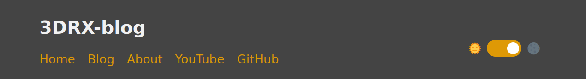

My very first experience on using astro to build a blog site

## Starting

node version: `18.16.0`

```sh
# create a new project with yarn
yarn create astro
```

## Modifying

### dark mode

Added dark mode support following
[this article](https://www.tohuwabohu.io/2022/11/astrojs-theme-toggle/).



### katex rendering in markdown

I use [katex](https://katex.org/) heavily, but astro doesn't support it out of the box,
so I made changes following [this article](https://ileumas.com/writing/2022/03/astro-math-katex/).
And to ignore warnings when a Unicode character is included in katex
(which is common for me because I type Chinese),
I found how to disable the warning in [katex options](https://katex.org/docs/options.html).

```js
['rehype-katex', {
    strict: false,
}]
```

So by the end, my `astro.config.mjs` looks like this

```js
import { defineConfig } from 'astro/config';
import mdx from '@astrojs/mdx';
import sitemap from '@astrojs/sitemap';

export default defineConfig({
    site: 'https://example.com',
    integrations: [mdx(), sitemap()],
    markdown: {
        remarkPlugins: [
            'remark-math'
        ],
        rehypePlugins: [
            ['rehype-katex', {
                strict: false
            }]
        ]
    },
    experimental: {
        assets: true
    }
});
```

